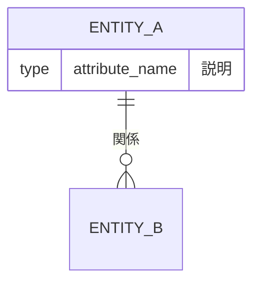
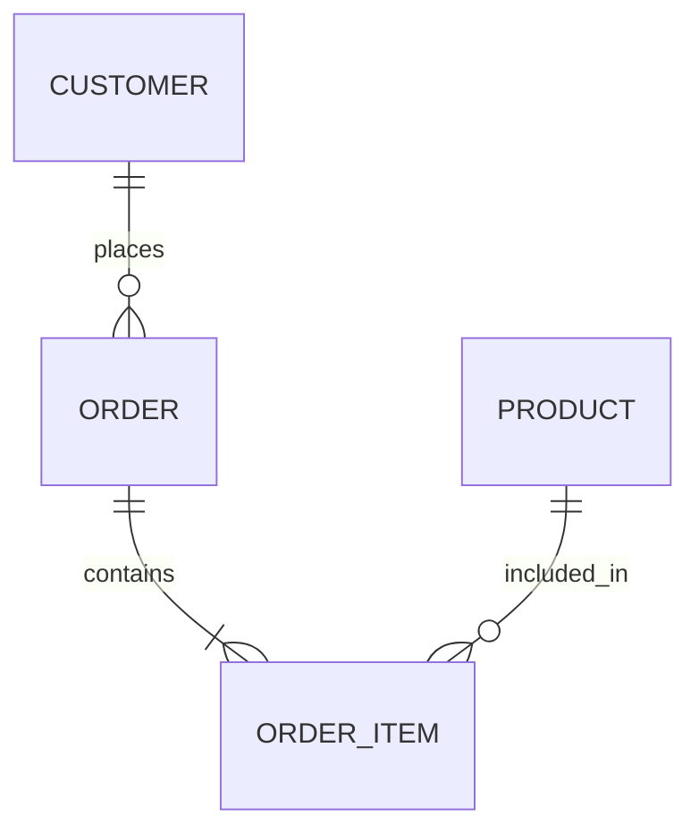
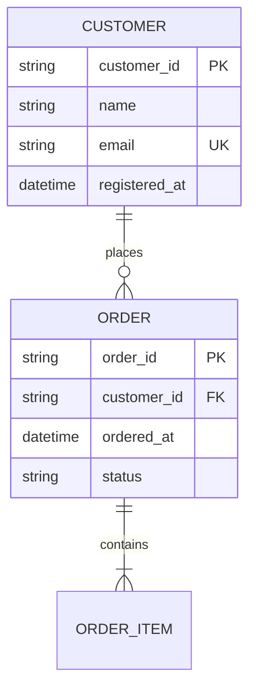

# Data Model Designer - Reference

概念→論理→物理データモデル設計の詳細ガイドライン。

---

## 1. 概念データモデル（CDM）詳細

### 目的
- **業務の主要エンティティと関係**を「業務用語」で合意し、関係者の共通理解を作る
- DB製品や実装方式に依存しない

### 注意点

#### 業務用語で書く（DB用語を持ち込まない）
- NG：テーブル、カラム、インデックス、VARCHAR
- OK：顧客、注文、商品、配送先

#### エンティティの境界とスコープを絞る
- 最初から網羅しすぎない
- 「今回のシステムが扱う世界」を切る
- 例：決済は外部システム、在庫管理は別システム

#### 属性を盛りすぎない
- 概念ERDでは重要エンティティと関係に集中
- 属性やPKは論理モデルで詰める

#### 同義語/多義語を潰す
- 「ユーザー」「会員」「アカウント」は同じ？違う？
- 用語集で定義を固定する

#### 業務シナリオで検証する
- 代表ユースケース（登録→購入→返品など）を通して確認
- 登場人物（エンティティ）が揃っているか

### 成果物
- 概念ER図（概念ERD）
- 用語集（Glossary）
- スコープ/前提メモ

---

## 2. 論理データモデル（LDM）詳細

### 目的
- 概念モデルを **属性・キー・制約・関係の詳細** として整える
- 実装へ渡せる「矛盾のないデータ構造」にする
- まだ特定DBMSには依存しない

### 注意点

#### エンティティごとに属性を定義し、定義（意味）を必ず書く
- 属性名だけでは解釈が割れる
- データ辞書をセットで作成

#### 主キー/外部キー（識別子）を明確にする
- ID体系を決める
  - 自然キー：業務上一意な値（メールアドレス等）
  - サロゲートキー：システムが生成するID（UUID, SERIAL等）
- 一意性の根拠を明記

#### カーディナリティ・任意/必須を明確にする
- 1:1, 1:N, N:M を正確に
- NULL許容の意味を業務ルールとして言語化

#### N:Mは中間（関連）エンティティで表現する
- 曖昧な「多対多」を放置しない
- 例：注文—商品 → 注文明細（中間）

#### 正規化を意識する
- 第3正規形を目指す
- 重複・更新不整合を排除
- 物理で崩すとしても、論理は整える（仕様変更に強い）

#### "DB固有"に寄せすぎない
- 論理モデルは技術非依存が基本
- データ型は概念的な型で表現
  - OK：文字列、整数、日時、真偽値
  - NG：VARCHAR(255), BIGINT, TIMESTAMP WITH TIME ZONE

### 成果物
- 論理ER図（属性・PK/FK・関係・任意必須を含む）
- データ辞書（項目定義書）
- 業務ルール一覧

---

## 3. 物理データモデル（PDM）詳細

### 目的
- 論理モデルを **特定DBMSで実装可能な形** に落とし込む
- 性能・運用要件を満たす設計

### 注意点

#### DBMS前提を固定する
- PostgreSQL / MySQL / SQLite / SQL Server 等で設計が変わる
- 前提を早めに確認・固定

#### 論理→物理のマッピングを明確にする
- エンティティ → テーブル
- 属性 → カラム
- 関係 → FK / 中間テーブル
- 追跡可能にする

#### データ型・NULL・デフォルトを具体化する
- 桁あふれに注意
- 時刻のタイムゾーン（TIMESTAMP vs TIMESTAMPTZ）
- 文字コード・照合順序

#### インデックス設計は"実クエリ"から逆算
- WHERE / JOIN / ORDER BY 条件を考慮
- 更新頻度とのバランス
- 張りすぎは書き込みコスト増

#### 性能のための非正規化は「理由つき」で限定的に
- 読み取り最適化
- 集計テーブル
- キャッシュ列
- 「どのクエリを何msにしたいか」を根拠に

#### 運用要件をモデルに入れる
- 監査カラム：created_at, updated_at
- 論理削除：deleted_at（必要なら）
- 履歴管理（SCD Type 2等）
- パーティション
- アーカイブ方針
- バックアップ/リストア方針
- 権限分離

#### 制約は"できるだけDBに寄せる"
- アプリ側だけで守ると抜け道が増える
- NOT NULL, UNIQUE, CHECK, FK制約をDB側で

### 成果物
- 物理ER図
- DDL一式（CREATE TABLE / INDEX / VIEW / 制約）
- インデックス設計書（根拠付き）
- マイグレーション計画
- 運用設計メモ

---

## 4. Mermaid ER図の書き方

### 基本構文


### カーディナリティ記号
| 記号 | 意味 |
|------|------|
| `\|\|` | 1（必須） |
| `o\|` | 0または1（任意） |
| `}o` | 0以上（任意・複数） |
| `}\|` | 1以上（必須・複数） |

### 関係の読み方
```
A ||--o{ B : "has"
```
→ A は B を 0個以上持つ（A:1 - B:多）

### 概念ERDの例


### 論理ERDの例


---

## 5. 型マッピング例

### 論理型 → 物理型（PostgreSQL）
| 論理型 | PostgreSQL |
|--------|------------|
| 文字列（短） | VARCHAR(n) |
| 文字列（長） | TEXT |
| 整数 | INTEGER / BIGINT |
| 小数 | NUMERIC(p,s) / DECIMAL |
| 真偽値 | BOOLEAN |
| 日付 | DATE |
| 日時 | TIMESTAMP / TIMESTAMPTZ |
| UUID | UUID |

### 論理型 → 物理型（MySQL）
| 論理型 | MySQL |
|--------|-------|
| 文字列（短） | VARCHAR(n) |
| 文字列（長） | TEXT / LONGTEXT |
| 整数 | INT / BIGINT |
| 小数 | DECIMAL(p,s) |
| 真偽値 | TINYINT(1) / BOOLEAN |
| 日付 | DATE |
| 日時 | DATETIME / TIMESTAMP |
| UUID | CHAR(36) / BINARY(16) |

---

## 6. 命名規則

### テーブル名
- snake_case（小文字、アンダースコア区切り）
- 複数形 or 単数形で統一（推奨：複数形）
- 例：`customers`, `orders`, `order_items`

### カラム名
- snake_case
- 予約語を避ける（`order` → `orders` or `order_record`）
- FK名は `参照先テーブル_id`（例：`customer_id`）

### インデックス名
- `idx_テーブル名_カラム名`
- 例：`idx_orders_customer_id`

### 制約名
- PK：`pk_テーブル名`
- FK：`fk_テーブル名_参照先`
- UK：`uk_テーブル名_カラム名`
- CK：`ck_テーブル名_条件`

---

## 7. 共通の運用カラム

```sql
-- 監査カラム
created_at TIMESTAMP NOT NULL DEFAULT CURRENT_TIMESTAMP,
updated_at TIMESTAMP NOT NULL DEFAULT CURRENT_TIMESTAMP,

-- 論理削除（必要な場合）
deleted_at TIMESTAMP NULL,

-- 作成者/更新者（必要な場合）
created_by VARCHAR(255),
updated_by VARCHAR(255)
```

---

## 8. トレーサビリティ

各モデル間の対応を追跡可能にする：

| 概念（CDM） | 論理（LDM） | 物理（PDM） |
|-------------|-------------|-------------|
| 顧客 | Customer | customers |
| 注文 | Order | orders |
| 注文明細 | OrderItem | order_items |
| 商品 | Product | products |

対応表を作成し、変更時の影響範囲を把握できるようにする。
