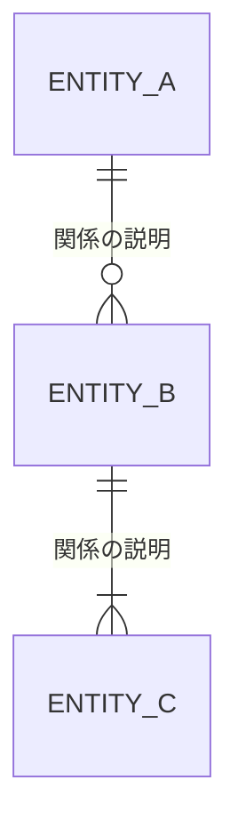

# 概念データモデル - テンプレート

## 概要
- **対象システム**: [システム名]
- **作成日**: [YYYY-MM-DD]
- **スコープ**: [対象範囲の説明]

---

## 概念ER図

---

## 用語集（Glossary）

| エンティティ | 定義 | 別名・同義語 | 備考 |
|--------------|------|--------------|------|
| [エンティティ名] | [このエンティティが表すものの定義] | [他の呼び方があれば] | [補足] |

---

## スコープ/前提

### 対象範囲
- [含まれるもの]

### 対象外
- [含まれないもの（外部システム連携等）]

### 前提条件
- [設計上の前提]

---

## 検証（代表ユースケース）

### ユースケース1: [名前]
1. [ステップ1]
2. [ステップ2]
3. [ステップ3]

**登場エンティティ**: [A], [B], [C]
**検証結果**: ✅ 必要なエンティティが揃っている / ⚠️ [不足があれば記載]

---

## チェックリスト

- [ ] 業務用語で書かれている（DB用語なし）
- [ ] エンティティの境界・スコープが明確
- [ ] 同義語/多義語が整理されている
- [ ] 代表ユースケースで検証済み
