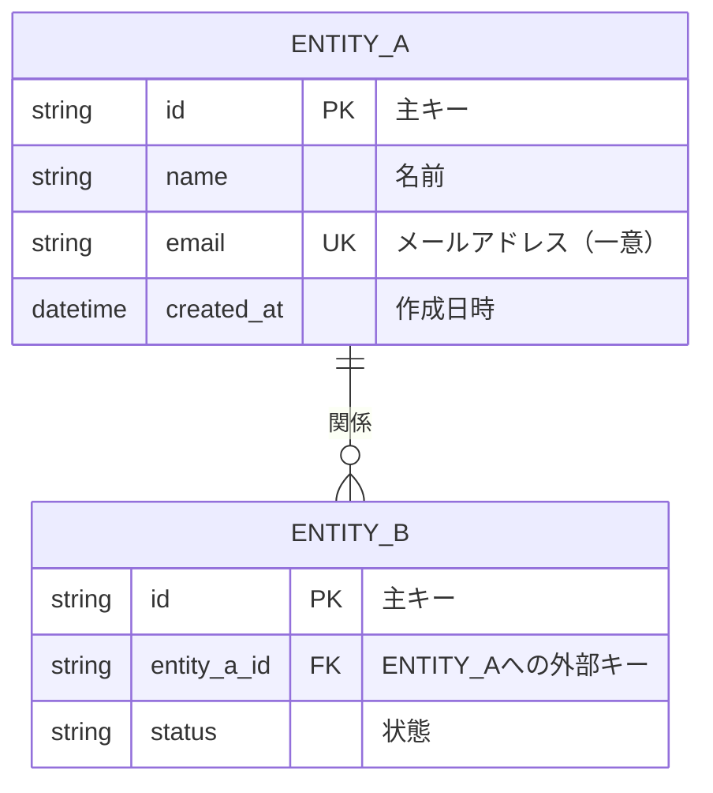
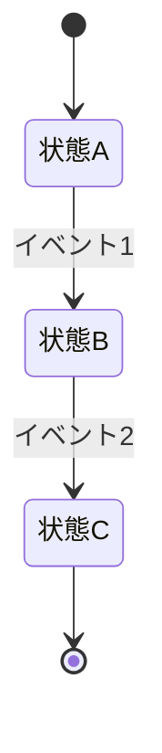

# 論理データモデル - テンプレート

## 概要
- **対象システム**: [システム名]
- **作成日**: [YYYY-MM-DD]
- **ベース**: [概念モデルからの継続 or 新規]

---

## 論理ER図

---

## データ辞書

### [エンティティ名1]

| 属性名 | 論理型 | 必須 | 一意 | 定義 | 例 | 備考 |
|--------|--------|------|------|------|-----|------|
| id | 文字列 | ✅ | ✅(PK) | 一意識別子 | "cust_001" | |
| name | 文字列 | ✅ | - | 名前 | "山田太郎" | 最大100文字 |
| email | 文字列 | ✅ | ✅ | メールアドレス | "yamada@example.com" | 形式検証必要 |
| created_at | 日時 | ✅ | - | 作成日時 | "2024-01-15 10:30:00" | |

### [エンティティ名2]

| 属性名 | 論理型 | 必須 | 一意 | 定義 | 例 | 備考 |
|--------|--------|------|------|------|-----|------|
| ... | ... | ... | ... | ... | ... | ... |

---

## 業務ルール一覧

| No | ルール名 | 説明 | 関連エンティティ |
|----|----------|------|------------------|
| BR-001 | [ルール名] | [業務ルールの詳細説明] | [Entity_A, Entity_B] |
| BR-002 | ... | ... | ... |

### 状態遷移（該当する場合）

---

## キー設計

### 主キー（PK）方針
- [ ] サロゲートキー（システム生成ID）
- [ ] 自然キー（業務上一意な値）
- [ ] 複合キー

**選択理由**: [理由を記載]

### ID体系

| エンティティ | ID形式 | 例 | 生成方法 |
|--------------|--------|-----|----------|
| [Entity_A] | [形式] | [例] | [UUID/SERIAL/etc] |

---

## 正規化状態

- [x] 第1正規形（1NF）：繰り返し項目なし
- [x] 第2正規形（2NF）：部分関数従属なし
- [x] 第3正規形（3NF）：推移関数従属なし
- [ ] BCNF（必要に応じて）

### 正規化で解決した問題
- [例：N:Mを中間テーブルで解決]

---

## チェックリスト

- [ ] 全属性に定義（意味）がある
- [ ] PK/FKが明確
- [ ] カーディナリティが正確
- [ ] N:Mは中間エンティティで解決
- [ ] 正規化されている（理由なき冗長なし）
- [ ] DB固有の型名を使っていない（概念型で記述）
