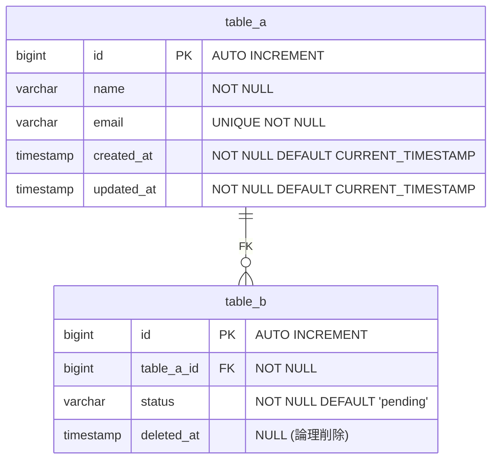

# 物理データモデル - テンプレート

## 概要
- **対象システム**: [システム名]
- **作成日**: [YYYY-MM-DD]
- **DBMS**: [PostgreSQL 15 / MySQL 8.0 / SQLite 3 / etc]
- **文字コード**: [UTF-8]
- **照合順序**: [ja_JP.UTF-8 / utf8mb4_unicode_ci / etc]

---

## 物理ER図



---

## テーブル定義

### table_a

| カラム名 | データ型 | NULL | デフォルト | 制約 | 説明 |
|----------|----------|------|------------|------|------|
| id | BIGINT | NO | AUTO_INCREMENT | PK | 主キー |
| name | VARCHAR(100) | NO | - | - | 名前 |
| email | VARCHAR(255) | NO | - | UNIQUE | メールアドレス |
| created_at | TIMESTAMP | NO | CURRENT_TIMESTAMP | - | 作成日時 |
| updated_at | TIMESTAMP | NO | CURRENT_TIMESTAMP | - | 更新日時 |

### table_b

| カラム名 | データ型 | NULL | デフォルト | 制約 | 説明 |
|----------|----------|------|------------|------|------|
| ... | ... | ... | ... | ... | ... |

---

## DDL

### テーブル作成

```sql
-- =============================================
-- テーブル: table_a
-- 説明: [テーブルの説明]
-- =============================================
CREATE TABLE table_a (
    id BIGINT GENERATED ALWAYS AS IDENTITY PRIMARY KEY,
    name VARCHAR(100) NOT NULL,
    email VARCHAR(255) NOT NULL,
    created_at TIMESTAMP NOT NULL DEFAULT CURRENT_TIMESTAMP,
    updated_at TIMESTAMP NOT NULL DEFAULT CURRENT_TIMESTAMP,

    CONSTRAINT uk_table_a_email UNIQUE (email)
);

COMMENT ON TABLE table_a IS '[テーブルの説明]';
COMMENT ON COLUMN table_a.id IS '主キー';
COMMENT ON COLUMN table_a.name IS '名前';
COMMENT ON COLUMN table_a.email IS 'メールアドレス（一意）';

-- =============================================
-- テーブル: table_b
-- 説明: [テーブルの説明]
-- =============================================
CREATE TABLE table_b (
    id BIGINT GENERATED ALWAYS AS IDENTITY PRIMARY KEY,
    table_a_id BIGINT NOT NULL,
    status VARCHAR(20) NOT NULL DEFAULT 'pending',
    deleted_at TIMESTAMP NULL,
    created_at TIMESTAMP NOT NULL DEFAULT CURRENT_TIMESTAMP,
    updated_at TIMESTAMP NOT NULL DEFAULT CURRENT_TIMESTAMP,

    CONSTRAINT fk_table_b_table_a FOREIGN KEY (table_a_id)
        REFERENCES table_a(id) ON DELETE RESTRICT ON UPDATE CASCADE
);
```

### インデックス作成

```sql
-- =============================================
-- インデックス
-- =============================================

-- table_b: table_a_idでの検索用
CREATE INDEX idx_table_b_table_a_id ON table_b(table_a_id);

-- table_b: statusでの絞り込み用
CREATE INDEX idx_table_b_status ON table_b(status);

-- table_b: 論理削除されていないレコードの検索用（部分インデックス）
CREATE INDEX idx_table_b_active ON table_b(id) WHERE deleted_at IS NULL;
```

---

## インデックス設計

| テーブル | インデックス名 | カラム | 種別 | 根拠 |
|----------|----------------|--------|------|------|
| table_b | idx_table_b_table_a_id | table_a_id | B-tree | JOINクエリで使用 |
| table_b | idx_table_b_status | status | B-tree | WHERE句で頻繁に絞り込み |
| table_b | idx_table_b_active | id (WHERE deleted_at IS NULL) | Partial | アクティブレコードの検索 |

### 想定クエリ

```sql
-- クエリ1: table_aとtable_bのJOIN
SELECT a.*, b.*
FROM table_a a
JOIN table_b b ON b.table_a_id = a.id
WHERE b.deleted_at IS NULL;
-- 使用インデックス: idx_table_b_table_a_id, idx_table_b_active

-- クエリ2: statusでの絞り込み
SELECT * FROM table_b WHERE status = 'pending';
-- 使用インデックス: idx_table_b_status
```

---

## 運用設計

### 監査カラム
- `created_at`: レコード作成日時（INSERT時自動設定）
- `updated_at`: レコード更新日時（UPDATE時にトリガーで更新）

```sql
-- updated_at自動更新トリガー（PostgreSQL）
CREATE OR REPLACE FUNCTION update_updated_at()
RETURNS TRIGGER AS $$
BEGIN
    NEW.updated_at = CURRENT_TIMESTAMP;
    RETURN NEW;
END;
$$ LANGUAGE plpgsql;

CREATE TRIGGER trg_table_a_updated_at
    BEFORE UPDATE ON table_a
    FOR EACH ROW
    EXECUTE FUNCTION update_updated_at();
```

### 論理削除
- `deleted_at`: NULL=有効、非NULL=削除日時
- 物理削除は行わず、deleted_atで管理
- 検索時は `WHERE deleted_at IS NULL` を付与

### バックアップ方針
- [ ] 日次フルバックアップ
- [ ] WALアーカイブ（PITR用）
- [ ] 保持期間: [XX日]

### 権限設計
| ロール | 権限 | 対象テーブル |
|--------|------|--------------|
| app_read | SELECT | 全テーブル |
| app_write | SELECT, INSERT, UPDATE | 全テーブル |
| app_admin | ALL | 全テーブル |

---

## マイグレーション計画

### 初期マイグレーション
1. スキーマ作成
2. テーブル作成（依存順）
3. インデックス作成
4. トリガー作成
5. 初期データ投入

### 実行順序
```
001_create_schema.sql
002_create_table_a.sql
003_create_table_b.sql
004_create_indexes.sql
005_create_triggers.sql
006_seed_data.sql
```

---

## 論理→物理マッピング

| 論理エンティティ | 物理テーブル | 備考 |
|------------------|--------------|------|
| EntityA | table_a | |
| EntityB | table_b | deleted_at追加 |

---

## チェックリスト

- [ ] DBMS前提が明記されている
- [ ] データ型・NULL・デフォルトが具体的
- [ ] 全インデックスに根拠がある
- [ ] 運用カラム（監査/論理削除等）が考慮されている
- [ ] DDLが実行可能（構文エラーなし）
- [ ] 命名規則が統一されている
- [ ] 権限設計が考慮されている
- [ ] マイグレーション順序が明確
