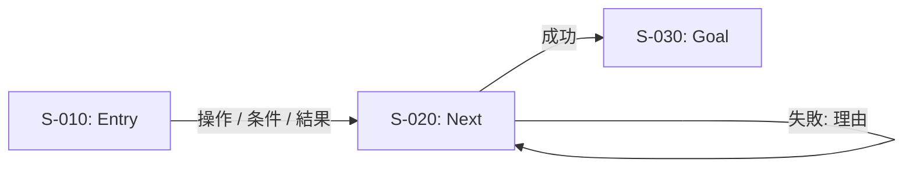
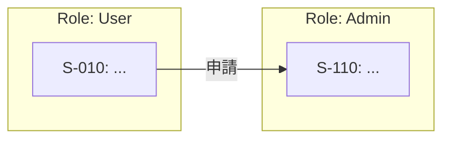

# Screen Transition Diagram Skill

このSkillは、Web/アプリの「画面(ページ)」をノード、ユーザー操作や条件を矢印として、**実装/QAに耐える画面遷移図**を作るための手順です。

## Output Contract(必ずこの形で返す)

1. **スコープ/粒度宣言**(A/B/Cのどれか + ユースケース範囲 + レベル)
2. **前提(Assumptions)**(不明点は仮置きして明示)
3. **画面カタログ(表)**:`ScreenID / 画面名 / 役割 / 状態(空・エラー等) / 入口or出口 / ルート(任意)`
4. **遷移カタログ(表)**:`From / To / トリガー / 条件 / 結果(成功・失敗) / 備考`
5. **Mermaid(flowchart)**:図(必要ならL0/L1/L2で複数)
6. **レビュー用チェックリスト**(resources/checklist_review.md をベースに)
7. **未確定事項(Questions)**:次に埋めるべき確認事項

## 粒度の選び方(最初に決める)

- **A. 情報設計寄り**:画面名+遷移が中心(注釈最小)
- **B. 仕様寄り**:ログイン状態/権限/バリデーション/エラー/空状態まで記載
- **C. デザイン寄り(Wireflow)**:画面の簡易ワイヤー相当の注釈(Figma Frame参照など)を追加

ユーザーから粒度指定がない場合は、**まずB(仕様寄り)**で作り、過剰ならAに落とす。

## 手順(再現可能な作り方)

### 0) 最小インプットの確保
ユーザー入力が足りない場合は resources/template_minimum_input.md をそのまま貼って埋めてもらう。
ただし「今すぐ作って」が強い場合は、**仮置き前提で作成→未確定事項に回す**(質問だけで止めない)。

### 1) ユースケースで分割(スパゲッティ回避)
- まず **L0: 全体(入口→主要ハブ→出口)**
- 次に **L1: 機能/フロー別(例:ログイン、作成、購入、設定)**
- 必要なら **L2: 詳細(例外/分岐/状態)**
図が読めない密度になったら、迷わず分割する。

### 2) 画面の洗い出し → 画面ID採番
- 画面IDは `S-010` のように **10刻み**(あとで差し込みやすい)
- 同じ画面の「別状態」は増殖させすぎない
  - 例:一覧の空状態は `状態` 列と注釈で表す(必要なら分ける)

### 3) 主経路(Happy Path)を先に繋ぐ
入口(Entry)→ゴール(Goal)を最短で繋いだ図をまず完成させる。

### 4) 例外系・戻り導線を追加(必須)
最低限これを入れる:
- ログイン失敗
- 権限不足
- バリデーションNG
- 通信失敗/タイムアウト
- 空状態(データなし)
- 戻る/キャンセル/閉じる

### 5) 矢印ラベルを埋める(解釈割れ防止)
矢印ラベルは原則この形式:
- `操作 / 条件 / 結果`
例:
- `保存 / バリデーションOK / 詳細へ`
- `保存 / NG(必須未入力) / エラー表示して同画面`

### 6) Mermaid化(表→図の順が崩れにくい)
まず「画面カタログ」「遷移カタログ」を作り、そこからMermaidへ落とす。

## Mermaid表記ルール(推奨)

- ノード表示:`S-010: 画面名`
- 分岐:`{}`(例:確認ダイアログ、権限分岐)
- ループ:失敗時は同画面に戻す矢印を明示
- 役割が複数:`subgraph` でスイムレーン風に分ける(必要時のみ)

### Mermaidテンプレ(単一フロー)

### Mermaidテンプレ(役割別レーン)

## 既存仕様の更新(差分最小)
ユーザーが「修正して」「追加して」と言ったら:
1) 変更点の要約(箇条書き)
2) 画面/遷移カタログの差分
3) Mermaidの差分(該当部分のみ再掲)
の順で出す。

---

## Examples(発動例)

### Example 1: ゼロから作る
**User:** 「投稿フローの画面遷移図を作って。未ログインはログインへ。下書き保存あり。」
**Assistant (you):**
- 粒度Bで宣言 → 画面カタログ/遷移カタログ → Mermaid(Happy→例外→戻り)→未確定事項

### Example 2: 複雑なので分割
**User:** 「購入・配送・返品まで全部の遷移を1枚で」
**Assistant (you):**
- L0全体 + L1(購入/配送/返品)に分割してMermaidを複数出す(スパゲッティ回避)

### Example 3: 既存Mermaidの更新
**User:** 「このMermaidに『権限不足』を追加して」
**Assistant (you):**
- 差分方針 → 追加ノード/矢印 → 変更箇所だけのMermaid再掲

---

## Linked Resources(必要時だけ読む:progressive disclosure)
- [最小インプットテンプレ](resources/template_minimum_input.md)
- [出力スキーマ(表テンプレ + Mermaid雛形)](resources/template_output_schema.md)
- [レビュー用チェックリスト](resources/checklist_review.md)
