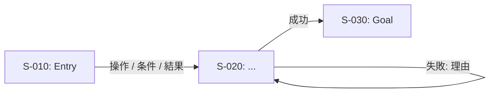

# 出力スキーマ(テンプレ)

## 画面カタログ
| ScreenID | 画面名 | 役割 | 状態(空/エラー等) | Entry/Goal | ルート(任意) | 備考 |
|---|---|---|---|---|---|---|
| S-010 | Login | Guest | 認証エラー | Entry | /login |  |

## 遷移カタログ
| From | To | トリガー | 条件 | 結果 | 備考 |
|---|---|---|---|---|---|
| S-010 | S-020 | ログイン | OK | 成功→遷移 |  |
| S-010 | S-010 | ログイン | NG | 失敗→エラー表示 |  |

## Mermaid(雛形)

