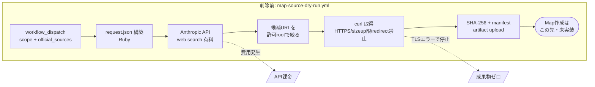

# コミット 7a3879fd「fix: Domain Map作成を明示依頼に限定する」を理解する

結論を先に言うと、これは**機能追加でもバグ修正でもなく、方針の撤回コミット**である。
直前の2つのPRで作った「有料APIを使って Domain Map の外部sourceを自動探索する経路」を、
実測1回で費用対効果が取れないと判断して**丸ごと削除し**、Map作成の入口を
「利用者が明示的に依頼したときだけ」に**契約として狭めた**。

変更規模は 8 files / +53 / -616 で、削除が支配的である。

---

## 1. Background

### 1-1. このリポジトリが何なのか（既知ならスキップ可）

このリポジトリは「LLM Wiki」の実装である。`lilpacy/` 配下が wiki 本体で、
Markdown ファイル群が LLM によって書かれ、維持される。人間は情報源を選び、
問いを立てる側にいる。運用ルールは `lilpacy/CLAUDE.md` に集約されており、
これが実質的な**実行契約（どの入口で何が起きるか）**を定義している。

wiki のメンテナンスは GitHub Actions で自動化されている。コミット時点で稼働していたのは:

- `daily-wiki-ingest.yml` / `pi-daily-wiki-ingest.yml` — 日次の情報源取り込み
- `pi-concept-synthesis.yml` — Concept ページの統合を PR として提案
- `synthesis-finalize.yml` — その PR の merge/close を確定
- `weekly-wiki-lint.yml` — 週次の健全性点検

`PI_API_KEY` / `PI_MODEL` / `PI_PROVIDER` は、これらの自動ジョブが LLM（Pi 経由の
Anthropic API）を叩くための**有料**クレデンシャルである。ここが後で費用の話に繋がる。

### 1-2. Domain Map とは何か

`maps/` に入る成果物で、Summary / Concept / Entity / Curriculum とは独立した第5の種類である。
`lilpacy/CLAUDE.md:267-296` が定義している完成条件が要点で、Map は**2つの View の両方**が
実質的内容と根拠を持って初めて保存できる。

| View | 何を表すか | 許される根拠source |
|---|---|---|
| 経時 View | 概念の発展経緯（時間軸） | 一次論文、標準・製品のrevision履歴、当事者の回顧、技術史 |
| 共時 View | `as_of` 時点の概念間関係・多重度（構造） | 現行標準、公式architecture、定評あるhandbook・教科書 |

どちらかが空・`未構築`・根拠不足なら Map は保存しない。さらに
「Map作成はsource収集を無期限の前工程に分離せず、原則として同じ試行で完結させる」
という規則がある。つまり**source探索だけ成功して Map ができない状態は、成果ゼロ**である。
この一文が、このコミットの判断根拠そのものになる。

### 1-3. 直前に何が起きていたか

コミット履歴を辿ると、このコミットの直前3週間ぶんの流れは一貫している。

```
ee07d34b test: Map source検索経路を実測する      ┐ spike (PR #70)
3f198a1b test: Map source取得境界を実測する      │ = 「技術的に可能か」の実証
782c2b95 docs: Map source取得の実証結果を記録する ┘
af107ef4 feat: Map source手動dry-runを追加する    ┐ 手動canary (PR #71)
58c29305 fix: Map source取得境界を閉じる          ┘ = 実際に動く経路を置いた
7a3879fd fix: Domain Map作成を明示依頼に限定する  ← 本コミット（全部消した）
```

PR #70 の spike で得られていた結論は `docs/map-source-acquisition-feasibility.md` にある。
Pi 0.80.3 自体には web search tool がなく、プロンプトで「一次・公式sourceを探せ」と
指示しても Medium や Wikipedia や解説記事が混ざる。18 URL 中に非公式が混在し、
API 応答は `stop_reason: max_tokens` だった。一方、**すでに公式と分かっている domain を
渡せば**、HTTPS限定・サイズ上限付きで取得して SHA-256 を計算することはできた。

そこで PR #71 は「LLM に探させるが、許可された domain/path root の外には出させない」
`map-source-dry-run.yml` を手動 canary として置いた。これが本コミットの削除対象である。

---

## 2. Intuition

核となる直感は一言で書ける。

> **技術的に成立することと、運用として採用に値することは別である。**

spike が示していたのは前者だけだった。手動 canary を1回本気で回した結果が後者を否定した。
`run #31355724703` は、有料 API を叩いて source 候補を探すところまでは進み、
そこで `spec.modelcontextprotocol.io` への **TLS接続エラー**で落ちた。
snapshot artifact も、当然 Map も生成されていない。

ここで 1-2 の「同じ試行で完結させる」規則が効く。source 探索の API 費用は発生し、
成果物は 0 件。部分的な前進として貯金もできない。これを 1 回味わった時点で、
「費用対効果が確認できるまで保留」という判断になった。

パイプラインとして見ると、こうなっていた。



そして入口（entrypoint）の設計が、こう変わった。

```mermaid
flowchart TB
  subgraph plan["変更前の構想（design_review）"]
    Q1[通常Query] --> M1[Map作成・更新]
    I1[daily ingest] --> M1
    S1[Concept Synthesis完了] --> M1
    L1[weekly lint] --> M1
    E1[利用者の明示依頼] --> M1
  end
  subgraph now["変更後の契約（deferred）"]
    Q2[通常Query] -.x.- M2[Map作成・更新]
    I2[daily ingest] -.x.- M2
    S2[Concept Synthesis完了] -.x.- M2
    L2[weekly lint] -.x.- M2
    E2[利用者の明示依頼] ==> M2
  end
```

重要なのは、**Map という成果物の設計は一切壊していない**点である。
log.md の判断行がそれを明言している。経時・共時の2 View、外部source、Curriculum との
分離はすべて維持され、「Map自動生成だけを一時的に断念する」。捨てたのは*自動化*で、
*概念設計*ではない。

---

## 3. Code

ファイル順ではなく、**「契約 → 記録 → 実行可能コード → テスト」**の順で見ると理解しやすい。
このコミットは実質「契約を書き換え、根拠を残し、実行系を消し、テストを契約検証へ差し替えた」だけである。

### 3-1. 契約を書き換える — `lilpacy/CLAUDE.md`

心臓部はここ。変更前は将来の自動化を予告する文だった。

```diff
-Map作成・更新の明示依頼は正当なentrypointであり、定期hookを待たず同じ品質条件で処理する。将来の
-自動Map maintenanceも既存ingestやConcept Synthesisの責務へ混ぜず、Concept Synthesis完了後に起動する
-独立workflowとし、明示経路と同じscope解決・builder・lintへ合流させる。自動workflowはまだ未実装である。
+Map作成・更新は、利用者が明示的に依頼した場合だけ実行する。通常Query、daily ingest、Concept Synthesis、weekly lint
+の実行や完了をMap作成・更新の契機にしない。`PI_API_KEY`を使う有料APIでのsource探索・Map自動生成は、
+費用対効果が確認できるまで保留し、workflowを置かない。自動化を再検討する場合は、source選定精度、完成Map
+1件あたりの費用、経時・共時2 Viewの完結率を実測し、新しい意思決定として明示的に採用する。
```

3つのことを同時にやっている。(a) 許可される入口を1つに絞る、(b) 禁止される契機を
名前で列挙する（曖昧さを残さない）、(c) 再開に必要な実測項目を先に決めておく。

これはエージェントに読ませる指示書なので、「〜しない」を明示的に書くことが
そのまま実行時の振る舞いになる。ここが単なるドキュメント更新ではない理由である。

同じファイルから、削除された workflow の説明も消えている。

```diff
-- `map-source-dry-run.yml`: 明示されたscopeと公式domain/path rootだけを対象に、外部source候補を検索・取得して
-  artifactへ保存する手動canary。repositoryは変更せず、検索2回・候補4件・1source 1 MiBを上限とする。
-  これは自動Map maintenanceのproduction予算ではない。
```

### 3-2. 判断を記録する — `docs/` 2ファイル

`docs/map-source-acquisition-feasibility.md` は結論部が書き換わった。以前は
「Piにshell/write権限を渡さず、決定的な取得処理へ分離する」という*実装方針*だったが、
今は*撤退の理由*になっている。

```diff
-したがって自動Map maintenanceでは、Piへshellやwrite権限を追加しない。検索・取得は
-決定的なsource acquisition処理へ分離し、Piには取得・検証済みsnapshotだけを`read`で渡す。
+技術的に成立することと、運用として効率的であることは別である。手動canaryでは有料APIによるsource探索後、
+取得候補のTLSエラーでMap作成前に停止し、費用に対する完成Mapの価値を得られなかった。
```

セクション見出しも意味が変わっている。`## 採用する境界` →
`## 将来再検討する場合にも必要な境界`（今は動いていないと明記）、
`## 未解決` → `## 再開条件`（3つの実測項目を列挙）。実測表には失敗行が1行追加された。

`automatic-domain-map-maintenance.design-case.json` は設計ケースの構造化記録で、
`status` が `design_review` → `deferred` になり、`current_decision` オブジェクトが増えた。

```json
"current_decision": {
  "decided_at": "2026-08-10",
  "active_entrypoint": "利用者による明示的なMap作成・更新依頼",
  "deferred_entrypoints": ["通常Query", "daily ingest", "Concept Synthesis completion", "weekly lint"],
  "reason": "PI_API_KEYを使うsource探索は、API費用に対して完成Mapを得られず、現時点の費用対効果を採用できない。",
  "resumption_condition": "source選定精度、完成Map 1件あたりの費用、経時・共時2 Viewの完結率を実測し、新しい意思決定として自動化を採用する。",
  "history_note": "以下の自動maintenance設計は、再検討時の履歴として保持するが、現在の実行契約ではない。"
}
```

`history_note` が上手い。SC1〜SC4 などの成功条件や business_workflow を**削除せずに残し**、
「これは履歴で、現在の実行契約ではない」というラベルだけを被せている。
再開時に設計をゼロから起こし直す必要がない。

`lilpacy/log.md` には追記専用の台帳エントリが 1 件足された
（`## [2026-08-10] ops | 有料APIによるDomain Map自動生成を保留`）。更新/削除/判断の4行構成。

### 3-3. 実行可能コードを消す — workflow + script + 専用テスト

ここが -616 行の大半である。

| 削除 | 行数 | 何だったか |
|---|---|---|
| `.github/workflows/map-source-dry-run.yml` | -117 | 手動 canary 本体 |
| `scripts/map_source_dry_run.rb` | -263 | 入力検証・リクエスト構築・候補収集 |
| `test/map_source_dry_run_test.rb` | -203 | 上記の単体テスト |

消えた Ruby は真面目に書かれていた。`MAX_SEARCHES = 2` / `MAX_SOURCES = 4` /
`MAX_BYTES_PER_SOURCE = 1_048_576` / `MAX_REDIRECTS = 0` といった上限が定数で、
`valid_domain?` は DNS ラベルを正規表現で検証し、`valid_source_root?` は path に
`..` が含まれないことまで見ていた。workflow 側も `--proto '=https'`、`--max-filesize`、
`--location` なし（リダイレクト追跡禁止）、content-type ホワイトリスト、
`stop_reason == "pause_turn"` の継続処理まで実装されていた。

**動くものを、動かないから消したのではない。境界としては十分によく出来ていたが、
それを回して得られる価値が費用に見合わなかったから消した。** これがこのコミットの
性格を最もよく表している部分である。

なお `PI_API_KEY` を使う実行可能な経路が消えたことで、secret を消費する入口が
自動ジョブ側からなくなった。

### 3-4. テストを「契約の検証」へ差し替える — `test/ci_workflow_contract_test.rb`

一番示唆的な変更。テストを削除するのではなく、**同じテスト名の位置に、
逆向きのテストを置いた**。

```diff
-  def test_正常系_map_source_dry_runは手動実行でartifactだけを生成する
-    workflow = REPO_ROOT.join(".github/workflows/map-source-dry-run.yml").read
-    assert_includes workflow, "workflow_dispatch:"
-    ...
+  def test_正常系_map作成は利用者の明示依頼だけを入口にする
+    policy = REPO_ROOT.join("lilpacy/CLAUDE.md").read
+    design = JSON.parse(REPO_ROOT.join("docs/interactive-design-review/automatic-domain-map-maintenance.design-case.json").read)
+
+    assert_includes policy, "Map作成・更新は、利用者が明示的に依頼した場合だけ実行する。"
+    assert_includes policy, "通常Query、daily ingest、Concept Synthesis、weekly lint"
+    assert_equal "deferred", design.dig("project", "status")
+    assert_equal "利用者による明示的なMap作成・更新依頼", design.dig("project", "current_decision", "active_entrypoint")
+    refute REPO_ROOT.join(".github/workflows/map-source-dry-run.yml").exist?
+    refute REPO_ROOT.join("scripts/map_source_dry_run.rb").exist?
+  end
```

変更前は「workflow がこう書かれていること」を検証していた。変更後は
「**方針文が CLAUDE.md に存在し、設計ケースが deferred で、実行系ファイルが存在しないこと**」
を検証している。`refute ... .exist?` は、うっかり（あるいはエージェントが親切心で）
workflow を復活させたら CI が落ちるという意味である。

つまりこのリポジトリでは、**自然言語で書かれた方針そのものがテスト対象**になっている。
CLAUDE.md がエージェントの実行契約なのだから、契約文の消失は挙動のリグレッションであり、
テストで守る対象になる。この発想が理解できていれば、このコミットの狙いは全部読めている。

---

## 4. Quiz

3問。PRの実質を理解していれば解けるが、ひっかけではない。

**Q1.** このコミットで削除された `map_source_dry_run.rb` と workflow は、
なぜ削除されたか。最も正確なものを選べ。

- (a) 実装にセキュリティホール（redirect 追跡やサイズ無制限）があり、危険だったため
- (b) 技術的には成立していたが、有料 API 費用に対して完成 Map が得られず、費用対効果を採用できなかったため
- (c) `spec.modelcontextprotocol.io` の TLS エラーというバグを修正できなかったため
- (d) Domain Map という成果物そのものの設計が破棄されたため

**Q2.** `design-case.json` で `success_conditions`（SC1〜SC4）や `business_workflow` が
**削除されずに残された**理由として、このコミットの意図に最も合うのはどれか。

- (a) 削除するとテストが落ちるため、暫定的に残した
- (b) JSON schema が必須フィールドとして要求しているため消せなかった
- (c) 自動化は保留だが設計自体は妥当なので、再開時の履歴として保持し `history_note` で「現在の実行契約ではない」と区別した
- (d) SC1〜SC4 は明示依頼の経路でもそのまま満たされる現行要件だから

**Q3.** `test/ci_workflow_contract_test.rb` の新テストは
`assert_includes policy, "Map作成・更新は、利用者が明示的に依頼した場合だけ実行する。"` と、
自然言語の一文を文字列一致で検証している。この設計の狙いはどれか。

- (a) Markdown の文法エラーを検出するため
- (b) `lilpacy/CLAUDE.md` はエージェントの実行契約なので、その一文の消失・改変は挙動のリグレッションに等しく、CI で守るべき対象だから
- (c) 日本語の誤字を防ぐ校正テストとして
- (d) 他にテストできる対象がなく、カバレッジを維持するための形式的な措置

（各選択肢の正誤理由は回答後に説明する。誤答があればその領域を特定して、
挙動を手で触れるマイクロワールドの作成を提案する。たとえば
「入口イベント → Map作成が起動するか」を切り替えて叩ける小さな CLI や、
削除された Ruby の境界検証（domain / path root のバリデーション）に
任意の入力を通して弾かれ方を見るスクリプトが候補になる。）

---

**注記（非対話テスト実行）**: 本来はここでユーザーのクイズ回答を待ち、
全問正解なら Step 4（この explainer を wiki に取り込むか／Markdown で残すか／破棄するかの確認）へ、
誤答があれば誤答パターンから欠けている直感を診断して Step 3（マイクロワールドの提案）へ
エスカレーションする。今回は非対話実行のため、クイズ提示で停止する。
