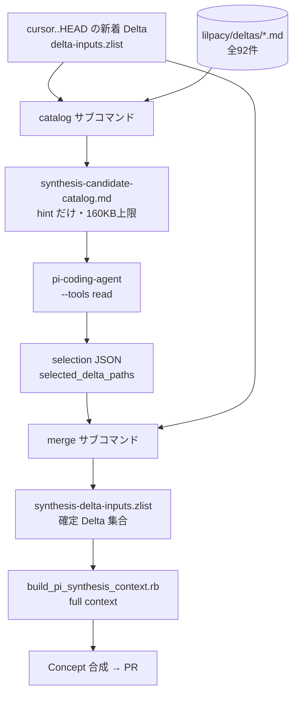

# `scripts/pi_synthesis_candidates.rb` を理解する

対象: `/Users/lilpacy/.herdr/worktrees/obsidian/worktree-rapid-stone-a736/scripts/pi_synthesis_candidates.rb`（138行、Ruby）
深さの見積り: 中規模〜アーキテクチャ寄り。単体では小さいが、**LLM を含むパイプラインの検索段**という役割を掴まないとコードが意味を持たない。よって構造化説明フル + クイズ5問。

---

## 1. Background

### 1-A. 深い背景（LLM Wiki の3層と Concept の制約 — 既知ならスキップ可）

この repo は「LLM が維持する個人 Wiki」で、`lilpacy/` 以下が3層に論理分割されている（`lilpacy/CLAUDE.md`）。

- **raw**（不変・LLM は読むだけ）: 生ノート約4000件、`queries/` の会話逐語記録
- **wiki**（LLM が書く）: `deltas/`, `summaries/`, `concepts/`, `entities/`, `index.md`, `log.md`
- **schema**: `AGENTS.md` / `CLAUDE.md` / `schema/`

このうち今回関係するのが2つ。

**`deltas/`（Knowledge Delta）** は、ある raw source を1回取り込んだ時点の「Vault との差分」を記録する**不変イベント**。現在92件ある。1件はこういう形をしている（`lilpacy/deltas/2026-08-04 Linearのチーム横断工数集計--3b4a442f09f9.md` を短縮）。

```markdown
---
source: "[[queries/2026-08-04 Linearのチーム横断工数集計]]"
summary: "[[summaries/Linearのチーム横断工数集計]]"
source_snapshot: 3b4a442f09f9...
---
## Changes
- classification: refines | claim: ... | evidence: ... ^kd-3110f15e4e8a

## Concept impact hints
- 複数Teamの見積値を横断集計する前に、尺度の意味と正規化条件を明示する計画原則の候補
- キャパシティ管理の相対Estimateと、原価・予算管理の共通時間単位を分離するConcept候補
```

最後の `## Concept impact hints` が本題の主役。ingest 時に「これは将来 Concept になりそう」という**非決定的な当たりを付けたメモ**で、ingest 自体は `concepts/` を触らない（`CLAUDE.md`「ingestは`concepts/`を変更しない」）。判断は後段に委ねられる。

**`concepts/`** は複数 source を横断して初めて見える理解。ここに厳しい制約がある: **各 claim は2つ以上の独立 source lineage に接地しないといけない**。これが以降の設計をほぼ全部決めている。

### 1-B. 直結する背景（48時間ごとの Concept Synthesis と、そこで生じる困りごと）

`.github/workflows/pi-concept-synthesis.yml` が48時間ごとに走り、Delta から Concept を創発して Concept だけの PR を出す。流れの前半はこう。

1. `synthesis_ledger.rb cursor` で「前回 finalize した commit」を得る
2. `git diff --diff-filter=A cursor..HEAD -- 'lilpacy/deltas/*.md'` で**新着 Delta** を列挙（`delta-inputs.zlist`）
3. ← **ここに本スクリプトが入る**
4. `build_pi_synthesis_context.rb` で確定 Delta 集合から Summary / Entity / Concept を集めた full context を組む
5. pi-coding-agent に読ませ、`pi_synthesis_apply.rb` で決定的に検証して適用

問題は step 2 と step 4 の間にある。**新着 Delta だけでは Concept が作れない。** 2つ以上の独立 lineage が必要なので、相方はたいてい cursor より前の**過去 Delta** だ。ではどうやって92件から相方を選ぶ？

- 全92件の Delta 全文 + Summary を full context に入れる → 予算が破綻する（`build_pi_synthesis_context.rb` の上限は336KB、1ページ16KB）
- 埋め込み検索インフラは無い（Wiki の規模では index ファイル運用で足りる、という repo の方針）

そこで **2段リトリーバル**にする。まず安い catalog で候補を絞り、絞った確定集合だけで高い full context を組む。この「安い catalog を作る」と「LLM が選んだ結果を検証して確定集合にする」の両方が、このスクリプトの仕事である。

---

## 2. Intuition

**このスクリプトは「LLM に読ませる候補一覧を作る係」と「LLM が返してきた選択を信用せず検証して確定させる係」の2つである。** LLM は挟まれているが、このスクリプト自体に LLM は登場しない。前後の穴を埋める決定的な部品だ。

核となる直感を3つに分けると:

**(1) catalog は「hint だけの索引カード」で、本文を意図的に落とす。** 92件の Delta について、path / source リンク / summary リンク / Concept impact hints だけを並べる。`## Changes` の evidence も raw 本文も入れない。テストがこれを露骨に守らせている（`refute_includes catalog, "NEW_RAW_SECRET"` / `refute_includes catalog, "## Changes"`）。図書館の目録カードに本文が載っていないのと同じで、それで十分に「どの棚を見るか」は決められる。

トイデータで catalog の出力を見るとこう（`New` が新着、`Old` が過去）。

```markdown
# Pi Concept Candidate Catalog

This catalog contains only Delta metadata and non-deterministic Concept impact hints.
Raw Source and query transcript contents are intentionally excluded.

## lilpacy/deltas/New.md [new]

source: [[Raw New]]
summary: [[summaries/New]]
- E2E高速化ではデータ独立を先に確立する

## lilpacy/deltas/Old.md

source: [[Raw Old]]
summary: [[summaries/Old]]
- E2E高速化を独立性と二段並列化で捉える
```

`[new]` マーカーが唯一の非対称性で、LLM への指示は「`[new]` と組み合わせて2 lineage を張れそうな過去 Delta を選べ」。新着が起点、過去は相方、という向きがここで表現されている。

**(2) hint は検索の手掛かりでしかない。** workflow のプロンプトが明言している: 「Hintは検索手掛かりであってConcept claimの根拠ではなく、Conceptの最終判断は後続のfull contextで行います」。だから hint ベースで多めに拾ってよく、精度は後段が担保する。逆に言えば catalog 段で落としたものは二度と復活しないので、**再現率だけが catalog の責務**。

**(3) 出力の確定集合には新着が必ず含まれる。** merge は `新着 + LLM選択` の和で、LLM が空配列を返しても新着は残る（テスト `test_準正常系_関連候補がない場合も新着知識だけで合成を続行できる`）。LLM は集合を**削れない**、増やせるだけ。

パイプライン内の位置づけ:



`catalog` と `merge` は LLM 呼び出しを挟んで分離された前半・後半であり、同じクラスにまとめられていないのはそのためである。

---

## 3. Code

ファイル順ではなく「入口 → catalog → merge → 両者に共通するガード」の順で見る。

### 3-A. 入口: 2つのサブコマンドを持つ CLI（121-138行）

```ruby
if $PROGRAM_NAME == __FILE__
  command = ARGV.shift
  repo_root = ARGV.shift
  case command
  when "catalog"
    output_path = ARGV.shift
    abort "usage: ..." unless repo_root && output_path && !ARGV.empty?
    PiSynthesisCandidateCatalog.new(repo_root, new_delta_paths: ARGV).build(output_path)
  when "merge"
    ...
```

`$PROGRAM_NAME == __FILE__` ガードがあるので、`require_relative` したときはクラス定義だけが読まれる。テスト（`test/pi_synthesis_candidates_test.rb`）はこれを利用してクラスを直接叩いている。

`ARGV.shift` を重ねた後、**残った ARGV 全部が新着 Delta path のリスト**になる。`!ARGV.empty?` を必須にしているのは、新着ゼロで呼ばれるのは呼び出し側のバグだからで、workflow 側も `steps.inputs.outputs.found == 'true'` でガードしている。二重の防御。

### 3-B. `catalog`: hint を持つ Delta だけを索引化（10-49行）

```ruby
@vault_dir.glob("deltas/*.md").sort.each do |path|
  relative = path.relative_path_from(@repo_root).to_s
  hints = concept_hints(path)
  next if hints.empty?

  metadata = frontmatter(path)
  marker = @new_delta_paths.include?(relative) ? " [new]" : ""
  lines.concat([
    "## #{relative}#{marker}",
    "",
    "source: [[#{required_link(metadata, "source", path)}]]",
    "summary: [[#{required_link(metadata, "summary", path)}]]",
    *hints.map { |hint| "- #{hint}" },
    ""
  ])
end
```

読みどころが3つある。

**`next if hints.empty?` が先に来ている。** hint が無い（または `none` だけの）Delta は catalog に載らない。載せても LLM が判断できる情報がゼロなのでトークンの無駄、という判断。同時に `frontmatter(path)` より前に置かれているので、**hint の無い Delta は frontmatter 検証もされない**。これは意図というより順序の副作用に見える点で、注意しておく価値がある。

**hints の抽出は行ベースで、次の `##` で止まる。**

```ruby
def concept_hints(path)
  lines = path.readlines(chomp: true)
  heading = lines.index("## Concept impact hints")
  return [] unless heading
  lines[(heading + 1)..]
    .take_while { |line| !line.start_with?("## ") }
    .map { |line| line.delete_prefix("- ").strip if line.start_with?("- ") }
    .compact
    .reject { |hint| hint == "none" }
end
```

YAML/Markdown パーサではなく `lines.index` の完全一致と `take_while`。見出し文字列が1文字でも違えば静かに `[]` になり、その Delta は catalog から消える。Delta が機械生成である前提に依存した割り切りである。`reject { |hint| hint == "none" }` は、ingest が「Concept 候補なし」を `- none` と書く規約への対応。

**frontmatter は自前で切り出してから YAML に渡す。**

```ruby
raise ArgumentError, "missing Delta frontmatter: #{path}" unless lines.first == "---"
closing = lines[1..]&.index("---")
YAML.safe_load(lines[1..closing].join("\n"), permitted_classes: [Date], aliases: false) || {}
```

`safe_load` + `aliases: false` + `permitted_classes: [Date]`（`created: 2026-08-04` を Date にするため）。Vault は自分のデータだが、YAML billion-laughs 的な入力を通さない構えは維持している。`Psych::SyntaxError` は `ArgumentError` に翻訳され、CI では workflow が非ゼロ終了で落ちる。

`required_link` は wikilink から表示名を剥がす。

```ruby
link = metadata[field].to_s[/\[\[([^\]]+)\]\]/, 1]&.split("|", 2)&.first
raise ArgumentError, "Delta #{field} link is missing: #{path}" unless link
```

`[[summaries/X|別名]]` → `summaries/X`。`source` と `summary` は**必須**で、欠けたら例外。ここは緩めず落とす設計で、後段の lineage 検証が frontmatter を信頼できることの担保になっている。

**最後に予算チェック。**

```ruby
content = "#{lines.join("\n")}\n"
raise ArgumentError, "candidate catalog budget exceeded: #{content.bytesize} > #{@max_total_bytes}" if content.bytesize > @max_total_bytes
Pathname(output_path).write(content)
```

160,000 bytes を超えたら**書かずに落ちる**。ここが設計判断として一番はっきりしている箇所で、テスト名がそのまま意図を語っている: `test_異常系_catalog上限を超える場合は候補を欠落させず失敗する`。切り詰めて静かに続行すると「載らなかった Delta は永久に Concept にならない」という silent な取りこぼしになるので、**沈黙の欠落より騒がしい失敗を選んでいる**。full context 側（`build_pi_synthesis_context.rb`）も同じ思想で `context budget exceeded; omitted paths: ...` を投げる。

### 3-C. `merge`: LLM の返答を検証して確定集合にする（90-119行）

```ruby
selection = JSON.parse(Pathname(selection_path).read)
raise ArgumentError, "schema_version must be integer 1" unless selection.fetch("schema_version", nil) == 1
selected = selection.fetch("selected_delta_paths", nil)
raise ArgumentError, "selected_delta_paths must be an array" unless selected.is_a?(Array)

paths = (@new_delta_paths + selected.map { |path| validate_delta_path(path) }).uniq
Pathname(output_path).binwrite("#{paths.join("\0")}\0")
```

`schema_version` は `== 1` の完全一致（`"1"` も `1.0` も拒否）。LLM 出力を扱うので「だいたい合っている」を通さない。

出力形式が NUL 区切り（`.zlist`）なのは、**Delta のファイル名に空白が入る**から。`2026-08-04 Linearのチーム横断工数集計--3b4a442f09f9.md` を改行区切りにするのはまだ動くが、shell の単語分割やパス中の記号に強い NUL 区切りが workflow 側と揃っている（`mapfile -d ''` で読む）。`binwrite` と末尾 NUL も含めてその都合。workflow は同じ内容を人間可読な `.txt` にも書き出して artifact に上げている。

そして順序が `@new_delta_paths + selected` で、`.uniq` は先勝ち。**新着が必ず先頭に並ぶ。** LLM が新着を重複して返しても位置は変わらない。

### 3-D. 両クラスに重複している `validate_delta_path`（53-59行 / 112-118行）

```ruby
path = Pathname(String(value)).cleanpath.to_s
unless path.start_with?("lilpacy/deltas/") && path.end_with?(".md") && !path.include?("..") && @repo_root.join(path).file?
  raise ArgumentError, "invalid Delta path: #{value}"
end
```

4条件すべてを要求する。`cleanpath` で正規化した上で `..` を明示的に禁止し、`lilpacy/deltas/` 配下の `.md` で、かつ**実在するファイル**であること。

これが効くのは merge 側だ。`selected_delta_paths` は LLM が生成した文字列で、catalog に出てくる path をコピーしてくれるとは限らない。テストがその攻撃面を突いている: `selected_delta_paths: ["lilpacy/Raw Old.md"]` は `ArgumentError` になる。**raw 本文を full context に混入させない**という Concept Synthesis の不変条件（「Raw Source は通常入力にせず」）を、プロンプトの言葉ではなくコードで守っている。同じ検証が catalog 側にもあるのは、新着リストの生成元（workflow の git diff）を信用しきらないため。

2クラスに同じメソッドが写っているのは素朴な重複だが、片方だけ緩む事故を防ぐという意味では共有 mixin より読みやすい、とも言える。ここは好みの範囲。

### まとめると

このスクリプトは、**予算のある LLM に対する2段リトリーバルの「安い1段目」と「1段目の出力を信用しないゲート」**である。設計の芯は3つ。hint だけを見せて本文を隠す（コスト）、上限超過で切り詰めずに落ちる（silent な取りこぼしの回避）、LLM の返す path を4条件で検証する（raw 混入と path 逸脱の防止）。

---

## 4. Quiz（5問）

理解の調整弁です。番号だけで答えてもらえれば十分。「ここがまだピンとこない」でも構いません。

**Q1.** `catalog` が Delta の `## Changes` セクション（claim と evidence）を出力に含めないのはなぜか。

1. Changes は raw source の逐語引用なので、raw を LLM に見せない不変条件に触れるから
2. catalog の目的は候補の絞り込みだけで、claim の妥当性は full context 段で判断するため、hint 以外を載せるとトークン予算を圧迫するだけだから
3. Changes は `^kd-` ブロック参照を含み、Markdown として壊れるから
4. Changes は Summary に投影済みなので、Delta 側の記述は常に stale だから

**Q2.** `merge` に渡された selection JSON が `{"schema_version":1,"selected_delta_paths":[]}` だったとき何が起きるか。

1. 「候補なし」として `ArgumentError` になり workflow が失敗する
2. 出力 zlist は空になり、後段の `build_pi_synthesis_context.rb` が「at least one delta path」で落ちる
3. 出力 zlist は新着 Delta だけになり、synthesis は続行する
4. catalog に載っていた全 Delta が fallback として選択される

**Q3.** ある Delta の `## Concept impact hints` 見出しが `## Concept Impact Hints`（大文字）と書かれていた場合、`catalog` の挙動はどうなるか。

1. `ArgumentError "missing Concept impact hints"` で落ちる
2. その Delta は hints 空とみなされ、catalog から静かに除外される
3. 大文字小文字を無視して一致するので影響はない
4. hints は空だが frontmatter 検証は走るので、frontmatter 不備があればそこで落ちる

**Q4.** `catalog` が上限 160,000 bytes を超えたとき、古い Delta を落として上限内に収める実装に変えたとする。パイプライン全体として何が悪化するか。

1. LLM の入力が短くなり選択精度が上がるので、特に悪化しない
2. 落とされた過去 Delta は候補検索に現れず、2 lineage の相方を永久に得られないまま Concept 化されない取りこぼしが静かに発生する
3. `merge` の `validate_delta_path` が落とされた path を拒否して workflow が失敗する
4. full context 側の 336,000 bytes 上限と競合して二重に切り詰められる

**Q5.** LLM が `selected_delta_paths: ["lilpacy/deltas/../queries/2026-08-04 会話.md"]` を返した。何が起きるか。またその防御が守っている不変条件は何か。

1. `cleanpath` が `lilpacy/queries/...` に正規化し、`lilpacy/deltas/` 前置チェックで落ちる。Concept の入力に raw / query transcript を混入させない不変条件を守っている
2. `!path.include?("..")` が生の文字列に対して先に効いて落ちる。ディレクトリトラバーサル対策である
3. `.md` で終わるので通り、full context に query transcript が混入する
4. ファイルが実在するので `File.file?` を通り、警告付きで採用される

---

### この後どうなるか（非対話テスト実行のため、ここで停止）

本来はここでユーザーの回答を待ち、skill の Step 2 に従って分岐します。

- **全問正解 or「掴めた」** → Step 4 に進み、「この explainer を wiki（`lilpacy/`）に取り込むか、repo 外の Markdown として残すか、破棄するか」を1回だけ確認して終了。合意なしに ingest はしない。
- **誤答あり** → 誤答パターンから欠けている直感を診断して Step 3（マイクロワールド）を**提案**する。想定される対応は次の通り。
  - Q1 / Q4 を外した → 予算と再現率のトレードオフの直感が薄い。マイクロワールド案: 実 Vault の92件で catalog を生成し、上限を引数で振って「何 bytes で何件が落ちるか」を出す使い捨てスクリプト（`/tmp`、十数分）。silent truncation の危険が数字で見える。
  - Q2 / Q3 を外した → 「静かに空になる」経路と「明示的に落ちる」経路の区別が曖昧。マイクロワールド案: 壊れた Delta（見出し違い、frontmatter 欠落、hint が `none` だけ）を並べた tmp Vault で catalog を叩き、どれが例外・どれが黙って消えるかを表で出す CLI。
  - Q5 を外した → LLM 出力を敵性入力として扱う層の位置が掴めていない。マイクロワールド案: `validate_delta_path` に任意文字列を流して 4条件のどれで落ちたかを表示する REPL 的スクリプト。
  - いずれも操作後に同領域の別問題を1〜2問出して確認し、Step 4 へ。
