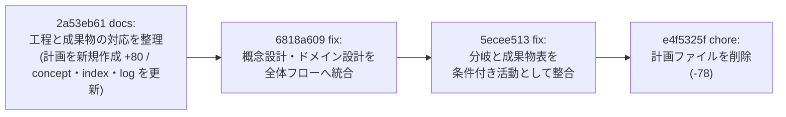

# コミット e4f5325f の理解

## 一言でいうと

作業が完了した実装計画ファイル 1 本（`docs/superpowers/plans/2026-08-16-development-process-artifacts.md`、78行）を削除しただけの後片付けコミットです。vault の中身（`lilpacy/` 配下の concept / index / log）には一切触っていません。

```
commit e4f5325f  chore: 中間生成物の実装計画を削除
 docs/superpowers/plans/2026-08-16-development-process-artifacts.md | 78 ------
 1 file changed, 78 deletions(-)
```

Step 0 の深さ見積もりに従い、これは「typo・設定値・依存 bump」相当の変更として扱います。クイズとマイクロワールドは実行しません（理由は末尾）。ただし「なぜ消して良かったのか」は diff だけでは分からないので、その背景だけ補足します。

## 背景: 消されたファイルは何だったのか

削除されたのは superpowers の `writing-plans` 系ワークフローが生む**実装計画**です。`docs/superpowers/plans/` は実行前に計画を書き出し、`superpowers:executing-plans` / `subagent-driven-development` がそれをタスク単位で消化していくための置き場です。同じディレクトリには `2026-07-21-query-ingest.md` が残っていて、こちらは冒頭に「For agentic workers: REQUIRED SUB-SKILL: ... implement this plan task-by-task」と書かれた**まだ生きている**計画です。つまりこのディレクトリは「これから／進行中の計画」を置く場所であり、完了した計画は資産ではなく中間生成物になります。

削除された計画のゴールはこう書かれていました。

> **Goal:** `concepts/ソフトウェア開発プロセス.md` を、工程名だけでなく「いつ、何を確定し、どの成果物として次工程へ渡すか」が分かる正本へ更新する。

中身は変更範囲（concept / `index.md` / `log.md` の 3 ファイル）、工程別成果物表の列設計、成果物の精緻化系列 5 本、概念設計・ドメイン設計の起動条件、新規 claim ごとの独立 source lineage 表、そして lint・`git diff --check`・Codex review・PR 作成までの検証手順、という**作業指示書**でした。成果物そのものではなく、成果物を作るための足場です。

## 直感: 足場は建物が建ったら外す

この計画ファイルは、同一ブランチ（`worktree/quiet-field-6595`）上の 3 コミットで完全に消化されています。



注目すべきは、中間の 2 コミットが計画ファイル**も**書き換えていることです（`6818a609` で 21 行、`5ecee513` で 7 行）。実装しながら計画の記述もずれないよう追随させていた、ということです。たとえば `5ecee513` のメッセージにある「要件定義→ドメイン設計の分岐を自己ループから『不要なら方式設計へ直接進む』経路へ修正」は、concept 側の Mermaid と計画側の記述を同時に直しています。

そしてここが本質です。計画が実装に追随して書き換えられていた以上、計画ファイルは**最終成果物である concept ページのやや劣化した複製**に収束します。同じ情報が 2 箇所にあると、以後どちらが正本か曖昧になり、片方だけ更新されて矛盾する。削除は「不要になったから捨てた」以上に「single source of truth を concept ページ 1 つに戻した」という意味を持ちます。

実際に成果は残っています。`lilpacy/concepts/ソフトウェア開発プロセス.md` は現在 15KB で、計画が指定した構造をそのまま備えています。

```
## 開発フロー全体            (mermaid)
## 工程と成果物の対応
### 成果物が精緻化される流れ  (mermaid)
## 工程の境界と覚え方
## 直列と反復の読み分け        (mermaid)
```

計画の履歴を追いたければ git に残っており、`git show e4f5325f^:docs/superpowers/plans/2026-08-16-development-process-artifacts.md` で読めます。だから削除は情報の喪失ではありません。

## コード（というより差分）のウォークスルー

diff は 78 行すべてが削除で、追加行はゼロ。実行コード・スクリプト・lint 対象への影響はありません。確認した点を挙げます。

- `AGENTS.md` / `CLAUDE.md` / `lilpacy/CLAUDE.md` に `docs/superpowers` への参照はなく、計画ディレクトリを参照する仕組みは存在しません。よってリンク切れや lint 失敗は起きません。
- `lilpacy/index.md` と `lilpacy/log.md` は先行 3 コミットで既に更新済みで、このコミットでは触られていません。wiki 層の整合性はこのコミットの前に取られています。
- このコミットは PR #86（`worktree/quiet-field-6595` → main、マージコミット `1676174f`）経由で main に取り込まれており、現在の `main` に含まれています。

一点だけ注意しておくと、この「完了した計画は削除する」というルールはリポジトリのどこにも明文化されていません。`docs/superpowers/plans/`、`docs/superpowers/specs/`、`docs/plans/` の 3 箇所に計画・仕様が散在していて（`docs/plans/pi-ingest-schema-v2-plan.md`、`docs/superpowers/specs/2026-07-21-query-ingest-design.md`）、どれが生きていてどれが完了済みかは中身を読まないと判別できません。今回と同じ判断を将来もぶれずに繰り返したいなら、`AGENTS.md` に一行「完了した計画は削除する。履歴は git に残る」と書いておくのが安いです。これは今回のコミットの欠陥ではなく、次の一手の候補です。

## クイズについて

このコミットは 1 ファイル削除・追加行ゼロで、理解すべき状態遷移やアルゴリズムがありません。understand skill の深さ見積もりでは「小さい変更に儀式を強制しない」に該当するため、クイズとマイクロワールドは実行しません。作っても「削除されたファイルは何行でしたか」のような、PR の実質と無関係な暗記問題になってしまいます。

もし理解を確かめたいポイントがあるとすれば、それは diff ではなく判断のほうです。「計画を消して良いと判断できる条件は何か」— 答えは「計画の内容が最終成果物に完全に反映されており、かつ計画自体を参照する仕組みが存在しないこと」で、これは上のウォークスルーで両方確認済みです。

## 共有について

この explainer を共有・保存しますか。選択肢は 3 つです。

1. **wiki に取り込む** — `lilpacy/` の query 取り込みフロー（`lilpacy/CLAUDE.md`）に従って ingest します。ただし内容はリポジトリ運用の話であり、vault の知識ドメイン（概念・技術知識）とは層が違うので、個人的には推奨しません。
2. **`AGENTS.md` に運用ルールを一行追記** — 上で挙げた「完了した計画は削除する」の明文化。今回の判断を再現可能にする最小の一手で、これが一番リターンが大きいと思います。
3. **不要** — このまま終了。何も残しません。

これは非対話テスト実行なので、ここで停止します。通常セッションであれば、ユーザーの選択を待ってから該当する書き込みを行います（合意なしに wiki や `AGENTS.md` へは書き込みません）。
