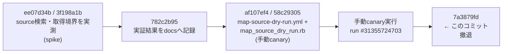
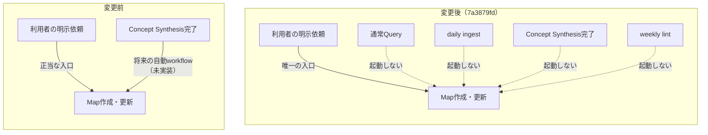

# コミット 7a3879fd「fix: Domain Map作成を明示依頼に限定する」の理解

一言でいうと、**「有料APIで Domain Map を自動生成する」路線を、実測結果を根拠に撤退させたコミット**である。
コード上の主役は追加ではなく削除で、8ファイル・53追加・616削除。消えたのは
GitHub Actions workflow 1本、Ruby script 1本、その専用テスト 1本。残ったのは
「Map は人が明示的に頼んだときだけ作る」という契約と、なぜ撤退したかの記録である。

---

## Background

### 深い背景（このrepoの構造を知っているならスキップ可）

このリポジトリは LLM Wiki パターンの実装である。`lilpacy/` が wiki 本体（LLM が書き、
人が読む Markdown 群）、`lilpacy/CLAUDE.md` がその **schema** — つまり「エージェントは
この wiki をどう扱うべきか」を定めた実行契約である。ここが重要な点で、この repo における
`CLAUDE.md` は単なるドキュメントではなく、**振る舞いを決める設定ファイル**として機能している。

wiki の成果物は種類ごとに責務が分かれている。今回関係するのは `maps/` に置かれる
**Domain Map** で、`lilpacy/CLAUDE.md:267-301` に運用規則がある。Domain Map の完成条件は
厳しく、2つの View の**両方**に実質的内容と根拠が必要である。

| View | 何を表すか | 優先する外部source |
|---|---|---|
| 経時View | 概念の発展経緯（歴史） | 一次論文、revision履歴、当事者の回顧 |
| 共時View | `as_of`時点の概念間関係・多重度 | 現行標準、公式architecture、定評ある教科書 |

どちらかが空・`未構築`・根拠不足なら **Map を保存しない**。しかも source は
`map-sources/<body_sha256>.md` という content-addressed な不変 snapshot として
外部から取得・保存しなければならない。つまり Domain Map を1件作るには
「公式・一次sourceを探す → 取得する → 2 View を構築する」が同じ試行の中で完結する必要がある。

wiki のメンテナンスは一部が GitHub Actions で自動化されている（daily ingest、
Concept Synthesis、weekly lint など）。これらは `PI_API_KEY`（Pi 経由の有料 LLM API）を使う。
Domain Map もこの自動化の輪に入れられるか、というのが今回の題材である。

### このコミットに直結する背景

直前の3コミットで、まさにその自動化の実現可能性を実測していた。



`af107ef4` で作られた手動 canary は、`workflow_dispatch` で `scope` と
`official_sources` を受け取り、Pi API に source 候補を探させ、選ばれた URL を
厳しい境界（HTTPS限定、redirect 0回、接続10秒、全体30秒、1source 1 MiB上限、検索2回・候補4件まで）で
取得して artifact に上げる、というものだった。repository への書き込みは一切しない
（`permissions: contents: read` のみ）読み取り専用の探査装置である。

そして `docs/map-source-acquisition-feasibility.md` に記録された実測結果が撤退の根拠になる。

| 問い | 結果 |
|---|---|
| Pi API から web検索を呼べるか | できる |
| **指示だけで一次・公式sourceに限定できるか** | **できない**（18 URL中に Medium、Wikipedia、解説記事が混在） |
| 選択済みsourceを制限付きで取得できるか | できる |
| content-addressed snapshot用hashを作れるか | できる |
| **手動canaryでMap作成まで完結したか** | **できない**（`spec.modelcontextprotocol.io` の TLS接続エラーで停止。snapshotもMapも生成せず） |

最後の行がこのコミットで**追加された**行である。つまり canary を1回実際に回してみて、
API 費用を払った上で成果物ゼロで終わった、というのが引き金になっている。

---

## Intuition

このコミットの核となる直感は次の一文である。

> **技術的に成立することと、運用として採用に値することは別の判断である。**

この文は実際に `docs/map-source-acquisition-feasibility.md` の冒頭へ追記されている。
spike 3本が示したのは「経路は技術的に成立する」だった。にもかかわらず自動化を止めたのは、
成立性ではなく**費用対効果**という別の軸で否決したからである。有料 API で source を探させ、
取得段で落ち、完成 Map は 0 件。払ったコストに対して得たものがない。

もう一つの直感は、**Map 作成の「契機（entrypoint）」を絞った**という点である。
変更前後で、どの出来事が Map 作成を起動しうるかが変わっている。



変更前の `CLAUDE.md` は「明示依頼は正当な entrypoint であり、**将来の**自動 Map maintenance も
Concept Synthesis 完了後に起動する独立 workflow とする（自動workflowはまだ未実装である）」と
書いていた。つまり「明示依頼＋将来の自動化」という two-track の宣言だった。
変更後は「明示依頼**だけ**」の single-track になり、他の契機は明示的に否定されている。

ここが微妙で面白いところで、**変更前に自動 workflow は存在していなかった**（未実装だった）。
では何が変わったのか。変わったのは3つ。

1. 実行可能な source 探索経路（canary workflow + script）が消えた。有料 API を叩ける口が閉じた。
2. `CLAUDE.md` の宣言が「将来やる」から「保留する。workflow を置かない」に反転した。
3. 撤退が単なる放棄ではなく、**再開条件付きの保留（deferred）**として記録された。

3番目が設計上の要点である。設計記録 `docs/interactive-design-review/automatic-domain-map-maintenance.design-case.json`
の `status` は `design_review` → `deferred` に変わり、`current_decision` block が新設された。
自動 maintenance の設計本体（`success_conditions` 以下）は**削除せず残している**。
`history_note` が「以下の自動maintenance設計は、再検討時の履歴として保持するが、現在の実行契約ではない」と
明記して、残された設計が現行契約と誤読されるのを防いでいる。

再開に必要な実測項目も3つに具体化された。

- source選定精度
- 完成Map 1件あたりのAPI費用
- 経時・共時2 Viewを同じ試行で完成できる割合

これは「なんとなく気が向いたら再開」ではなく、**次に誰かが再挑戦するときの受け入れ条件**である。
`docs/map-source-acquisition-feasibility.md` では見出しも `## 未解決` → `## 再開条件`、
`## 採用する境界` → `## 将来再検討する場合にも必要な境界` に書き換えられており、
「現在稼働する pipeline の仕様」から「凍結された知見」へと文書の性格が変わっている。
取得境界（HTTPS限定、redirect禁止、byte上限など）を消さずに残したのは、
再検討時に安全境界の再発明・再失敗を避けるためである。

---

## Code

ファイル順ではなく、「実行能力を消す」「契約を書き換える」「テストの守る対象を移す」「記録を残す」の
4グループで見るとわかりやすい。

### 1. 実行能力の削除（-583行）

```
削除: .github/workflows/map-source-dry-run.yml   (-117)
削除: scripts/map_source_dry_run.rb              (-263)
削除: test/map_source_dry_run_test.rb            (-203)
```

`map_source_dry_run.rb` は入力検証と境界の実装本体だった。定数がそのまま方針を表している。

```ruby
module MapSourceDryRunInput
  MAX_SEARCHES = 2
  MAX_SOURCES = 4
  MAX_BYTES_PER_SOURCE = 1_048_576
  CONNECT_TIMEOUT_SECONDS = 10
  TOTAL_TIMEOUT_SECONDS = 30
  MAX_REDIRECTS = 0
  MAX_SOURCE_ROOTS = 5
```

domain の DNS ラベル検証、path traversal（`..`）拒否、redirect 0 回といった
防御的な作り込みが 263 行かけてなされていた。それでも消したのは、
**動く経路を残しておくと有料 API が偶発的に叩かれうる**からで、
「保留」を宣言だけで済ませずコードレベルで到達不能にしている。
削除後 `.github/workflows/` に残るのは daily ingest 2本、Concept Synthesis、
synthesis-finalize、weekly lint の5本で、Map 関連は 0 本になった。

### 2. 実行契約の書き換え（`lilpacy/CLAUDE.md`）

2箇所を編集している。1つは workflow 一覧から `map-source-dry-run.yml` の説明を削除（-3行）。
もう1つが本命で、Domain Map 運用節の末尾（`lilpacy/CLAUDE.md:328-331`）を差し替えた。

変更前:

```
Map作成・更新の明示依頼は正当なentrypointであり、定期hookを待たず同じ品質条件で処理する。将来の
自動Map maintenanceも既存ingestやConcept Synthesisの責務へ混ぜず、Concept Synthesis完了後に起動する
独立workflowとし、明示経路と同じscope解決・builder・lintへ合流させる。自動workflowはまだ未実装である。
```

変更後:

```
Map作成・更新は、利用者が明示的に依頼した場合だけ実行する。通常Query、daily ingest、Concept Synthesis、weekly lint
の実行や完了をMap作成・更新の契機にしない。`PI_API_KEY`を使う有料APIでのsource探索・Map自動生成は、
費用対効果が確認できるまで保留し、workflowを置かない。自動化を再検討する場合は、source選定精度、完成Map
1件あたりの費用、経時・共時2 Viewの完結率を実測し、新しい意思決定として明示的に採用する。
```

否定される契機を列挙している点が効いている。「自動化しない」だけだと
エージェントが「daily ingest のついでに Map も更新しておこう」と解釈する余地が残るが、
名前を挙げて塞いでいる。なお Map の品質規則（2 View 必須、content-addressed snapshot、
predicate 制約など `lilpacy/CLAUDE.md:267-326`）は一切変更されていない。
**「どう作るか」は無傷で、「いつ作るか」だけを絞った変更**である。

### 3. テストの守る対象の移動（`test/ci_workflow_contract_test.rb`）

ここが個人的にいちばん見どころで、テストを削除ではなく**書き換え**ている。

変更前のテスト名は `test_正常系_map_source_dry_runは手動実行でartifactだけを生成する` で、
YAML を文字列として読み `workflow_dispatch:` があること、`--proto '=https'` があること、
`--location`（redirect追従）が**ない**こと、`git add|commit|push` が**ない**ことなどを
assert していた。つまり **workflow の安全境界**を守るテストだった。

変更後は同じ位置に別の意図のテストが座っている。

```ruby
  def test_正常系_map作成は利用者の明示依頼だけを入口にする
    policy = REPO_ROOT.join("lilpacy/CLAUDE.md").read
    design = JSON.parse(REPO_ROOT.join("docs/interactive-design-review/automatic-domain-map-maintenance.design-case.json").read)

    assert_includes policy, "Map作成・更新は、利用者が明示的に依頼した場合だけ実行する。"
    assert_includes policy, "通常Query、daily ingest、Concept Synthesis、weekly lint"
    assert_equal "deferred", design.dig("project", "status")
    assert_equal "利用者による明示的なMap作成・更新依頼", design.dig("project", "current_decision", "active_entrypoint")
    refute REPO_ROOT.join(".github/workflows/map-source-dry-run.yml").exist?
    refute REPO_ROOT.join("scripts/map_source_dry_run.rb").exist?
  end
```

守る対象が「workflow がこう書かれていること」から「**方針がこう宣言され、実行経路が存在しないこと**」へ
移った。`refute ... exist?` の2行は、将来うっかり workflow や script を復活させたら CI が落ちる、
という逆向きのガードである。ここでも `CLAUDE.md` が実行契約として扱われていることがわかる
（policy 文字列そのものを assert している）。`require "json"` の追加は
design-case JSON を読むためである。テスト総数は 13 のまま。

### 4. 記録（`docs/` と `lilpacy/log.md`）

`docs/map-source-acquisition-feasibility.md` は Intuition で述べた通り、
実測表に canary の失敗行を追加し、見出しを「採用する境界／未解決」から
「将来再検討する場合にも必要な境界／再開条件」へ改めた。

`docs/interactive-design-review/automatic-domain-map-maintenance.design-case.json` は
`status: "design_review" → "deferred"` と `current_decision` block の追加（+13行）。
`active_entrypoint` / `deferred_entrypoints` / `reason` / `resumption_condition` / `history_note` を持つ。

`lilpacy/log.md` には `## [2026-08-10] ops | 有料APIによるDomain Map自動生成を保留` として追記。
このリポジトリの log は追記専用の時系列台帳なので、撤退という出来事自体が wiki の履歴に残る。
最後の一行が方針の射程を正確に区切っている。

> 判断: Domain Mapの経時・共時View、外部source、Curriculumとの分離は維持し、Map自動生成だけを一時的に断念する。

---

## Quiz

理解の確認として3問。各問、答えを選んでから理由も一言つけてみてほしい。

**Q1.** このコミットの直前まで、Concept Synthesis 完了をトリガーにして Domain Map を
自動生成する GitHub Actions workflow は稼働していた。正しいか。

- A. 正しい。稼働していた workflow をこのコミットで削除した。
- B. 誤り。自動 Map maintenance workflow は未実装で、削除されたのは手動 `workflow_dispatch` の canary である。
- C. 誤り。workflow は存在したが schedule ではなく weekly lint から呼ばれていた。
- D. 正しいが、削除ではなく無効化（`if: false`）にとどめている。

**Q2.** `test/ci_workflow_contract_test.rb` のテストが「削除」ではなく「書き換え」された。
書き換え後のテストが守っているものは何か。

- A. 削除された workflow の YAML が構文的に妥当であること。
- B. `map-sources/` の snapshot ファイル名が SHA-256 になっていること。
- C. `CLAUDE.md` と design-case に保留方針が宣言されており、かつ workflow / script が存在しないこと。
- D. Pi API に渡す検索リクエストの上限が 2 searches / 1 MiB であること。

**Q3.** 撤退の決定的な理由として、docs に追記された実測結果はどれか。

- A. Pi 0.80.3 に web search tool がなく、API から検索自体が呼べなかった。
- B. source 取得時に `contents: write` 権限が必要になり、安全境界を超えてしまった。
- C. 手動 canary が source 探索後に TLS 接続エラーで停止し、snapshot も Map も生成しないまま API 費用だけが発生した。
- D. 生成された Map の経時 View が既存 Map と `disputed` Relation を大量に生み、lint が通らなかった。

<details>
<summary>採点の観点（自己採点する場合）</summary>

Q1 は B、Q2 は C、Q3 は C。
Q1 を A/D と答えた場合、「宣言としての将来計画」と「実装された workflow」の区別がついていない
可能性がある。Q2 を A/D と答えた場合、テストの守る対象が実装から方針へ移った点が要点である。
Q3 を A と答えた場合、それは先行 spike の別の失敗（prompt だけでは公式 source に限定できない）で、
今回の引き金は canary の取得段の失敗である。

</details>

---

### 次のステップ（非対話テスト実行のため、ここで停止）

本来ここでユーザーの回答を待ち、

- 全問正解／「掴めた」→ Step 4 として「この explainer を wiki に取り込む／保存するか」を1回だけ確認して終了。
- 誤答領域あり → その領域の直感が欠けていると診断し、Step 3 のマイクロワールドを**提案**する。
  例: Q1 を外した場合、`git show <sha>:<path>` で各コミット時点の `.github/workflows/` の中身と
  `CLAUDE.md` の該当節を並べて出す小さなシェルスクリプトを作り、
  「宣言」と「実装」がいつ乖離していたかを自分で辿れるようにする（数十分で作れて捨てられる規模）。
  Q2 を外した場合は、`ci_workflow_contract_test.rb` を各コミット時点で走らせて、
  何が落ちて何が通るかを叩けるコマンドにするのが効く。

この実行は非対話テストのため、クイズを提示した時点で停止する。
