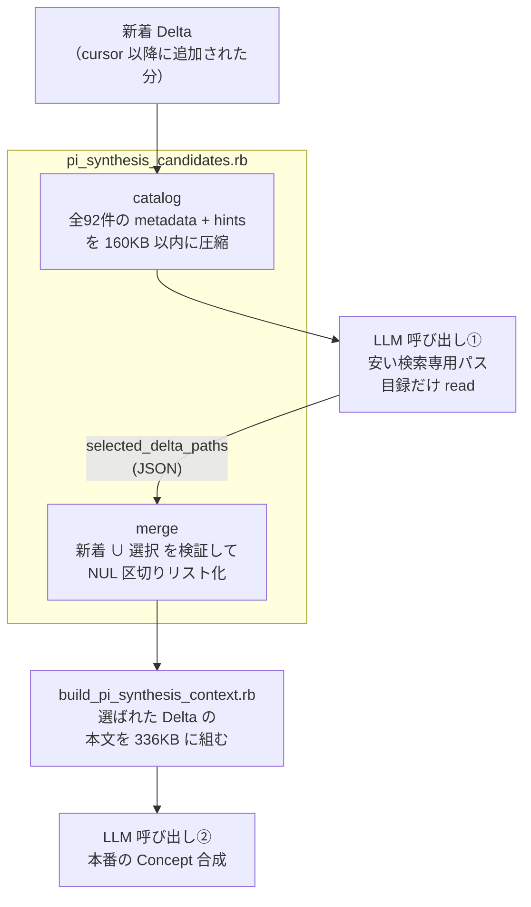

# `scripts/pi_synthesis_candidates.rb` を読み解く

このファイルは単体では意味が分かりにくい。理由は明白で、これは
**LLM に「どの過去 Delta を思い出すべきか」を聞くための、前処理と後処理のペア**
だからである。呼び出し元（GitHub Actions workflow）を見ないと、なぜ 2 つの
クラスが 1 ファイルに同居しているのかが見えない。順に組み立てていく。

---

## Background

### 深い背景（LLM Wiki の3層構造を既にご存知ならスキップ可）

この repo は「LLM が維持する個人 wiki」である。3層に分かれている。

| 層 | 場所 | 誰が書くか | 可変性 |
|---|---|---|---|
| Raw Source | `lilpacy/*.md`（フラットに数千件） | 人間がクリップ | 不変 |
| Wiki | `lilpacy/summaries/`, `entities/`, `concepts/` | LLM | 可変 |
| Schema | `lilpacy/CLAUDE.md`, `AGENTS.md` | 人間と LLM の共進化 | 可変 |

ここに **Knowledge Delta** という第4の要素がある（`lilpacy/deltas/`、現在92件）。
これは「ある query を処理した結果、wiki の理解がどう変わったか」の不変な記録である。
実物を見るのが速い:

```markdown
---
created: 2026-08-04
source: "[[queries/2026-08-04 Linearのチーム横断工数集計]]"
summary: "[[summaries/Linearのチーム横断工数集計]]"
entities:
  - "[[entities/Linear]]"
---
## Changes

- classification: refines | claim: LinearのEstimateは人時・人日ではなく相対的な
  複雑さ・規模であり… | evidence: （原文からの引用）… ^kd-3110f15e4e8a

## Concept impact hints

- 複数Teamの見積値を横断集計する前に、尺度の意味と正規化条件を明示する計画原則の候補
- キャパシティ管理の相対Estimateと、原価・予算管理の共通時間単位を分離するConcept候補
```

注目すべきは末尾の `## Concept impact hints` である。Delta を書いた時点の LLM が
「この知識は将来どんな Concept につながりそうか」を書き残した**検索用の手掛かり**だ。
これが本スクリプトの主役になる。

### 直結する背景 — Concept Synthesis という夜間バッチ

`.github/workflows/pi-concept-synthesis.yml` が48時間ごとに走り、
新しく追加された Delta から **Concept**（複数の source を横断して初めて見える
理解・パターン・設計原理）を作る・更新する。

決定的な制約が Concept の定義そのものにある。workflow の prompt から引用:

> 新規または変更する各 claim は、必ず2つ以上の独立 source lineage に
> 解決できる grounding_inputs を持たせます。

つまり **新着 Delta だけでは Concept を作れない**。必ず過去の Delta を
引っ張ってきて突き合わせる必要がある。ここで困るのが、
`build_pi_synthesis_context.rb` の予算である:

```ruby
MAX_PAGE_BYTES  = 16_000
MAX_TOTAL_BYTES = 336_000
```

Delta 92件とその summary/entity/concept 本文を全部 context に入れたら
336KB には到底収まらない。かといって「新着の周辺だけ」と機械的に絞ると、
2年前の関連知識を取りこぼす。

**この矛盾を解くのが本スクリプトである。**

---

## Intuition

核となる発想は一つ。

> 高価な full context を組む前に、**安い metadata だけの目録**で LLM に
> 「どれを思い出すべきか」を選ばせ、選ばれた分だけ本文を読み込む。

図書館の比喩がそのまま当てはまる。書架の本すべてを机に運ぶのではなく、
まずカード目録（背表紙とキーワードだけ）を見て、必要な数冊だけ運ぶ。



LLM 呼び出しが 2 回あるのが要点である。1回目は**検索**（cheap, metadata only）、
2回目は**判断**（expensive, full text）。本スクリプトは 1回目の入口（`catalog`）と
出口（`merge`）を担う。

### なぜ「目録」が本当に安いのか

実際に走らせて測った数字がある。

```console
$ ruby scripts/pi_synthesis_candidates.rb catalog . /tmp/cat.md \
    "lilpacy/deltas/2026-08-04 Linearのチーム横断工数集計--3b4a442f09f9.md"
$ wc -c /tmp/cat.md
64825 /tmp/cat.md
```

Delta 全92件を通しても 65KB。上限 160KB に対して余裕がある。
出力はこうなる（`[new]` マーカーに注目）:

```markdown
## lilpacy/deltas/2026-08-04 Linearのチーム横断工数集計--3b4a442f09f9.md [new]

source: [[queries/2026-08-04 Linearのチーム横断工数集計]]
summary: [[summaries/Linearのチーム横断工数集計]]
- 複数Teamの見積値を横断集計する前に、尺度の意味と正規化条件を明示する計画原則の候補
- キャパシティ管理の相対Estimateと、原価・予算管理の共通時間単位を分離するConcept候補

## lilpacy/deltas/2026-08-02 Linearの主要機能と統合運用--d5608d359046.md

source: [[queries/2026-08-02 Linearの主要機能と統合運用]]
summary: [[summaries/Linearの主要機能と統合運用]]
- [[concepts/タスク管理と優先順位]]へ、Triageを入口ゲート、Backlogを受入済み候補、
  CycleをWIP制限として対応づける候補
```

`## Changes` の claim / evidence 本文は**入っていない**。metadata 3行と hints だけ。
LLM は「Linear の工数集計が新着 → Linear の主要機能の Delta も関係しそう」と
目録レベルで判断できる。それで十分なのである。

### 設計の裏にある2つ目の直感 — 情報漏洩の防止

catalog が出力する内容には、もう一つ意図がある。冒頭に自ら宣言している:

```
This catalog contains only Delta metadata and non-deterministic Concept impact hints.
Raw Source and query transcript contents are intentionally excluded.
```

Raw Source と query transcript を**構造的に**除外している。これは
テストが直接守っている性質だ（`test/pi_synthesis_candidates_test.rb`）:

```ruby
@vault_dir.join("Raw New.md").write("NEW_RAW_SECRET")
@vault_dir.join("Raw Old.md").write("OLD_RAW_SECRET")
# ...
refute_includes catalog, "NEW_RAW_SECRET"
refute_includes catalog, "OLD_RAW_SECRET"
refute_includes catalog, "## Changes"
```

Raw に `SECRET` という文字列を仕込んで、catalog に漏れないことを assert している。
「Raw を読むのは検索フェーズの仕事ではない」という境界を、コメントではなく
テストで固定している。

---

## Code

ファイルは 2 クラス + CLI dispatcher。**パイプラインの前半と後半**という
関係なので、実行順に読むのが分かりやすい。

### 1. 共通の門番 — `validate_delta_path`

両クラスに**同じ実装がコピーされている**（`scripts/pi_synthesis_candidates.rb:53-59`
と `:112-118`）。ここが理解の起点になる。

```ruby
def validate_delta_path(value)
  path = Pathname(String(value)).cleanpath.to_s
  unless path.start_with?("lilpacy/deltas/") && path.end_with?(".md") &&
         !path.include?("..") && @repo_root.join(path).file?
    raise ArgumentError, "invalid Delta path: #{value}"
  end
  path
end
```

4条件を全部満たさないと通らない。`lilpacy/deltas/` 配下 / `.md` 拡張子 /
`..` を含まない / 実在するファイル。

なぜここまで厳しいか。**この関数が受け取る値の一部は LLM が生成した文字列**
だからである。`merge` に渡る `selected_delta_paths` は LLM の出力 JSON から来る。
LLM が幻覚で `lilpacy/../../etc/passwd` や `lilpacy/Raw 秘密メモ.md` を
返しても、ここで止まる。テストが狙い撃ちしている:

```ruby
def test_異常系_delta以外の候補pathは拒否される
  # selected_delta_paths に "lilpacy/Raw Old.md" を入れる
  error = assert_raises(ArgumentError) { ... }
  assert_includes error.message, "Delta path"
end
```

`cleanpath` を先にかけてから `..` を検査している順序も意図的である
（`a/../b` のような正規化前の形で判定をすり抜けさせない）。

### 2. `PiSynthesisCandidateCatalog#build` — 目録を作る

```ruby
@vault_dir.glob("deltas/*.md").sort.each do |path|
  relative = path.relative_path_from(@repo_root).to_s
  hints = concept_hints(path)
  next if hints.empty?
  # ...
  marker = @new_delta_paths.include?(relative) ? " [new]" : ""
```

`sort` が入っているのがポイント。glob の順序は OS 依存なので、
明示的に並べて**出力を決定的にしている**。同じ入力なら同じ目録が出る。

`next if hints.empty?` は目録の縮小に効いている。hints が無い Delta は
検索の手掛かりを持たないので載せない。実測すると:

```console
$ ls lilpacy/deltas/*.md | wc -l
92
$ grep -c "^## " /tmp/cat.md
90
```

92件中90件が載り、2件が落ちた。落ちた2件は hints が `- none` だったものである
（`2026-08-07 洗顔料使用時のモロモロと肌質分析`, `2026-08-12 例とアナロジーの違い`）。
これは `concept_hints` の最後の1行が担っている:

```ruby
lines[(heading + 1)..]
  .take_while { |line| !line.start_with?("## ") }
  .map { |line| line.delete_prefix("- ").strip if line.start_with?("- ") }
  .compact
  .reject { |hint| hint == "none" }
```

`take_while` で次の `##` 見出しに当たるまでを切り出す素朴なパーサである。
Markdown パーサを持ち込まず、行の prefix だけで処理している。

### 3. 「切り捨てずに落ちる」という予算の扱い

`build` の締めが、この pipeline の性格をよく表している
（`scripts/pi_synthesis_candidates.rb:45-48`）:

```ruby
content = "#{lines.join("\n")}\n"
raise ArgumentError, "candidate catalog budget exceeded: #{content.bytesize} > #{@max_total_bytes}" if content.bytesize > @max_total_bytes

Pathname(output_path).write(content)
```

上限を超えたら **truncate せず raise する**。しかも `write` の前に検査するので、
壊れた目録がディスクに残らない。

これは思想の表明である。目録を黙って切り詰めると、切られた Delta は
検索候補から消え、LLM は「その知識は存在しない」と誤認して Concept を作る。
静かに劣化した Concept が wiki に入るより、**バッチが落ちて人間が気づく**方がよい。
テスト名がそのまま設計意図になっている:

```ruby
def test_異常系_catalog上限を超える場合は候補を欠落させず失敗する
```

同じ思想は `required_link` にもある:

```ruby
def required_link(metadata, field, path)
  link = metadata[field].to_s[/\[\[([^\]]+)\]\]/, 1]&.split("|", 2)&.first
  raise ArgumentError, "Delta #{field} link is missing: #{path}" unless link
  link
end
```

`source` / `summary` の wikilink が無い Delta は、空文字で埋めずに落とす。
`split("|", 2).first` は `[[path|表示名]]` 形式から path 側だけを取る処理である。

frontmatter の読み方も安全側に寄っている:

```ruby
YAML.safe_load(lines[1..closing].join("\n"), permitted_classes: [Date], aliases: false)
```

`safe_load` + `Date` だけ許可 + alias 無効。vault の Markdown は
LLM が生成したものなので、任意オブジェクトの復元を許さない。

### 4. `PiSynthesisCandidateSelection#merge` — LLM の答えを受け取る

catalog の対になる後処理である。LLM 呼び出し①の出力を検証して次段へ渡す。

```ruby
selection = JSON.parse(Pathname(selection_path).read)
raise ArgumentError, "schema_version must be integer 1" unless selection.fetch("schema_version", nil) == 1

selected = selection.fetch("selected_delta_paths", nil)
raise ArgumentError, "selected_delta_paths must be an array" unless selected.is_a?(Array)

paths = (@new_delta_paths + selected.map { |path| validate_delta_path(path) }).uniq
Pathname(output_path).binwrite("#{paths.join("\0")}\0")
```

4つの動作が詰まっている。

**(a) schema_version の厳格一致。** `== 1` なので `"1"` でも `1.0` でも落ちる。
LLM の出力形式が将来ずれたときに沈黙しない。

**(b) 新着は必ず残る。** `@new_delta_paths + selected` の順で結合している。
LLM が新着を選び忘れても（あるいは空配列を返しても）、新着 Delta は
必ず合成入力に入る。これが「準正常系」テストの中身である:

```ruby
def test_準正常系_関連候補がない場合も新着知識だけで合成を続行できる
  selection.write(JSON.generate("schema_version" => 1, "selected_delta_paths" => []))
  # ...
  assert_equal ["lilpacy/deltas/New.md"], read_zlist(output)
end
```

「関連候補ゼロ」は失敗ではなく正常な結果として扱われる。この場合、後段の
LLM は 2 lineage を作れないので `action: "skip"` を返すことになる。

**(c) `.uniq` で重複排除。** LLM が新着 Delta を選択リストにも入れてくることは
実際に起きる。手元で試すと期待通り 2 件に収束した:

```console
$ echo '{"schema_version":1,"selected_delta_paths":[
    "lilpacy/deltas/…Linearの主要機能と統合運用--d5608d359046.md",
    "lilpacy/deltas/…Linearのチーム横断工数集計--3b4a442f09f9.md"]}' > /tmp/sel.json
$ ruby scripts/pi_synthesis_candidates.rb merge . /tmp/sel.json /tmp/out.zlist \
    "lilpacy/deltas/…Linearのチーム横断工数集計--3b4a442f09f9.md"
$ tr '\0' '\n' < /tmp/out.zlist
lilpacy/deltas/2026-08-04 Linearのチーム横断工数集計--3b4a442f09f9.md
lilpacy/deltas/2026-08-02 Linearの主要機能と統合運用--d5608d359046.md
```

新着が先頭に来て、重複した工数集計は 1 回だけ。順序は「新着 → LLM 選択順」。

**(d) NUL 区切りで `binwrite`。** `\0` 区切りにトレーリング `\0` 付き。
理由は上のパスを見れば明らかである。`2026-08-04 Linearのチーム横断工数集計--….md`
には**空白が含まれる**。改行区切りでも問題ないが、workflow 側は一貫して
NUL を使っている:

```bash
mapfile -d '' -t synthesis_deltas < "$RUNNER_TEMP/synthesis-delta-inputs.zlist"
ruby scripts/build_pi_synthesis_context.rb . "$RUNNER_TEMP/synthesis-context.md" "${synthesis_deltas[@]}"
```

`mapfile -d ''` が NUL 区切りで bash 配列に読み込み、`"${arr[@]}"` で
そのまま次のスクリプトの ARGV になる。空白・改行・記号を含むファイル名が
shell で壊れる経路を全部潰している。ちなみに workflow は同じ内容を
`.txt`（改行区切り）にも書き出しているが、そちらは診断 artifact 用の
人間向けコピーであって、機械が読むのは常に `.zlist` である。

### 5. CLI dispatcher

```ruby
if $PROGRAM_NAME == __FILE__
  command = ARGV.shift
  repo_root = ARGV.shift
  case command
  when "catalog"
    output_path = ARGV.shift
    abort "usage: …" unless repo_root && output_path && !ARGV.empty?
    PiSynthesisCandidateCatalog.new(repo_root, new_delta_paths: ARGV).build(output_path)
  when "merge"
    # …
```

`$PROGRAM_NAME == __FILE__` のガードがあるので、テストは
`require_relative` でクラスだけ読み込める。位置引数を `shift` で削っていき、
**残った ARGV 全部が new_delta_paths** になる規約である。
だから `"${new_deltas[@]}"` を末尾に展開するだけで済む。

`!ARGV.empty?` の検査と、コンストラクタの
`raise ArgumentError, "at least one new Delta path is required" if @new_delta_paths.empty?`
は二重防御になっている。新着ゼロで走らせても静かに空の目録を作らない。

---

## まとめ

このファイルの正体は次の一文に収まる。

> **336KB の context 予算に収まらない92件の Delta から、
> 「今回の合成に必要な数件」を LLM に選ばせるための、
> 安い metadata 目録の生成器（catalog）と、その回答の検証器（merge）。**

一貫して流れている設計方針は3つ。

1. **安いパスで検索、高いパスで判断**（LLM 2段構成）
2. **LLM の出力は信用しない**（path 検証、schema_version 厳格一致、Raw 除外をテストで固定）
3. **静かに劣化するより落ちる**（予算超過・リンク欠損は raise。truncate しない）

読みにくかった原因も同じ場所にある。2つのクラスは互いを呼ばない。
両者を繋いでいるのは Ruby のコードではなく、`pi-concept-synthesis.yml` の
`catalog` → `pi-coding-agent` → `merge` という**shell の3ステップ**である。

---

## Quiz

理解の確認として3問。「なんとなく読めた」と「次の一手を自分で発想できる」の
差が出るところを選んだ。

**Q1.** `merge` は `paths = (@new_delta_paths + selected.map { … }).uniq` と、
新着を**先頭**に置いて結合している。もしこれが `(selected + @new_delta_paths).uniq`
だったら、何が壊れるか。

- A. 新着 Delta が合成入力から消えることがある
- B. 出力される path の集合は同じだが、順序が変わる。`build_pi_synthesis_context.rb`
  が予算超過で削る際に新着が犠牲になりうる
- C. `.uniq` が効かなくなり重複が残る
- D. NUL 区切りの出力が壊れる

**Q2.** catalog が上限超過時に truncate せず `raise` する設計を、
「truncate して警告ログを出す」に変えたとする。**wiki の中身**に起きる
最も悪い帰結はどれか。

- A. バッチが毎回失敗して Concept が一切更新されなくなる
- B. 目録から落ちた過去 Delta が検索候補に現れず、LLM が本来2 lineage で
  裏付けられる Concept を「根拠不足」と誤判断する、あるいは片側 lineage だけの
  弱い Concept を作る
- C. `merge` の `validate_delta_path` が落ちるようになる
- D. Raw Source の内容が catalog に漏れる

**Q3.** ある Delta の `## Concept impact hints` が `- none` の1行だけだったとき、
その Delta は catalog に載らない。ではその Delta が**今回の新着**だった場合、
Concept Synthesis はどう動くか。

- A. `catalog` が「新着が目録に無い」と検出して abort する
- B. 目録には載らないので LLM 呼び出し①からは見えないが、`merge` が
  `@new_delta_paths` を無条件に足すため、合成 context には入る
- C. 新着 Delta は `next if hints.empty?` を免除され、目録に載る
- D. workflow の `found=false` 分岐に入り、実行がスキップされる

---

### この後の流れ（本来の対話）

通常はここでご回答をいただき、その内容で分岐します。

- **全問正解 / 「掴めた」** → 共有するかを確認して終了（この explainer を
  `lilpacy/` の wiki に query として取り込むか、あるいは何も残さないか）。
- **誤答あり / 「ここがピンとこない」** → 誤答パターンから欠けている直感を診断し、
  **マイクロワールド**の作成を提案します。この題材なら、たとえば
  「hints を書き換えた偽 Delta を `/tmp` の vault に置き、`catalog` → 手書きの
  selection JSON → `merge` → `build_pi_synthesis_context` を一撃で回して、
  目録サイズ・選択結果・最終 context の中身が同時に見えるスクリプト」が候補です。
  `max_total_bytes` を絞ったときにどこで落ちるか、hints を消すと何が消えるかを
  自分の手で動かして確かめられます。作成は20〜30分程度、使い捨て前提です。

（今回は非対話の検証実行のため、クイズ提示までで停止しています。）
