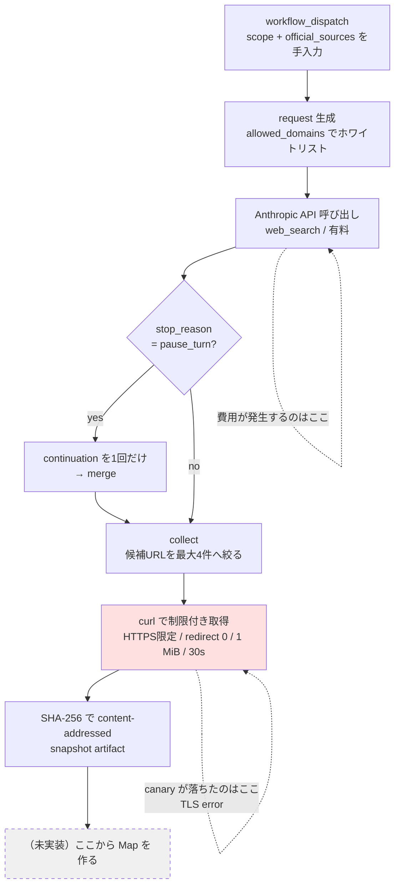
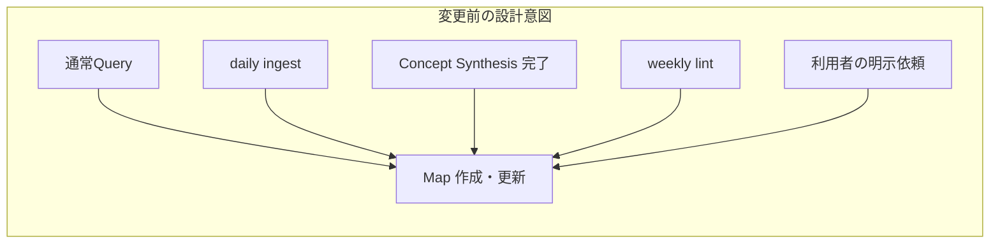
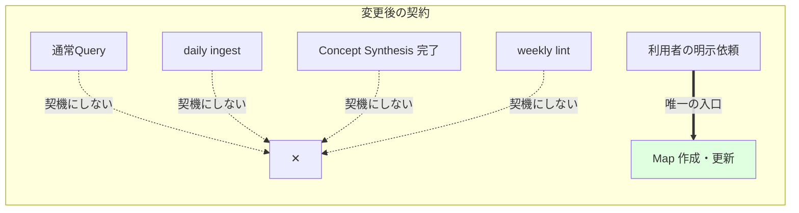

# `7a3879fd` — fix: Domain Map作成を明示依頼に限定する

**一言で**: 3日前に作ったばかりの「有料APIで外部sourceを自動探索してDomain Mapを作る」経路を、
実測1回の失敗を根拠に丸ごと撤去し、Map作成の入口を「利用者が明示的に依頼したときだけ」に
戻したcommit。616行削除・53行追加という比率が示す通り、機能追加ではなく**能力の意図的な後退**である。
ただし後退の仕方が重要で、消したコードの代わりに「なぜ消したか・何を満たせば戻すか」を
文書とテストへ書き込んでいる。

## Background — 変更前の世界

### 深い背景（Domain Map周りを知っているならskip可）

このrepositoryは Obsidian vault（`lilpacy/`）を LLM が保守する wiki として運用している。
その中で **Domain Map** は特殊な成果物で、`lilpacy/CLAUDE.md:267` 以降が完成条件を厳しく定義している。

- 完成Mapは**経時View**（概念の発展経緯）と**共時View**（`as_of`時点の概念間関係）の
  両方が実質的内容と根拠を持つ必要がある。片方が空・根拠不足ならMapを保存しない。
- 根拠は外部sourceに限る。取得したsourceは `map-sources/<body_sha256>.md` として
  content-addressed な不変snapshotに保存する。
- 「source収集を無期限の前工程に分離せず、原則として同じ試行で完結させる」というルールがある。

つまり Domain Map は「外部sourceを取ってこないと1件も作れない」成果物である。ここが今回の話の起点で、
**自動でMapを作りたいなら自動でsourceを探す必要がある**。

もう一つの前提として、このrepoの自動化は GitHub Actions の workflow 群で動いている
（`daily-wiki-ingest.yml`, `pi-concept-synthesis.yml`, `synthesis-finalize.yml`, `weekly-wiki-lint.yml`）。
これらは `PI_API_KEY` / `PI_MODEL` という secrets/vars 経由で有料の Anthropic API を叩く。
API費用は実際に発生する。

### 直接の背景 — 3日で作って壊した弧

このcommitの直前3〜4 commitが、そのまま前史になっている。

| commit | 内容 |
|---|---|
| `ee07d34b` test: Map source検索経路を実測する | 計測専用branchでweb search経路をprobe |
| `3f198a1b` test: Map source取得境界を実測する | HTTPS限定・サイズ上限つきfetchをprobe |
| `782c2b95` docs: Map source取得の実証結果を記録する | `docs/map-source-acquisition-feasibility.md` を作成 |
| `af107ef4` feat: Map source手動dry-runを追加する | `map-source-dry-run.yml` + `scripts/map_source_dry_run.rb` を production へ |
| `58c29305` fix: Map source取得境界を閉じる | redirect禁止などを締める |
| **`7a3879fd` ← 今回** | 上記を全部削除し、方針を「明示依頼のみ」へ |

feasibility文書が出していた結論は「技術的には成立する」だった。search→fetch→SHA-256 の経路は動く。
ただし1点だけ×が付いていた：**「指示だけで一次・公式sourceに限定できるか → できない」**
（18 URL中に Medium や Wikipedia が混在）。この×への対策が
`allowed_domains` による事前ホワイトリストで、それを実装したのが削除された Ruby script である。

そして今回のcommitが feasibility文書に追記した**4行目の×**が決定打になった。
MCP scopeでの手動canary（run #31355724703）は、source探索を終えた後
`spec.modelcontextprotocol.io` への TLS 接続エラーで落ち、snapshot artifact も Map も生成しなかった。
つまり **有料APIの費用は払ったが、成果物はゼロ**。

## Intuition — 「技術的成立」と「採用」を切り離した

このcommitの核となる直感は、feasibility文書へ追加された1文に凝縮されている。

> 技術的に成立することと、運用として効率的であることは別である。

削除された pipeline は、こういう形をしていた。落ちた場所が最終段の直前だった点が重要である。



費用は step C で確定するのに、価値が生まれるのは step I である。その間に step G という
**自分では制御できない外部要因**（相手サーバのTLS設定）が挟まっている。しかも step I はまだ実装されていない。
「費用に対する完成Mapの価値を得られなかった」という判断は、この構造から出ている。

もう一つの軸として、Map作成の**entrypoint**を絞ったという点がある。元の設計は複数の契機を想定していた。





ここで注意したいのは、「明示依頼」は**元々も正当なentrypointだった**ことである。
変更前の `CLAUDE.md` も「Map作成・更新の明示依頼は正当なentrypointであり、定期hookを待たず
同じ品質条件で処理する」と書いていた。今回削られたのは**それ以外**の経路である。
だから commit message の「明示依頼に限定する」は、新機能ではなく集合の縮小を意味する。

Curriculum 側の「明示依頼のときだけ生成」という既存パターン（`CLAUDE.md` の表）と
形が揃ったことになる。Map も Curriculum と同じ二段ゲート思想に寄った。

## Code — 何がどう変わったか

ファイル順ではなく「実行能力の除去 → 契約の書き換え → 番人の入れ替え → 履歴の保存」の順で追う。

### 1. 実行能力の除去（-583行）

3ファイルが完全削除された。

| ファイル | 行数 | 役割 |
|---|---:|---|
| `.github/workflows/map-source-dry-run.yml` | -117 | `workflow_dispatch` の手動canary本体 |
| `scripts/map_source_dry_run.rb` | -263 | request組み立て・continuation・merge・候補collect |
| `test/map_source_dry_run_test.rb` | -203 | 上記の正常系/準正常系/異常系テスト |

削除されたRubyには、けっこう neat な防御コードが入っていた。たとえば URL正規化による
path root 逸脱の遮断。

```ruby
def allowed_https_url(value)
  return if String(value).length > 2_048 || String(value).match?(/[[:cntrl:]]/)
  uri = URI.parse(String(value))
  host = uri.host&.downcase
  return unless uri.scheme == "https" && host && uri.userinfo.nil? && uri.port == 443
  return if uri.query || uri.path.include?("%") || uri.path.include?("\\")
  return if uri.path.split("/").any? { |segment| segment == "." || segment == ".." }
  return unless @sources.any? { |root| source_root_allows?(root, host, uri.path) }
  ...
```

`github.com/example-org` を許可したときに `github.com/other/example` を弾く
（同一domainの別publisher問題）ためのロジックまで書かれ、テストもあった。
`pause_turn` を無限に継続しない上限（1回だけ）も実装済みだった。
**これらは動く状態で捨てられている。** feasibility文書が「再検討時にも失ってはいけない取得境界」
として境界図を残しているのは、この実装知識を文書へ蒸留し直すためである。

削除された workflow 側も `permissions: contents: read` のみで、
`git add/commit/push` を一切含まない設計だった（テストが `refute_match(/git (?:add|commit|push)/, workflow)`
で保証していた）。つまり repository を書き換えるリスクはそもそも無かった。
撤去理由はセキュリティではなく純粋に費用対効果である。

### 2. 契約の書き換え — `lilpacy/CLAUDE.md`

削除されたのは workflow 一覧の説明3行と、将来設計を語っていた段落。追加されたのが新しい契約文。

```diff
-Map作成・更新の明示依頼は正当なentrypointであり、定期hookを待たず同じ品質条件で処理する。将来の
-自動Map maintenanceも既存ingestやConcept Synthesisの責務へ混ぜず、Concept Synthesis完了後に起動する
-独立workflowとし、明示経路と同じscope解決・builder・lintへ合流させる。自動workflowはまだ未実装である。
+Map作成・更新は、利用者が明示的に依頼した場合だけ実行する。通常Query、daily ingest、Concept Synthesis、weekly lint
+の実行や完了をMap作成・更新の契機にしない。`PI_API_KEY`を使う有料APIでのsource探索・Map自動生成は、
+費用対効果が確認できるまで保留し、workflowを置かない。自動化を再検討する場合は、source選定精度、完成Map
+1件あたりの費用、経時・共時2 Viewの完結率を実測し、新しい意思決定として明示的に採用する。
```

`CLAUDE.md` はこのrepoにおける**エージェントの実行契約**なので、ここを書き換えることが
実質的な振る舞いの変更になる。ファイルを消すだけでは「エージェントが自発的にMapを作ろうとする」
可能性が残るため、禁止を明文化する必要があった。「workflowを置かない」という一文が、
将来のエージェントが親切心で再実装するのを防いでいる。

### 3. 番人の入れ替え — `test/ci_workflow_contract_test.rb`

ここが設計的にいちばん面白い部分である。テストが**削除ではなく差し替え**られた。

```ruby
# before: workflow の中身が正しいことを検証していた
def test_正常系_map_source_dry_runは手動実行でartifactだけを生成する
  workflow = REPO_ROOT.join(".github/workflows/map-source-dry-run.yml").read
  assert_includes workflow, "workflow_dispatch:"
  ...

# after: 「存在しないこと」と「方針が書かれていること」を検証する
def test_正常系_map作成は利用者の明示依頼だけを入口にする
  policy = REPO_ROOT.join("lilpacy/CLAUDE.md").read
  design = JSON.parse(REPO_ROOT.join("docs/.../automatic-domain-map-maintenance.design-case.json").read)

  assert_includes policy, "Map作成・更新は、利用者が明示的に依頼した場合だけ実行する。"
  assert_includes policy, "通常Query、daily ingest、Concept Synthesis、weekly lint"
  assert_equal "deferred", design.dig("project", "status")
  assert_equal "利用者による明示的なMap作成・更新依頼", design.dig("project", "current_decision", "active_entrypoint")
  refute REPO_ROOT.join(".github/workflows/map-source-dry-run.yml").exist?
  refute REPO_ROOT.join("scripts/map_source_dry_run.rb").exist?
end
```

テスト名（`test_正常系_...`）が同じスロットに残り、対象だけが workflow の YAML から
**方針文書 + ファイルの不在**へ移った。これは「決定をテストで固定する」パターンで、
誰か（あるいは将来のエージェント）が workflow を復活させたり `CLAUDE.md` の一文を消したりすると
CI が落ちる。撤去が「なんとなく消えた」状態に劣化しないための仕掛けである。

### 4. 履歴の保存 — design-case JSON と log.md

`automatic-domain-map-maintenance.design-case.json` は `status` を
`design_review` → `deferred` に落とし、`current_decision` ブロックを新設した。

```json
"current_decision": {
  "decided_at": "2026-08-10",
  "active_entrypoint": "利用者による明示的なMap作成・更新依頼",
  "deferred_entrypoints": ["通常Query", "daily ingest", "Concept Synthesis completion", "weekly lint"],
  "reason": "PI_API_KEYを使うsource探索は、API費用に対して完成Mapを得られず、現時点の費用対効果を採用できない。",
  "resumption_condition": "source選定精度、完成Map 1件あたりの費用、経時・共時2 Viewの完結率を実測し、新しい意思決定として自動化を採用する。",
  "history_note": "以下の自動maintenance設計は、再検討時の履歴として保持するが、現在の実行契約ではない。"
}
```

注目すべきは `history_note` である。この JSON の残り（`success_conditions` SC1〜SC4、
9段階の `pipeline` stages、`facts`）は**そのまま残されている**。SC1 は今も
「利用者が個別に Map 作成を指示しなくても…」と自動化を前提に書かれたままだ。
`history_note` は「以下は履歴であって現在の実行契約ではない」と読み手に告げる**注意書き**として機能し、
矛盾を消すのではなくラベルを貼って共存させている。設計プロセスの成果を捨てずに無効化する扱いである。

feasibility文書のセクション見出しも、同じ意図でリネームされている。

| before | after |
|---|---|
| `## 採用する境界` | `## 将来再検討する場合にも必要な境界` |
| `## 未解決` | `## 再開条件` |

「採用する」から「将来再検討する場合にも」への変更で、境界図が現在稼働する仕様ではなく
アーカイブされた知識になったことを示している。`## 未解決`（=いつか解く宿題）が
`## 再開条件`（=これを満たしたら戻る）になったのは、曖昧な保留を測定可能な条件へ変えたということ。
再開に必要な3つの実測項目が箇条書きで明示された。

`lilpacy/log.md` には追記専用ledgerとして1エントリが加わった。

```
## [2026-08-10] ops | 有料APIによるDomain Map自動生成を保留
```

最後の1行が撤去のスコープを限定している——
「Domain Mapの経時・共時View、外部source、Curriculumとの分離は維持し、**Map自動生成だけを**一時的に断念する」。
Domain Map という概念自体は生きていて、諦めたのはその自動生成だけである。

## この変更を踏まえた次の一手

レビュー観点で見るなら、いちばん気になるのは **design-case JSON の内部整合性**である。
`status: deferred` と `history_note` は付いたが、SC1（「指示しなくてもMapが作成される」）や
`pipeline.current_stage: "ui_behavior"` は自動化前提のまま残っている。今は注意書きで運用できているが、
数か月後にこのJSONを読むエージェントが `current_decision` を読み飛ばして SC1 を実行しようとする
リスクは残る。weekly lint が「ページ間の矛盾」を検出する仕組みなので、そこで拾えるか確認しておく価値がある。

もう一つは**再開条件の測定可能性**。「完成Map 1件あたりのAPI費用」を測るには完成Mapが1件必要だが、
そのMapを作る自動経路はいま削除されている。明示依頼での手動Map作成から費用を推定する
という順序になるはずで、この鶏卵関係が意識されているかは文書からは読み取れない。
実際、Map作成の手動フロー自体（`maps/` への保存）は `CLAUDE.md:290` 以降の手順として生きているので、
まずそこで1件作ってみるのが自然な次手だろう。

技術的には、削除された Ruby の URL 検証ロジック（同一domain別publisherの遮断、
path traversal の正規化前遮断、`pause_turn` の1回上限）は再実装コストが高い部分である。
feasibility文書の境界図はASCII figureで境界を残しているが、コードレベルの細かい判定条件までは
書き戻されていない。再開時に `git show af107ef4` から拾い直せることを、
文書のどこかに書いておくと安全度が上がる。

---

## Quiz — 理解の確認（3問）

### Q1. このcommitで `map-source-dry-run.yml` が削除された理由として最も正確なのはどれか。

- **A.** workflow が `contents: write` 権限を持っており、repositoryを勝手に書き換える危険があったため
- **B.** web search が非公式sourceを混入させる問題を `allowed_domains` で解決できず、技術的に成立しなかったため
- **C.** 技術的には成立していたが、手動canaryが取得段のTLSエラーで完成Mapを生成できず、API費用に見合う価値が得られなかったため
- **D.** `PI_API_KEY` が失効し、workflow が実行できなくなったため

### Q2. このcommitの後、`daily-wiki-ingest.yml` が実行され新しいsummaryが追加された。このとき Domain Map はどうなるか。

- **A.** ingest後に自動でMap候補が検出され、経時・共時2 Viewが揃えばMapが作成・更新される
- **B.** Map候補は検出されるが、`PI_API_KEY` を使うsource探索が保留中なので探索だけskipされる
- **C.** Map作成・更新は一切起動しない。利用者が明示的に依頼するまで何も起きない
- **D.** Concept Synthesis完了を待ってから、独立workflowとしてMap作成が起動する

### Q3. 将来のエージェントが「自動Map生成は良いアイデアだ」と考えて `map-source-dry-run.yml` を復元し、`CLAUDE.md` の該当段落を元の文面に戻したとする。何が起きるか。

- **A.** 何も起きない。削除されたのは実行可能コードだけなので、復元は自由にできる
- **B.** `test/ci_workflow_contract_test.rb` の `test_正常系_map作成は利用者の明示依頼だけを入口にする` が失敗する。`refute ...exist?` と `CLAUDE.md` の文面 assert の両方に引っかかる
- **C.** design-case JSON の `status: deferred` が自動で `design_review` に戻り、テストは通る
- **D.** `lilpacy/log.md` が追記専用のため、log整合性チェックで失敗する

---

*（想定される正解: Q1=C, Q2=C, Q3=B）*

このあと本来は、あなたの回答を受けて分岐します——全問正解なら「この explainer を wiki に取り込むか」を
確認して終了、誤答があればその領域（例: Q2 を A/B と答えたなら「entrypoint の縮小」と
「source探索の保留」を別レイヤーの変更として区別できていない）に対して、
削除前後の entrypoint 判定を並べて叩けるマイクロワールドを提案します。

これは非対話テスト実行のため、クイズを提示した時点で停止します。
