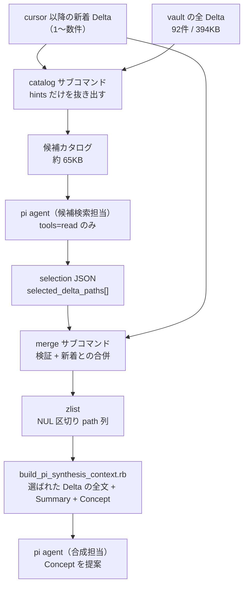

# `scripts/pi_synthesis_candidates.rb` を読み解く

一言でいうと、このファイルは **Concept 合成の「候補検索」段を成立させるための2つの小さな道具**です。
LLM に vault 全体の Delta を見せたいが全文は入らない、という制約を、
「安いカタログで探させて、選ばれたものだけ全文を読ませる」という二段構えで解いています。

---

## Background — なぜこれが存在するのか

### 深い背景（この vault の3層構造を知っているならスキップ可）

この repo は LLM Wiki です。`lilpacy/` の中に3種類の層があります。

| 層 | 例 | 性質 |
|---|---|---|
| Raw Source / query transcript | `lilpacy/queries/*.md` | 不変。一次情報 |
| Summary / Entity / **Knowledge Delta** | `lilpacy/summaries/`, `lilpacy/deltas/` | 1つの source から機械的に導かれる |
| **Concept** | `lilpacy/concepts/` | 複数 source を横断して初めて見える理解 |

Knowledge Delta は「ある source を取り込んだ結果、wiki の理解が何ビット増えたか」の差分記録です。
実物（`lilpacy/deltas/2026-08-02 DGX SparkとM5 Max 128GBの用途別購入判断--aa14fcbb18cc.md`）はこんな形です。

```markdown
---
source: "[[queries/2026-08-02 DGX SparkとM5 Max 128GBの用途別購入判断]]"
summary: "[[summaries/2026-08-02 DGX SparkとM5 Max 128GBの用途別購入判断]]"
source_snapshot: aa14fcbb...
entities:
  - "[[entities/DGX Spark]]"
---
## Changes

- classification: new | claim: M5 Max 128GBは... | evidence: ... ^kd-5bd34134bd97

## Concept impact hints

- ローカルLLMハードウェア選定に、同容量の統合メモリでも帯域差が逐次生成速度を左右する実測比較を追加候補とする
- ローカルLLMハードウェア選定に、総容量だけでなく同条件のdecode実測を購入判断へ含める根拠を追加候補とする
```

最後の `## Concept impact hints` が今回の主役です。
これは Delta を書いた時点で「この知見は将来どの Concept に効きそうか」を1行ずつ書き残した**検索用の付箋**です。

### 直結する背景 — 48時間ごとに動くパイプラインの困りごと

`.github/workflows/pi-concept-synthesis.yml` が2日に1回動き、Delta から Concept を合成します。
入力の選び方は「前回 finalize した cursor commit から HEAD までに **追加された** Delta」です（`git diff --diff-filter=A`）。

ここに構造的なミスマッチがあります。Concept のルールは workflow のプロンプトにこう書かれています。

> 新規または変更する各 claim は、必ず**2つ以上の独立 source lineage** に解決できる grounding_inputs を持たせます。

つまり Concept は定義上、単独の Delta からは作れません。
ところが cursor 以降の新着 Delta は 1件だけ、ということが普通に起きます。
その1件が「3か月前に取り込んだ別の source の Delta」と組んで初めて Concept になる、という状況で、
新着分しか context に入っていなければ合成は永久に skip され続けます。

素朴な解決は「全 Delta を context に入れる」ですが、これは通りません。実測すると:

- `lilpacy/deltas/` は現在 92 ファイル、全文で **約 394 KB**
- 一方 `build_pi_synthesis_context.rb` の context 予算は `MAX_TOTAL_BYTES = 336_000`

Delta 本文だけで予算を食い潰し、Summary も Entity も既存 Concept も入りません。
**このファイルはこのジレンマの解決策です。**

---

## Intuition — 二段検索

核となる直感は、図書館の使い方と同じです。**書架を全部読むのではなく、まず目録を読む。**



圧縮率が本質です。実際に走らせて測ると:

| 入力 | サイズ |
|---|---|
| 全 Delta 全文 | 394 KB（予算超過） |
| catalog 出力（92件中 90件を収録） | **65 KB** |
| catalog の予算 | 160 KB |

約6分の1。**捨てているのは `## Changes` の claim / evidence 本文と frontmatter の大半**で、
残しているのは path・source リンク・summary リンク・hints だけです。
実際の catalog 出力の1セクションはこうなります。

```markdown
## lilpacy/deltas/2026-08-02 DGX SparkとM5 Max 128GBの用途別購入判断--aa14fcbb18cc.md

source: [[queries/2026-08-02 DGX SparkとM5 Max 128GBの用途別購入判断]]
summary: [[summaries/2026-08-02 DGX SparkとM5 Max 128GBの用途別購入判断]]
- ローカルLLMハードウェア選定に、同容量の統合メモリでも帯域差が逐次生成速度を左右する実測比較を追加候補とする
```

ここで押さえるべき設計判断が2つあります。

**1つ目: hints は「根拠」ではなく「検索手掛かり」。**
catalog の冒頭には自己申告のヘッダが入ります。

> This catalog contains only Delta metadata and non-deterministic Concept impact hints.
> Raw Source and query transcript contents are intentionally excluded.

workflow のプロンプト側も同じ線を引いています ——
「Hintは検索手掛かりであってConcept claimの根拠ではなく、Conceptの最終判断は後続のfull contextで行います」。
hints は Delta を書いた LLM の主観的な予測（non-deterministic）なので、
これを根拠に Concept を書くと検証されていない主張が wiki に入ります。
だから候補検索段は**呼び出す対象を決めるだけ**で、claim を書く権限を持ちません。
テストもこの分離を守っており、`refute_includes catalog, "NEW_RAW_SECRET"` と
`refute_includes catalog, "## Changes"` で Raw と Changes の混入を落とします。

**2つ目: LLM の出力は信用しない。**
候補検索の agent は `--tools read` で読み取りだけを許されていますが、
出力する `selected_delta_paths` は任意の文字列です。`merge` はそれを素通しせず、全件を検証します。

---

## Code — 高レベルウォークスルー

ファイル順ではなく、理解の順で見ます。

### 中心にある検証関数（2クラスに重複定義）

`scripts/pi_synthesis_candidates.rb:53` と `:112` に**同一内容で2回**書かれています。
これがこのファイルの信頼境界です。

```ruby
def validate_delta_path(value)
  path = Pathname(String(value)).cleanpath.to_s
  unless path.start_with?("lilpacy/deltas/") && path.end_with?(".md") && !path.include?("..") && @repo_root.join(path).file?
    raise ArgumentError, "invalid Delta path: #{value}"
  end
  path
end
```

4条件が並んでいます。`lilpacy/deltas/` 配下・`.md` 拡張子・`..` を含まない・実在するファイル。
`cleanpath` を先に通してから `..` を弾いているので、`lilpacy/deltas/../Raw.md` のような
正規化で外へ出る形も、正規化後に prefix 検査で落ちます。
これで LLM ができるのは「既にある Delta ファイルを名指しで選び直すこと」だけになり、
Raw Source や repo 内の任意ファイルを合成 context に引き込むことはできません。
テスト `test_異常系_delta以外の候補pathは拒否される` が `lilpacy/Raw Old.md` の拒否を固定しています。

### `catalog` — 目録を作る（`PiSynthesisCandidateCatalog`）

`build` は `lilpacy/deltas/*.md` を sort して順に舐めます（`:29`）。判断は3つ。

```ruby
hints = concept_hints(path)
next if hints.empty?                                    # hints がない Delta は載せない

metadata = frontmatter(path)
marker = @new_delta_paths.include?(relative) ? " [new]" : ""   # 新着に印を付ける
```

`next if hints.empty?` が第一のフィルタです。検索手掛かりを持たない Delta は
カタログに載せても LLM が判断できないので落ちます（実測で 92件 → 90セクション）。

`[new]` マーカーが第二の要点です。**新着 Delta もカタログに載ります。**
これがないと LLM は「何に対して関連する過去 Delta を探すのか」を知れません。
プロンプトが `[new] の Delta と組み合わせることで…横断できる過去Delta path` を求めているので、
カタログは検索対象と検索クエリの両方を1ファイルで運んでいることになります。

`hints` の抽出（`:77`）は heading ベースの素朴なパーサです。

```ruby
heading = lines.index("## Concept impact hints")
return [] unless heading

lines[(heading + 1)..]
  .take_while { |line| !line.start_with?("## ") }   # 次の ## まで
  .map { |line| line.delete_prefix("- ").strip if line.start_with?("- ") }
  .compact
  .reject { |hint| hint == "none" }
```

`take_while` で次の `##` 見出しまでを切り出し、箇条書き行だけを拾い、
プレースホルダの `none` を捨てます。`none` だけの Delta は結果的に `hints.empty?` になり、
上の `next` でカタログから消えます。

frontmatter 側（`:61`）と リンク抽出（`:71`）は逆に**厳格に落ちる**方針です。

```ruby
def required_link(metadata, field, path)
  link = metadata[field].to_s[/\[\[([^\]]+)\]\]/, 1]&.split("|", 2)&.first
  raise ArgumentError, "Delta #{field} link is missing: #{path}" unless link
  link
end
```

`source` と `summary` の wikilink が取れない Delta があれば例外で CI を止めます。
`[[target|alias]]` 形式に備えて `|` で切って target 側だけを取ります。
`YAML.safe_load` は `permitted_classes: [Date]`, `aliases: false` — frontmatter は自分の repo の
ファイルですが、YAML の任意オブジェクト生成と alias 爆弾は最初から閉じてあります。

そして最後の1行が、このクラスで一番方針の出ている箇所です（`:46`）。

```ruby
raise ArgumentError, "candidate catalog budget exceeded: #{content.bytesize} > #{@max_total_bytes}" if content.bytesize > @max_total_bytes
```

**予算を超えたら書かずに落ちます。** ここが `build_pi_synthesis_context.rb` と対照的です。
あちらは `omitted_paths` で予算に収まらない Delta を静かに落として context を作り続けます（`:197-206`）。
差の理由は役割の違いです。合成 context は「入りきらない分は今回は諦める」で正しさが保てますが、
**候補カタログから Delta が静かに消えると、その Delta は検索されないので永久に Concept へ昇格できません**。
サイレントな取りこぼしは沈黙の劣化になるため、失敗として顕在化させています。
テスト名がそのまま設計意図です: `test_異常系_catalog上限を超える場合は候補を欠落させず失敗する`。

### `merge` — 選択を検証して凍結する（`PiSynthesisCandidateSelection`）

`merge`（`:97`）は4段構えです。

```ruby
selection = JSON.parse(Pathname(selection_path).read)
raise ArgumentError, "schema_version must be integer 1" unless selection.fetch("schema_version", nil) == 1

selected = selection.fetch("selected_delta_paths", nil)
raise ArgumentError, "selected_delta_paths must be an array" unless selected.is_a?(Array)

paths = (@new_delta_paths + selected.map { |path| validate_delta_path(path) }).uniq
Pathname(output_path).binwrite("#{paths.join("\0")}\0")
```

`== 1` は厳密な整数比較なので、LLM が `"1"` と文字列で返しても落ちます。
`@new_delta_paths + selected` の順序も意図的で、**新着が先頭、`uniq` で重複排除**。
候補検索が空配列を返しても新着だけで合成が続きます
（`test_準正常系_関連候補がない場合も新着知識だけで合成を続行できる`）。
つまり候補検索は合成を**強化する**段であって、必須の関門ではありません。

出力形式が `\0` 区切りなのは、この vault の実情に直結しています。
Delta のファイル名は `2026-08-02 DGX SparkとM5 Max 128GBの用途別購入判断--aa14fcbb18cc.md` ——
**空白と日本語を含みます。** 改行区切りにすると shell の word splitting で壊れるので、
NUL 区切りにして workflow 側で `mapfile -d '' -t synthesis_deltas` で読み戻します。
末尾に `\0` を付けているのは、最後の要素にも終端を与えて
`while IFS= read -r -d ''` ループが取りこぼさないようにするためです。

### CLI 境界（`:121`）

```ruby
command = ARGV.shift
repo_root = ARGV.shift
case command
when "catalog"  # catalog REPO_ROOT OUTPUT_PATH NEW_DELTA_PATH...
when "merge"    # merge REPO_ROOT SELECTION_JSON OUTPUT_ZLIST NEW_DELTA_PATH...
```

`$PROGRAM_NAME == __FILE__` ガードがあるので、テストからは `require_relative` でクラスだけ使えます。
両サブコマンドが `!ARGV.empty?` を要求し、コンストラクタも
「新着 Delta が0件なら `ArgumentError`」を課しています。
0件の場合は workflow の `steps.inputs.outputs.found == 'true'` 条件で
そもそもこの step に到達しません。二重の防御です。

---

## この変更を踏まえた次の一手

読むだけで済ませないための観測点を3つ挙げます。

**1つ目、catalog 予算はいつ壊れるか。** 現在 65 KB / 160 KB で使用率 41%、1セクションあたり約 720 バイト。
1日1 Delta のペースなら **残り約 180 Delta ≒ 6か月弱で `catalog budget exceeded` が daily pipeline を落とします。**
落ちるのは意図した設計ですが、そのとき取れる手は今のコードにはありません
（hints の要約・Delta の年代分割・階層カタログのどれかが必要）。
「静かに壊れるより落ちる方がよい」という判断は正しいので、
落ちたときに何をするかを先に決めておくのが次の設計課題です。

**2つ目、`merge` は catalog の内容を検証していない。**
`validate_delta_path` は「実在する Delta か」しか見ないので、
hints がなく catalog から除外された Delta を LLM が（幻覚で）選んでも merge は通します。
実害は「関係ない Delta が合成 context に混じる」程度で、
最終判断は full context 側で行うため壊滅的ではありません。
ただし catalog と merge の間に整合性チェックがないことは意識しておく価値があります。

**3つ目、`validate_delta_path` の重複。**
2クラスに完全同一の定義が置かれています（`:53` と `:112`）。
信頼境界の定義が2箇所にあると、片方だけ強化されたときに気付きにくいので、
module に切り出すのが素直なリファクタです。

---

## Quiz — 理解の確認

5問です。選択肢の番号だけで答えてください。

**Q1.** 候補検索段（`catalog` → pi agent → `merge`）を丸ごと削除し、
cursor 以降の新着 Delta だけを `build_pi_synthesis_context.rb` に渡すようにしたとします。
パイプラインに最初に現れる症状はどれか。

1. context が予算超過して毎回 CI が落ちる
2. Concept が作られず `action=skip` が続く率が上がる
3. Concept は作られるが grounding_inputs が Raw Source を指すようになる
4. Delta の hints が使われなくなり `wiki_pipeline_lint.rb` が失敗する

**Q2.** ある Delta の `## Concept impact hints` セクションの中身が `- none` の1行だけだった。
`catalog` の出力はどうなるか。

1. その Delta のセクションが `source` / `summary` 行だけで出力される
2. `- none` がそのまま hint として出力される
3. その Delta のセクションはまったく出力されない
4. `ArgumentError` で失敗する

**Q3.** vault が育ち、catalog が 160 KB を1バイト超えた。
`build_pi_synthesis_context.rb` が予算超過時にする振る舞いを `catalog` にも採用して
「入りきらない Delta を黙って落とす」ようにすると、何が起きるか。

1. 何も問題ない。合成 context 側と挙動が揃うので一貫性が増す
2. 落ちた Delta は検索対象から消え、Concept へ昇格する機会を恒久的に失う
3. 落ちた Delta は `[new]` マーカーを失うが、次回 cursor で再度候補になる
4. `merge` の `validate_delta_path` が落ちた path を弾いて CI が失敗する

**Q4.** 候補検索の agent が次の JSON を返した。
`{"schema_version":1,"selected_delta_paths":["lilpacy/deltas/../queries/2026-08-02 DGX Spark.md"]}`
（このファイルは実在する）。何が起きるか。

1. `cleanpath` が `lilpacy/queries/...` に正規化し、prefix 検査で落ちて `ArgumentError`
2. `..` を含む文字列として `include?("..")` で落ちて `ArgumentError`
3. 実在するファイルなので通り、query transcript が合成 context に入る
4. `catalog` に載っていない path なので `merge` が整合性チェックで落とす

**Q5.** `merge` の出力を `\0` 区切りではなく改行区切りに変え、
workflow 側も `mapfile -t` で読むように変えたとする。
このリポジトリで実際に起きる不具合はどれか。

1. 何も起きない。path に改行は含まれないので等価である
2. 末尾要素が欠落し、常に最後の Delta が合成対象から漏れる
3. 空白を含むファイル名は問題ないが、日本語ファイル名がエンコーディングで壊れる
4. `mapfile -t` 自体は空白を保つが、`--diff-filter=A` 由来の path が quote されていないため
   後段の展開で壊れる

---

回答をもらったら、正誤だけでなく**どの直感が欠けているか**を診断します。
全問正解なら Step 4（この explainer を wiki に取り込むか / どこかに保存するか）を確認して終了。
誤答があれば、その領域に対してマイクロワールドを提案します。想定している候補は
「catalog の予算消費を Delta 件数を振って可視化する使い捨てスクリプト」（Q3 系の誤答）と
「不正な `selected_delta_paths` を `merge` に流し込んで拒否理由を並べて見せる CLI」（Q4 系の誤答）です。

> 注記: これは非対話テスト実行なので、ここで停止します。
> 通常はユーザーの回答を待ってから分岐します。
