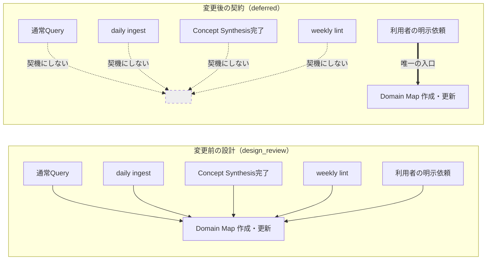
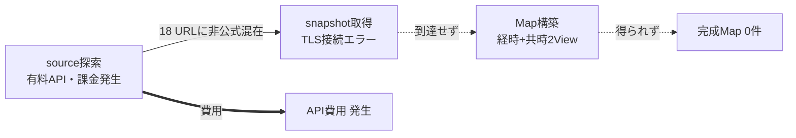

# コミット 7a3879fd「fix: Domain Map作成を明示依頼に限定する」の理解

## TL;DR

- 「Wiki の日常メンテから Domain Map を自動生成する」という設計方針を **撤回し、Map 作成・更新は利用者が明示的に依頼したときだけ実行する** 契約に変更したコミット。
- 撤回の直接の引き金は技術的失敗ではなく **費用対効果の判断**。有料 API（`PI_API_KEY`）で source 探索まで走ったが、TLS 接続エラーで Map 生成前に停止し、「払った API 費用に対して完成 Map が 0 件」という実測が出た。
- 実行可能な自動経路を物理的に消した: workflow (`map-source-dry-run.yml`) と Ruby スクリプト (`scripts/map_source_dry_run.rb`) とその専用テストを削除（8 files changed, 53 insertions, 616 deletions）。
- ただし **知識は消していない**。取得境界（HTTPS 限定・redirect 禁止・1 MiB 上限など）は「将来再検討する場合にも必要な境界」として docs に残し、design case の status を `design_review` → `deferred` に変えて履歴として保持した。
- テストも「workflow がこう書かれていること」から「**その workflow が存在しないこと＋ポリシー文が存在すること**」へ反転させ、方針の逆戻りを CI で検知できるようにしている。

## Background (why)

### 深い背景（Domain Map の運用を知っているならスキップ可）

このリポジトリは LLM が維持する個人 wiki（`lilpacy/`）で、`lilpacy/CLAUDE.md` が実行契約（スキーマ）を担っている。その中に **Domain Map** という成果物がある。`lilpacy/CLAUDE.md:267-296` によれば、Domain Map は外部情報を根拠に分野の Node と Relation を永続化するもので、完成条件が厳しい:

- **経時 View**（概念の発展経緯）と **共時 View**（`as_of` 時点の概念間関係・多重度）の **両方** が外部 source で支持されること。
- どちらかが空・`未構築`・根拠不足なら **Map を保存しない**。

つまり Map は「一次・公式 source を集めてこないと 1 件も完成しない」種類の成果物で、自動化するなら「信頼できる source をどう自動選定するか」が最大の難所になる。

### この変更に直結する狭い背景

コミット履歴を見ると、この変更の直前まで自動化に向けた助走が続いていた。

| コミット | 内容 |
|---|---|
| `ee07d34b` test: Map source検索経路を実測する | 有料 API で source を探せるか実測 |
| `3f198a1b` test: Map source取得境界を実測する | HTTPS 限定・サイズ上限などの取得境界を実測 |
| `782c2b95` docs: Map source取得の実証結果を記録する | feasibility doc を作成 |
| `af107ef4` feat: Map source手動dry-runを追加する | 手動 canary workflow + Ruby スクリプトを追加 |
| `58c29305` fix: Map source取得境界を閉じる | redirect 禁止など境界を厳格化 |
| **`7a3879fd`（本コミット）** | **その一連を保留し、削除する** |

feasibility doc の変更前の版はこう書いていた: 「したがって自動 Map maintenance では、Pi へ shell や write 権限を追加しない。検索・取得は決定的な source acquisition 処理へ分離し…」— **自動化する前提で境界を設計している** 文章である。本コミットはこの前提そのものを差し替えた。

そして `lilpacy/CLAUDE.md` の変更前の記述も同じ方向を向いていた:

> Map作成・更新の明示依頼は正当なentrypointであり、定期hookを待たず同じ品質条件で処理する。将来の自動Map maintenanceも…Concept Synthesis完了後に起動する独立workflowとし…

「明示依頼は **正当な entrypoint の一つ**、自動化も将来やる」という書き方だったことに注目したい。本コミットはこれを「明示依頼 **だけ**」に狭めた。

## Intuition (what)

**このコミットのゴール: 実測で費用対効果が確認できなかった Map 自動生成を、知識と境界だけ残して実行経路から取り除き、Map 作成の入口を人間の明示依頼 1 本に絞る。**

### 何が entrypoint から外れたのか

変更前は「Wiki の日常活動が Map 生成の契機になりうる」という設計だった。変更後は、それらすべてが契機ではなくなる。



### なぜ止めたのか（技術的成否と経済的成否の分離）

ここがこのコミットの一番おもしろい論点である。feasibility doc の実測表は、**技術的にはほぼ「できる」と言っている**。

| 観測項目 | 結果 |
|---|---|
| 有料 API で source 候補を検索できるか | できる |
| 指示だけで一次・公式 source に限定できるか | **できない**（18 URL に Medium・Wikipedia が混在、`stop_reason: max_tokens`） |
| 選択済み source を制限付きで取得できるか | できる（HTTPS 限定・redirect 5 回・接続 10 秒・全体 30 秒・1 MiB 上限で成功） |
| content-addressed snapshot 用 hash を作れるか | できる（14,904 bytes、SHA-256 算出済み） |
| **MCP scope の手動 canary で Map 作成まで完結したか** | **できない**（`spec.modelcontextprotocol.io` の TLS 接続エラーで失敗、snapshot artifact も Map も生成せず）← 本コミットで追加された行 |

本コミットが doc に書き加えた一文が判断の核心である:

> 技術的に成立することと、運用として効率的であることは別である。手動canaryでは有料APIによるsource探索後、取得候補のTLSエラーでMap作成前に停止し、費用に対する完成Mapの価値を得られなかった。

パイプラインは「検索 → 取得 → Map 構築」の直列で、検索段（課金される段）を通過した後に取得段で落ちた。つまり **費用は先に発生し、成果物は後段の失敗で 0 になる** 構造だった。1 回の失敗で永久に諦めたわけではなく、「この形の投資を今は採用しない」という意思決定として記録されている。



## Code (how)

ファイル順ではなく「契約 → 記録 → 実装削除 → テスト」の順で見ると意図が追いやすい。

### 1. 実行契約の書き換え（`lilpacy/CLAUDE.md`）

変更の中心はこの 4 行。エージェントが従うルールなので、ここが変わると挙動が変わる。

```
Map作成・更新は、利用者が明示的に依頼した場合だけ実行する。通常Query、daily ingest、Concept Synthesis、weekly lint
の実行や完了をMap作成・更新の契機にしない。`PI_API_KEY`を使う有料APIでのsource探索・Map自動生成は、
費用対効果が確認できるまで保留し、workflowを置かない。自動化を再検討する場合は、source選定精度、完成Map
1件あたりの費用、経時・共時2 Viewの完結率を実測し、新しい意思決定として明示的に採用する。
```

3 つのことを同時にやっている点に注意したい。(a) 許可された入口を 1 つに限定、(b) 契機にしてはいけないものを **名前を挙げて禁止**、(c) 再開に必要な実測項目を宣言。(b) が重要で、「自動化しない」だけだと解釈の余地が残るが、禁止対象を列挙すると将来のエージェントが「daily ingest のついでに Map も作っておこう」と判断できなくなる。

同じファイルの workflow 一覧からも `map-source-dry-run.yml` の 3 行の説明を削除している（`lilpacy/CLAUDE.md:258` 付近）。ドキュメント上の存在も消えた。

### 2. 判断の記録（`docs/map-source-acquisition-feasibility.md`）

見出し自体が書き換わっているのが読みどころ。

| 変更前の見出し | 変更後の見出し |
|---|---|
| `## 採用する境界` | `## 将来再検討する場合にも必要な境界` |
| `## 未解決` | `## 再開条件` |

「採用する」→「再検討時にも失ってはいけない」への格下げで、境界仕様（scope ツリー、`contents: read` のみ、repository を書き換えない等）は本文をほぼそのまま残している。**設計知識は資産として保持し、実行権限だけ取り上げる** という切り分けである。

`## 未解決` → `## 再開条件` の書き換えはさらに踏み込んでいて、「まだ答えが出ていない問い」を「これを満たせば再開してよいという条件」に変換している。列挙された 3 項目はそのままテストと design case にも現れる:

- source 選定精度
- 完成 Map 1 件あたりの API 費用
- 経時・共時 2 View を同じ試行で完成できる割合

### 3. design case の状態遷移（`...automatic-domain-map-maintenance.design-case.json`）

`status` を `design_review` → `deferred` にし、`current_decision` オブジェクトを新設した。

```json
"status": "deferred",
"current_decision": {
  "decided_at": "2026-08-10",
  "active_entrypoint": "利用者による明示的なMap作成・更新依頼",
  "deferred_entrypoints": ["通常Query", "daily ingest", "Concept Synthesis completion", "weekly lint"],
  "reason": "PI_API_KEYを使うsource探索は、API費用に対して完成Mapを得られず、現時点の費用対効果を採用できない。",
  "resumption_condition": "source選定精度、完成Map 1件あたりの費用、経時・共時2 Viewの完結率を実測し、新しい意思決定として自動化を採用する。",
  "history_note": "以下の自動maintenance設計は、再検討時の履歴として保持するが、現在の実行契約ではない。"
}
```

`success_conditions` 以下の自動 maintenance 設計は **1 行も削っていない**。代わりに `history_note` を先頭に置いて「以下は現在の実行契約ではない」と読み手に宣言する方式を採った。設計文書を削除すると再検討時に再発明が必要になるので、無効化のマーカーだけ被せている。

### 4. 実行経路の削除

| 削除対象 | 行数 | 何だったか |
|---|---|---|
| `.github/workflows/map-source-dry-run.yml` | 117 | `workflow_dispatch` 手動 canary。scope と official_sources を入力に取り、検索 → 取得 → artifact upload の 4 step |
| `scripts/map_source_dry_run.rb` | 263 | 入力検証と境界の実装。`MAX_SEARCHES = 2`, `MAX_SOURCES = 4`, `MAX_BYTES_PER_SOURCE = 1_048_576`, `MAX_REDIRECTS = 0`, domain / path root の validation |
| `test/map_source_dry_run_test.rb` | 203 | 上記スクリプトの専用テスト |

削除された workflow は `permissions: contents: read` のみ、artifact 出力だけで repository を書き換えない設計だった。**害はなかったが、有料 API を叩ける実行可能な経路が残っていること自体を消した** のがポイント。ポリシー文だけで「やらない」と書いても、実行できるボタンが残っていれば誰か（人間でもエージェントでも）が押せてしまう。

### 5. テストの反転（`test/ci_workflow_contract_test.rb`）

このコミットで一番示唆的な変更。テスト名から変わっている。

```ruby
# 変更前: workflow が正しく書かれていることを検証
def test_正常系_map_source_dry_runは手動実行でartifactだけを生成する
  workflow = REPO_ROOT.join(".github/workflows/map-source-dry-run.yml").read
  assert_includes workflow, "workflow_dispatch:"
  assert_includes workflow, "--proto '=https'"
  # ...

# 変更後: 経路が存在しないこととポリシーが存在することを検証
def test_正常系_map作成は利用者の明示依頼だけを入口にする
  policy = REPO_ROOT.join("lilpacy/CLAUDE.md").read
  design = JSON.parse(REPO_ROOT.join("docs/interactive-design-review/automatic-domain-map-maintenance.design-case.json").read)

  assert_includes policy, "Map作成・更新は、利用者が明示的に依頼した場合だけ実行する。"
  assert_includes policy, "通常Query、daily ingest、Concept Synthesis、weekly lint"
  assert_equal "deferred", design.dig("project", "status")
  assert_equal "利用者による明示的なMap作成・更新依頼", design.dig("project", "current_decision", "active_entrypoint")
  refute REPO_ROOT.join(".github/workflows/map-source-dry-run.yml").exist?
  refute REPO_ROOT.join("scripts/map_source_dry_run.rb").exist?
end
```

テストが `assert_includes`（あるべき記述の検証）から `refute ... exist?`（**あってはならないファイルの不在検証**）へ反転している。この 2 行の `refute` があるので、将来誰かが workflow を復活させたら CI が落ちる。「保留」という判断を、レビュー時の記憶ではなく実行される検査として固定した形。あわせてポリシー文の正確な一文を `assert_includes` で固定しているため、`lilpacy/CLAUDE.md` からこの契約文を消すこともできない。

### 6. log への追記（`lilpacy/log.md`）

wiki の追記専用台帳に `## [2026-08-10] ops | 有料APIによるDomain Map自動生成を保留` エントリを追加。更新・削除・判断の 4 行で、最後の 1 行が範囲を明確にしている:

> 判断: Domain Mapの経時・共時View、外部source、Curriculumとの分離は維持し、Map自動生成だけを一時的に断念する。

**Domain Map という成果物自体をやめたのではない**（そこが誤読しやすい）。Map の品質条件も Curriculum との関係も無傷で、止めたのは「自動生成」だけである。

## Quiz (check)

中規模の方針変更なので 3 問。本文の言い換えでは解けない形にしてある。

**Q1.** 本コミットの後、利用者が「MCP について Domain Map を作って」と明示的に依頼した。何が起きるのが正しいか。

- **A.** Map 作成は保留中なので拒否され、何も作られない
- **B.** Map 作成・更新は実行される。ただし `PI_API_KEY` を使う有料 API での source 自動探索は行わない
- **C.** daily ingest の次回実行を待ってから Map が作られる
- **D.** design case の status が `deferred` なので、Map の品質条件（経時・共時 2 View）が緩和されて作られる

**Q2.** 削除された `map-source-dry-run.yml` は `permissions: contents: read` だけで、artifact を出すのみで repository を書き換えなかった。それでも削除したのはなぜか。最も的確な説明はどれか。

- **A.** `contents: read` でも repository への書き込みが起きうる脆弱性があったため
- **B.** ファイルが 117 行あり、リポジトリのサイズ削減が必要だったため
- **C.** 害はないが、有料 API を叩ける実行可能な経路が残っていると意図せず起動されうるため。ポリシー文だけでは経路の存在を打ち消せない
- **D.** workflow の取得境界（HTTPS 限定・1 MiB 上限）が不十分で、危険だと判明したため

**Q3.** 半年後、別の担当者が「Map 自動生成を再開したい」と考えた。本コミットが残した仕組みに従うと、その人が最初にやるべきことは何か。

- **A.** `map-source-dry-run.yml` を git 履歴から復元して CI を通す
- **B.** source 選定精度・完成 Map 1 件あたりの API 費用・経時共時 2 View の完結率を実測し、費用対効果を新しい意思決定として明示的に採用する
- **C.** design case の `status` を `deferred` から `design_review` に戻し、`current_decision` を削除する
- **D.** `lilpacy/CLAUDE.md` の禁止リストから daily ingest だけを外し、段階的に自動化する

---

（正解と各選択肢の理由は、回答を受け取ってから提示する。誤答があった領域については「費用が先に発生し成果物が後段で 0 になるパイプライン構造」を手元で叩けるマイクロワールド — 各段の成功率を変えて期待費用と期待 Map 数を出す小さなスクリプト — を作ることを提案する予定。）

**注記（非対話テスト実行のため）**: 本来はここでユーザーのクイズ回答を待ち、全問正解なら Step 4（この explainer を wiki に取り込むか／Markdown として残すかの確認）へ、誤答があれば該当領域のマイクロワールド提案（Step 3）へ分岐する。今回は回答を得られないため、クイズ提示の時点で停止する。

## 次の一手

- **レビューで見るべき点**: `refute ... exist?` によるテストは強力だが、ファイル名の直接参照なので、別名（例 `map-source-canary.yml`）で同等の workflow を追加すれば通ってしまう。禁止を名前ではなく性質（`PI_API_KEY` を参照する workflow が存在しないこと）で表現する方が堅い可能性がある。
- **残った未解決点**: 「一次・公式 source をプロンプトだけで限定できない」問題は未解決のまま。再開条件の 3 項目のうち「source 選定精度」はこの問題の言い換えであり、allowlist 方式（既知の公式 domain を人間が与える）以外の解が示されていない。
- **確認しておくとよいこと**: `lilpacy/CLAUDE.md` の他の箇所に「自動 Map maintenance」を前提にした記述が残っていないか。`maps/` や `map-sources/` の説明（`lilpacy/CLAUDE.md:87`, `:275` 付近）は Map 自体の運用なので有効だが、起動契機に触れる記述があれば矛盾になる。
- **発展の方向**: この「技術的成立と経済的成立を分離し、実行経路を消してポリシーと再開条件を残す」パターンは、LLM を使う他の自動化（Concept Synthesis や weekly lint の AI 点検）にも適用できる判断フレームになっている。design case の `current_decision` スキーマを他の保留判断でも再利用できるか検討する価値がある。
