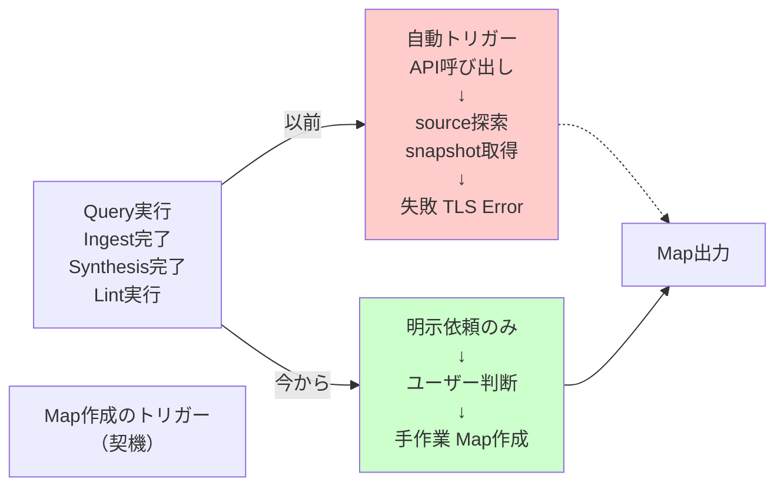
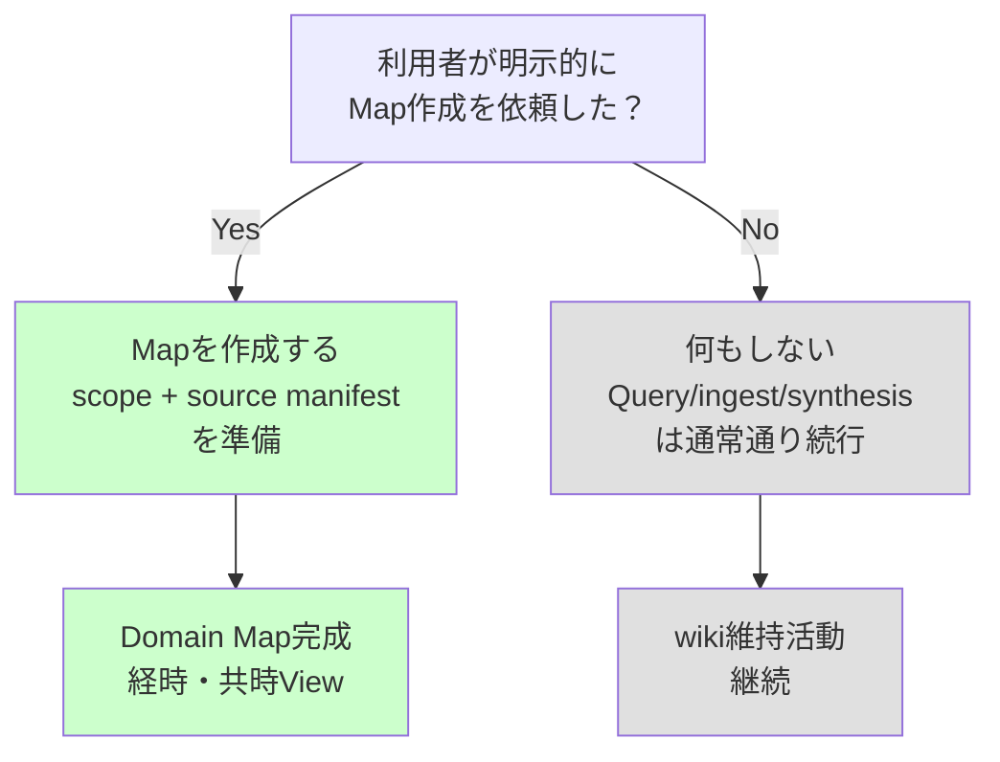

# Domain Map作成を明示依頼に限定する

## TL;DR

このコミットは、Domain Map の**自動生成パイプラインを一時的に停止し、利用者の明示的な依頼時だけに限定する方針転換**です。具体的には：

- GitHub Actions の自動 Map source 探索ワークフロー（`map-source-dry-run.yml`）と関連スクリプトを削除
- 手動 canary 実行で TLS エラーにより完成 Map を得られず、API 費用に対する価値が見合わないと判定
- Map 作成・更新のエントリーポイントを「利用者の明示依頼」だけに制限
- 通常 Query、daily ingest、Concept Synthesis、weekly lint の実行や完了を Map 作成の契機にしない
- 将来の自動化再開に向けて、必要な測定指標（source 選定精度、1 Map あたりの API 費用、2 View 完結率）を明記

## Background：なぜこの変更が存在するのか

### Domain Map の役割

lilpacy wiki では、知識ネットワークを 2 つの視点で視覚化する Domain Map を運用します：

- **経時 View（diachronic）**：概念や技術の歴史的発展を時系列で追跡
- **共時 View（synchronic）**：現在の体系内での関係性・構造を示す

Map 自体は人間が手で作るか、外部 source（論文・仕様・ブログ）から導出されます。

### 自動化の試み

従来、Map 作成は利用者が明示的に依頼する方式でした。しかし、この変更の前の設計では、自動化の可能性を探っていました：

- **Concept Synthesis や daily ingest の完了時に自動で Map を生成する**ことで、キュレーション作業の負荷を減らす
- Anthropic API と web search tool を使って、scope に関連する公式 source を自動探索
- 探索した source の snapshot を取得し、Map 作成に必要な input として用意
- 人間が最終的に Map を生成する前段階までを自動化

このアプローチは技術的に検証する価値があり、複数の小規模 probe で部分的に実証されました。

### 現実との衝突

しかし 2026-08-10 の手動 canary 実行で、理想と現実の間に大きなギャップが明らかになりました：

1. **source 選定精度の問題**：prompt だけでは「公式・一次 source」と「記事・ブログ」を完全に分けられない
2. **完全性の欠如**：実際の Map 作成まで到達しなかった（TLS エラーで途中終了）
3. **費用対効果**：API を呼び出して探索した結果、成功した Map を得られず、費用を回収できない

## Intuition：何をゴールとしているのか

**ゴール：お金を使わないで Map を作る**

より正確には、「API コストが確実に回収される運用設計まで、自動化を見送る」という意思決定です。

これは「自動化は悪い」という結論ではなく、「現時点の自動化は、投資対効果が負である」という計測に基づいた判断です。

### 3 つのレイヤー図



### Decision Tree



## Code：何が削除・変更されたか

### 1. ワークフロー削除：`.github/workflows/map-source-dry-run.yml`

**削除内容**：

```yaml
name: Map Source Dry Run
on:
  workflow_dispatch:
    inputs:
      scope:
      official_sources:
```

このワークフローは：
- GitHub Actions の手動実行ボタンから、scope と公式 source の root を指定
- `PI_API_KEY`（Anthropic API key）を使って web search ツールを呼び出し
- 検索結果から snapshot を取得
- artifact として保存（repository には書き込まない）

削除理由：API 呼び出しによる自動探索が、完成 Map を生成できず費用に合わないため

### 2. スクリプト削除：`scripts/map_source_dry_run.rb`

**削除内容**：Ruby で実装された 4 つの処理

| クラス | 責務 |
|--------|------|
| `MapSourceSearchRequest` | scope と allowed source から、web search tool 用の JSON request を生成 |
| `MapSourceContinuationRequest` | API response が `pause_turn` の場合、continuation request を作成 |
| `MapSourceResponseMerge` | pause_turn → continuation → merged response の処理 |
| `MapSourceCandidateCollector` | API response から URL を抽出、HTTPS と source root の検証、manifest と zlist を出力 |

このスクリプトは source 探索と検証ロジックの中核でした。削除により、自動探索パイプライン全体が非機能化します。

### 3. テスト削除：`test/map_source_dry_run_test.rb`

削除されたテストは 18 個、203 行：

- Request 生成の正常系・異常系
- Continuation 処理と merge
- URL validation（path traversal、encoding、domain root 検証）
- source 候補の最大数制限

### 4. テスト変更：`test/ci_workflow_contract_test.rb`

**Before**：
```ruby
def test_正常系_map_source_dry_runは手動実行でartifactだけを生成する
  workflow = REPO_ROOT.join(".github/workflows/map-source-dry-run.yml").read
  assert_includes workflow, "workflow_dispatch:"
  # ... 10行のアサーション
end
```

**After**：
```ruby
def test_正常系_map作成は利用者の明示依頼だけを入口にする
  policy = REPO_ROOT.join("lilpacy/CLAUDE.md").read
  design = JSON.parse(REPO_ROOT.join("docs/...").read)
  
  assert_includes policy, "Map作成・更新は、利用者が明示的に依頼した場合だけ実行する。"
  assert_includes policy, "通常Query、daily ingest、Concept Synthesis、weekly lint"
  assert_equal "deferred", design.dig("project", "status")
  assert_equal "利用者による明示的なMap作成・更新依頼", design.dig("project", "current_decision", "active_entrypoint")
  refute REPO_ROOT.join(".github/workflows/map-source-dry-run.yml").exist?
  refute REPO_ROOT.join("scripts/map_source_dry_run.rb").exist?
end
```

テストの対象が「ワークフローの実装の有無」から「ポリシー文書と design case の一貫性、ファイルの削除確認」に変更。

### 5. ポリシー文書変更：`lilpacy/CLAUDE.md`

**削除された行**：
```
- `map-source-dry-run.yml`: 明示されたscopeと公式domain/path rootだけを対象に、外部source候補を検索・取得して
  artifactへ保存する手動canary。
```

**追加された行**：
```
Map作成・更新は、利用者が明示的に依頼した場合だけ実行する。通常Query、daily ingest、Concept Synthesis、weekly lint
の実行や完了をMap作成・更新の契機にしない。`PI_API_KEY`を使う有料APIでのsource探索・Map自動生成は、
費用対効果が確認できるまで保留し、workflowを置かない。自動化を再検討する場合は、source選定精度、完成Map
1件あたりの費用、経時・共時2 Viewの完結率を実測し、新しい意思決定として明示的に採用する。
```

### 6. Design Case ステータス更新

ファイル：`docs/interactive-design-review/automatic-domain-map-maintenance.design-case.json`

```json
"status": "deferred",
"current_decision": {
  "decided_at": "2026-08-10",
  "active_entrypoint": "利用者による明示的なMap作成・更新依頼",
  "deferred_entrypoints": [
    "通常Query",
    "daily ingest",
    "Concept Synthesis completion",
    "weekly lint"
  ],
  "reason": "PI_API_KEYを使うsource探索は、API費用に対して完成Mapを得られず、現時点の費用対効果を採用できない。",
  "resumption_condition": "source選定精度、完成Map 1件あたりの費用、経時・共時2 Viewの完結率を実測し、新しい意思決定として自動化を採用する。",
  "history_note": "以下の自動maintenance設計は、再検討時の履歴として保持するが、現在の実行契約ではない。"
}
```

design case 全体は残し、ステータスを `design_review` → `deferred` に変更。自動化の詳細設計は「将来参照用の履歴」として保持します。

### 7. 実装可能性ドキュメント更新

ファイル：`docs/map-source-acquisition-feasibility.md`

| 項目 | 変更内容 |
|------|---------|
| 結論 | 技術的成立 + 手動 canary での TLS 失敗 → API 費用対効果が見合わないと判定 |
| 実測表 | 新たに行追加：「MCP scope の手動 canary で Map 作成まで完結したか」→ **できない** |
| 採用する境界 → 将来再検討する場合にも必要な境界 | セクション名を変更（現在運用外だが再開時に必要な知識） |
| 未解決 → 再開条件 | 再開するための必要条件：source 選定精度、API 費用、2 View 完結率 |

### 8. ログ記録

ファイル：`lilpacy/log.md`

```
## [2026-08-10] ops | 有料APIによるDomain Map自動生成を保留

- 更新: `CLAUDE.md` — Map作成・更新のentrypointを利用者の明示依頼だけに限定
- 更新: `docs/map-source-acquisition-feasibility.md`, `docs/...design-case.json` — 手動canaryの失敗と費用対効果の判断を記録
- 削除: `.github/workflows/map-source-dry-run.yml`, `scripts/map_source_dry_run.rb` と専用テスト
- 判断: Domain Mapの経時・共時View、外部source、Curriculumとの分離は維持し、Map自動生成だけを一時的に断念
```

## Quiz：理解の確認

以下の問題に答えることで、この変更の本質を理解しているか確認してください。

### Q1. 自動 Map 生成が停止した本質的な理由は何か？

**選択肢：**

A) web search tool がない  
B) API rate limit に引っかかった  
C) TLS エラーで失敗し、API コストに対して完成 Map を得られなかった  
D) Concept Synthesis との重複を避けるため  

**正解**：C

**解説**：削除されたコードを見ると、API 呼び出し自体は機能していました。問題は、手動 canary 実行時に `spec.modelcontextprotocol.io` の TLS 接続エラーで失敗し、有料 API を消費しても完成 Map が生成できなかったこと。これが直接的な判定理由です。

---

### Q2. 通常の Query 実行時、自動で Map が作成されるか？

**選択肢：**

A) はい、常に作成される  
B) はい、query に Map が参照される場合だけ  
C) いいえ、利用者の明示依頼でのみ作成される  
D) いいえ、Map は永遠に手作業のみ  

**正解**：C

**解説**：変更後のポリシーは「Map 作成・更新は、利用者が明示的に依頼した場合だけ実行する。通常 Query、daily ingest、Concept Synthesis、weekly lint の実行や完了を Map 作成・更新の契機にしない。」と明記されています。

---

### Q3. 削除されたコンポーネント（ワークフロー、スクリプト）は、完全に失われるのか？

**選択肢：**

A) はい、二度と使えない  
B) いいえ、git history に残り、将来復活可能  
C) いいえ、branch に移動された  
D) 問題外。削除されたら終わり  

**正解**：B

**解説**：git で削除されても commit 履歴に保存されます。ただより重要なのは、design case ファイルに `history_note` として「自動 maintenance 設計は、再検討時の履歴として保持するが、現在の実行契約ではない」と明記されていることです。つまり、将来自動化を再検討する際には、この設計ドキュメントが参照資料として機能します。

---

### Q4. 将来、自動 Map 生成を再度採用する場合、何を実測する必要があるか？

**選択肢：**

A) web search tool の性能  
B) source 選定精度、1 Map あたりの API 費用、経時・共時 2 View の完結率  
C) API rate limit  
D) Anthropic の価格体系だけ  

**正解**：B

**解説**：`docs/map-source-acquisition-feasibility.md` の「再開条件」セクションと、design case の `resumption_condition` に明記されています：「source 選定精度、完成 Map 1 件あたりの費用、経時・共時 2 View を同じ試行で完成できる割合を実測し、利用者が費用対効果を採用する必要がある。」

---

## 次の一手

### レビューで見るべき点

1. **git log との整合性**：ポリシー文書（CLAUDE.md）、design case、実装可能性ドキュメント、log.md がすべて同じタイミングで更新されているか
2. **テストの一貫性**：削除されたテストの責務が、新しいテストに引き継がれているか（ファイルの有無確認に変更）
3. **削除するだけでなく、再開条件を明記**：単なる「やめます」ではなく「いつ再開するか」の基準が明確か

### 残された検討課題

1. **source 選定精度をどう測定するか**：「公式・一次 source」の定義が分野によって異なるため、一般的な測定方法の検討が必要
2. **2 View 完結率が低い理由の分析**：TLS エラーは network 層の問題か、それとも prompt で指示した source 候補が現実に存在しないのか
3. **代替手段の検討**：API 費用が高すぎるなら、crowd-source や手作業 workflow の効率化の方がコスト効率的か

### 発展の方向

- **計測: 上記の 3 指標を実測する小規模 experiment を設計**
- **代替: API 呼び出しを最小化し、手作業を支援するツール（source 候補の絞り込み UI など）の検討**
- **再評価: 次回 experiment の結果をもとに、新しい意思決定として採用・見送り・改設計を判定**

---

## これは規模の変更なので、クイズは短縮形（3 問）で提示しました。必要に応じてお知らせください。

**クイズを終えて理解が掴めましたか？それとも「ここがまだピンとこない」という領域がありますか？**
