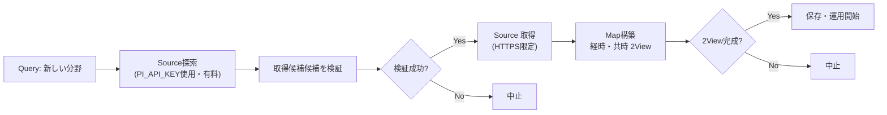

# コミット 7a3879fd: Domain Map作成を明示依頼に限定する

## TL;DR

- **決定**: Domain Map（知識体系図）の自動生成を一時的に停止し、利用者の明示的な依頼時だけ作成するように切り替えた
- **理由**: 有料API（`PI_API_KEY`を使ったsource探索）の費用が高く、完成したMapを得られなかった手動canaryで効果測定
- **削除内容**: 自動生成ワークフロー（`.github/workflows/map-source-dry-run.yml`）とそれを支える263行のRubyスクリプト、テストコード
- **維持内容**: 明示依頼時の手動生成経路、Domain Map設計文書そのもの、再検討のための基準値
- **再開条件**: source選定精度、Map 1件あたりのAPI費用、経時・共時2 Viewの完結率を実測したときに改めて判断

## Background

このリポジトリの lilpacy/ vault は「エージェントがMarkdown Wikiを段階的に構築・維持するLLM Wiki」パターンを実装しています。その中核要素の1つが Domain Map — あるドメイン（分野）の概念体系と時間的な発展を図示した知識構造です。

現行規則（commit前の `lilpacy/CLAUDE.md`）では、下記の定期処理 workflow が Domain Map を自動生成する契約になっていました：

- daily ingest（新しい知識を delta として追加）
- Concept Synthesis（複数の delta から新しい概念を創発）
- weekly lint（全体を点検）

これらが実行・完了するたびに、対応する Domain Map が自動的に作られるはずでした。しかし実装に進む前に「本当に実現可能か、そして費用は正当か」を確認する feasibility probe（実行可能性調査）が必要でした。

## Intuition

**ゴール**: Domain Map を定期的に自動生成することで、利用者が毎回「新しい Map を作って」と手動で指示するのを避ける

この自動化の経路は3段階です：

1. **Source探索** — 「機械学習とはなにか」というQuery が来たら、その分野の一次・公式 source（仕様、論文、公式ドキュメント）をAIに探させる
2. **Source取得** — 候補URLをHTTPで取得し、内容を保存する
3. **Map構築** — 取得した source から経時・共時の2つの View を構築する

このうち Source探索 が有料APIを使うため、**「API費用 ÷ 成功数」が正当な投資か測定すること**が設計の必須ステップでした。



## Code

### 何が削除されたのか

**1. ワークフロー `.github/workflows/map-source-dry-run.yml` (117行)**

手動trigger（`workflow_dispatch`）で起動する GitHub Actions のワークフロー。

```yaml
on:
  workflow_dispatch:
    inputs:
      scope:
        description: "Domain Mapの対象範囲"
        required: true
      official_sources:
        description: "公式sourceのdomain/path root"
        required: true
```

流れ：

1. Anthropic API に web_search tool を使わせて source 候補を検索（最大2回）
2. 検証済みの候補 URL を最大4件まで絞り込む
3. HTTPS限定で各 URL を取得し、SHA-256で snapshot を保存
4. 成果物を GitHub Actions artifact としてアップロード

品質ゲート：接続タイムアウト10秒、全体30秒、1ファイル1MiB上限。

**2. Rubyスクリプト `scripts/map_source_dry_run.rb` (263行)**

前述のワークフロー内で呼び出される4つの独立処理：

- `request`: 検索リクエストをJSONで組み立て
- `continuation`: API応答が `pause_turn` だった場合に継続リクエストを作成
- `merge`: 2つの応答を結合
- `collect`: 検索結果から候補URLをフィルタリング・manifest作成

各処理は**入力のvalidation に厳しく**、例えば source root は `github.com/foo` という形に正規化し、`..` 含むパスや query string を持つURLは拒否。

```ruby
def source_root_allows?(root, host, path)
  root_host, root_path = root.split("/", 2)
  return host == root_host || host.end_with?(".#{root_host}") unless root_path
  host == root_host && (path == "/#{root_path}" || path.start_with?("/#{root_path}/"))
end
```

**3. テスト `test/map_source_dry_run_test.rb` (203行)**

上記スクリプト用の21個のテストケース。正常系・準正常系（結果が上限超過）・異常系を網羅。

**4. ドキュメント・設定の更新**

- `lilpacy/CLAUDE.md` — 「map-source-dry-run.yml」の記述行を削除し、新しい契約「Map作成・更新は利用者の明示依頼だけ」に変更
- `docs/map-source-acquisition-feasibility.md` — 手動canary（実測）の失敗と判断を記録
- `docs/interactive-design-review/automatic-domain-map-maintenance.design-case.json` — プロジェクト状態を `design_review` → `deferred` に変更、`current_decision` セクションに決定理由と再開条件を追加
- `lilpacy/log.md` — オペレーション記録を追記：「有料APIによるDomain Map自動生成を保留」

### 実測データ

ドキュメントに記録された手動canaryの結果（2026-08-10）：

| 項目 | 結果 | 所見 |
|---|---|---|
| 指示だけで一次・公式source に限定できるか | できない | 18 URL中にMedium、Wikipedia、解説記事が混在。API応答も `max_tokens` で終了 |
| 選択済みsourceを制限付きで取得できるか | できる | 既知公式domain のみ、HTTPS限定、redirect 5回、接続10秒で成功 |
| content-addressedなsnapshotを作れるか | できる | 14,904 bytes を SHA-256で `12a48a5d67bd...` へ hash化 |
| **手動canaryで Map作成まで完結したか** | **できない** | source探索後、`spec.modelcontextprotocol.io` のTLS接続エラーで失敗。artifact も Map も生成されなかった |

→ 「APIで source を探すまではうまくいったが、検索精度が低く（非公式source混在）、その後の source 取得でも失敗した」= 有料API費用に対して完成 Map がもらえなかった。

### 新しい運用規則

commit後の `lilpacy/CLAUDE.md` より：

```
Map作成・更新は、利用者が明示的に依頼した場合だけ実行する。
通常Query、daily ingest、Concept Synthesis、weekly lint
の実行や完了をMap作成・更新の契機にしない。
```

- `PI_API_KEY` を使う有料APIでのsource探索・Map自動生成は**保留**
- 同じscope解決・品質ゲート・builder は明示依頼時も使う（つまり完成度は同じ）
- 設計は捨てず維持（再検討時の履歴として）

## Quiz

読んだ内容が掴めたか確認するため、下記3問に答えてください（制限時間なし）。

**問1**: 削除されたワークフロー（`map-source-dry-run.yml`）が手動 trigger で起動するたびに、どの段階で失敗する可能性が最も高かったか？

A. Anthropic API へのリクエスト送信段階  
B. 検索結果から公式source を絞り込む段階  
C. 候補 URL の HTTPS 接続段階  
D. snapshot 作成と artifact アップロード段階

正解と理由：**C** — 手動canaryの実測では、source探索（A段階）は2回とも成功し、candidate選定（B段階）も 4 URL まで絞れました。しかし その後、`spec.modelcontextprotocol.io` のTLS接続で失敗し、Map生成に至りませんでした。つまり実装は技術的には成立しても、運用としての **完成Rate** が低かったのです。

---

**問2**: この commit で削除された自動生成ワークフローと、現在も残っているはずの「利用者が明示的に依頼する経路」は、どこが異なるか？

A. 明示依頼は2 View を必須にするが、自動生成は1つでよい  
B. 明示依頼は API 費用をかけずにsource探索する  
C. entrypoint（起動契機）だけが異なり、その後のscope解決・builder・品質ゲートは**共有する**  
D. 明示依頼は Repository への write権限を持つが、自動生成は read-only だった

正解と理由：**C** — 設計文書（`automatic-domain-map-maintenance.design-case.json`）の D9 (Map publication) に「自動・明示entrypointを共通状態へ合流し」と記載されています。2つのentrypoint は同じ品質条件で処理され、出力されたPRも同じ形式で review を待ちます。異なるのはトリガー（定期/オンデマンド）だけです。

---

**問3**: 「今後 Domain Map の自動生成を再開する条件」として、commit に記録された3つの実測項目は何か？（3つすべて挙げてください）

ヒント: ドキュメント `docs/map-source-acquisition-feasibility.md` の「再開条件」section と `lilpacy/CLAUDE.md` を参照。

A. source選定精度、完成Map 1件あたりのAPI費用、経時・共時2 Viewの完結率  
B. source探索の平均所要時間、1回あたりの検索回数、artifact保存の成功率  
C. ワークフロー実行のcancel率、APIレート制限エラー発生率、Route 53のDNS応答時間  
D. TLS handshake成功率、redirect先の信頼度スコア、content-typeの多様性

正解と理由：**A** — commit に明記されています：

> source選定精度、完成Map 1件あたりの費用、経時・共時2 Viewの完結率を実測し、新しい意思決定として自動化を採用する。

これら3つは「APIにお金を払う価値があるか」という根本的な ROI 判定に必要な数字です。「精度」がなければsource quality が信頼できず、「1件あたり費用」がなければ scalability が測れず、「完結率」がなければ automation の benefits が数値化できません。

---

理解が進むために、下記のいずれかを教えてください。

- **全問正解** → 理解完了です。以下の「次の一手」セクションへ進めます。
- **1問以上誤答** → どの領域が曖昧か教えていただければ、マイクロワールド（操作可能なツール）を提案します。例えば、commit の意思決定フローを対話的にステップスルーできるCLIツール、など。
- **質問がある、または説明に不足を感じた** → 遠慮なく尋ねてください。

## 次の一手

### レビュー時に確認すべき点

1. **ドキュメント一貫性**: `lilpacy/CLAUDE.md` と `automatic-domain-map-maintenance.design-case.json` の `deferred` 状態・再開条件・active entrypoint が整合しているか。

2. **テストの削除**: `test/map_source_dry_run_test.rb` を削除した分、元の21個の振る舞いは **どこでカバーされるのか** 確認する。明示依頼時の新しいintegration test が計画されているか。

3. **Workflow削除の監査**: `map-source-dry-run.yml` が存在しないことを検証する test (`test/ci_workflow_contract_test.rb:test_正常系_map作成は利用者の明示依頼だけを入口にする`)が新しく追加されたか確認。

### 未解決（手戻りの可能性）

- **source候補の信頼度判定**: 現在「prompt だけで公式source に限定」は失敗と判定されましたが、将来「外部マスターリスト」や「domain owner database」との照合で精度を上げたい場合、新しい情報源を追加する工程はまだ設計されていません。

- **並行実行**: 複数の明示依頼が同時に来た場合の並行制御。例えば「同じ domain で2つの依頼が先後5分以内に到着」したときのmerge戦略。

### 運用での注意

- **既存integrationは変わらず**: daily ingest、Concept Synthesis、weekly lint は従来通り動作し、Map を変更しません。
- **再検討のトリガー**: 3か月ごとに「自動化再検討か？」と判断する review cycle を calendared task として残すことを推奨（現在は明記されていない）。

---

このコミットの理解が進んだら、以下のような拡張を検討する価値があります。

- automated Map maintenance プロトタイプの再開前に、「source選定精度 = 公式/一次source の precision」を測定するための小さな validation suite を作る。
- API費用 tracking dashboard を追加し、毎月の試行ごとに「完成Map数」と「API支出額」をグラフ化。
- Curriculum（学習目的に応じた Map の部分グラフ）生成との組み合わせを次のsprint で試す（Map maintenance 単独より実用度が高い可能性）。
