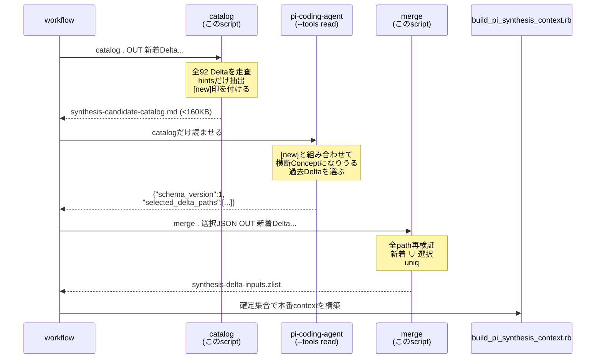

# `scripts/pi_synthesis_candidates.rb` を読む

## TL;DR

- このスクリプトは Concept Synthesis workflow の**候補検索ステージ**を担う。単体で完結する処理ではなく、**LLM 呼び出しを挟んで前半・後半に分かれた 2 つのクラス**が入っている。
- 前半 `PiSynthesisCandidateCatalog`（catalog）は、vault の 92 件の Delta 全部から `## Concept impact hints` だけを抜いた**軽量カタログ**を作る。Raw 本文と query transcript は意図的に入れない。目的は「全 Delta を LLM に検索させたいが、全文は context に入らない」問題の解決。
- 後半 `PiSynthesisCandidateSelection`（merge）は、LLM が選んだ path の JSON を受け取り、**全部を再検証**してから新着 Delta と union し、NUL 区切りリストとして書き出す。
- 一貫した設計思想は**信頼境界**: LLM の出力は untrusted input として扱い、path の妥当性・schema・新着 Delta の生存はすべて決定的な Ruby 側で保証する。
- 予算超過時は truncate ではなく `raise` する。候補を黙って落とすと Concept の判断が静かに間違うため、失敗を選んでいる。

## Background (why)

### 前提: この vault の 3 層構造（既知ならスキップ可）

`lilpacy/` は LLM Wiki です。人間が読む Wiki ページ群を LLM が維持し、その材料として不変な中間表現を挟む構造になっています。`lilpacy/CLAUDE.md` の 3 層マッピングでは、ページ種別ごとに役割が分かれています。

| ページ種別 | 中身 | 誰が書くか |
|---|---|---|
| `queries/`, Raw source | 一次情報。不変 | 人間が投入 |
| `deltas/` | 1 件の source snapshot から抽出した知識差分。**不変**（snapshot hash 単位） | daily ingest workflow |
| `summaries/` | Delta を source 単位で理解したもの | daily ingest workflow |
| `entities/` | 2 つ以上の独立 source lineage に現れた識別可能な対象 | daily ingest workflow |
| `concepts/` | **複数の独立 source lineage を横断して初めて見える**理解・パターン・設計原理 | Concept Synthesis workflow（別系統） |

重要なのは最後の行です。ingest は `concepts/` を絶対に触りません。「複数 source を横断した理解」は 1 件の source を読んだ瞬間には判定できないからです。そこで ingest は判断を放棄する代わりに、**非決定的なヒントを Delta に書き残します**。実際の Delta の末尾がこうなっています。

```markdown
## Concept impact hints

- ローカルLLMハードウェア選定に、同容量の統合メモリでも帯域差が逐次生成速度を左右する実測比較を追加候補とする
- ローカルLLMハードウェア選定に、総容量だけでなく同条件のdecode実測を購入判断へ含める根拠を追加候補とする
```

これは Concept の claim の**根拠ではありません**。「後で誰かが横断理解を作るとき、ここを見に来ると当たりがあるかも」という検索用の付箋です。

### 直近の背景: 48 時間ごとに走る Concept Synthesis の入力選定問題

`.github/workflows/pi-concept-synthesis.yml` が 48 時間ごとに起動し、`concepts/` だけを変更する PR を作ります。この workflow が最初に解くべき問題が、このスクリプトの存在理由です。

workflow の "Select immutable Delta inputs since finalized cursor" step は、前回確定した cursor 以降に**追加された** Delta を新着トリガーとして拾います。しかしここに落とし穴があります。

> Concept は「複数の独立 source lineage を横断して初めて見える理解」である。

つまり新着 Delta だけでは Concept は作れません。「今日の DGX Spark の Delta」と「3 週間前の M5 Max の Delta」を並べて初めて横断理解が立ち上がります。だから**過去の全 Delta を検索対象に戻す**必要があります。

一方で、92 件の Delta 全文（＋ Summary ＋ Entity ＋ Concept）を LLM の context に入れるのは現実的ではありません。ここに「安く広く検索してから、狭く深く読む」という 2 段構えが要求され、その前半をこのスクリプトが担当します。

## Intuition (what)

**このスクリプトのゴールは、「92 件の Delta のうちどれを本番の synthesis context に入れるか」を、安いカタログで LLM に選ばせ、その選択結果を安全に確定させることである。**

コード自体は 2 つのクラスですが、実行時には別々の workflow step から別々のサブコマンドで呼ばれ、その**間に LLM 呼び出しが挟まります**。この形を掴むのが最重要です。



### なぜ 2 段に割れているのか

情報量と件数のトレードオフを 2 回に分けて払っています。

| ステージ | 対象件数 | 1 件あたりの情報量 | 何を判断するか |
|---|---|---|---|
| catalog（前半） | 全 Delta（92 件） | hints 数行 + source/summary リンクのみ | どれを詳しく読むか |
| synthesis context（後半） | 選ばれた数件 | Delta 全文 + 関連 Summary / Entity / Concept | Concept をどう作る・更新するか |

前半で件数を絞り、後半で情報量を上げます。前半のカタログは Raw 本文も query transcript も含みません。これはコード冒頭の出力文で明示的に宣言されています。

```ruby
"This catalog contains only Delta metadata and non-deterministic Concept impact hints.",
"Raw Source and query transcript contents are intentionally excluded.",
```

workflow 側のプロンプトも同じ約束を LLM に念押しします。「Hintは検索手掛かりであってConcept claimの根拠ではなく、Conceptの最終判断は後続のfull contextで行います」。ここが設計の核心で、**非決定的なヒントは検索にだけ使い、主張の根拠には使わない**という役割分担が、コードとプロンプトの両側から支えられています。

## Code (how)

ファイル順ではなく、**信頼できるものから信頼できないものへ**という順で見ていきます。最初に両クラスで重複している検証、次に catalog、最後に merge です。

### 1. 両クラスに重複している path 検証

`validate_delta_path` は 2 つのクラスに**ほぼ同一の実装でコピーされています**（53-59 行と 112-118 行）。DRY 違反に見えますが、意図的な独立防御と読むのが自然です。

```ruby
def validate_delta_path(value)
  path = Pathname(String(value)).cleanpath.to_s
  unless path.start_with?("lilpacy/deltas/") && path.end_with?(".md") && !path.include?("..") && @repo_root.join(path).file?
    raise ArgumentError, "invalid Delta path: #{value}"
  end
  path
end
```

4 つの条件がそれぞれ別の脅威を潰しています。

| 条件 | 防いでいるもの |
|---|---|
| `String(value)` | JSON から来た非文字列（数値・`null`・ネストした配列）で `NoMethodError` にせず、確実に ArgumentError へ落とす |
| `start_with?("lilpacy/deltas/")` | Delta 以外のページ（`concepts/`, `queries/`, workflow ファイル等）を入力に混ぜること |
| `end_with?(".md")` | Markdown 以外 |
| `!path.include?("..")` | `cleanpath` 後にまだ残る親ディレクトリ脱出（例: `lilpacy/deltas/../../etc/passwd`） |
| `@repo_root.join(path).file?` | 存在しない path、およびディレクトリ |

`cleanpath` を通した**あと**に `..` を検査している点が効きます。`cleanpath` は `a/./b` → `a/b` のような正規化はしますが、先頭に残る `..` は消せないので、正規化後の文字列に対する検査が最後の砦になります。

merge 側の重要な性質は、この関数を **LLM が返した path と、workflow が渡した新着 path の両方に等しく適用する**ことです（104 行）。LLM の出力だから厳しく見る、という非対称な扱いをしていません。

### 2. `catalog`: 軽量カタログの構築

`build` は vault の Delta を全部走査します。走査対象は「引数で渡された新着 Delta」ではなく **glob による全件**です。ここを読み違えると全体が分からなくなります。

```ruby
@vault_dir.glob("deltas/*.md").sort.each do |path|
  relative = path.relative_path_from(@repo_root).to_s
  hints = concept_hints(path)
  next if hints.empty?
```

新着 Delta 引数（`@new_delta_paths`）の役割は走査範囲の指定ではなく、**マーカーを付ける対象の集合**です。

```ruby
marker = @new_delta_paths.include?(relative) ? " [new]" : ""
```

この `[new]` が LLM への指示と接続します。workflow のプロンプトは「`[new]` の Delta と組み合わせることで、2 つ以上の独立 source lineage を横断した Concept 作成・更新候補になりうる過去 Delta path をすべて選んでください」。つまり LLM は**アンカー（新着）と、それに引っかかる過去**という非対称な検索をします。カタログの中で両者を区別する唯一の手段が、この 5 文字のマーカーです。

なお `@new_delta_paths` は `Set` に変換されています（16 行）。全 Delta × 新着件数の `include?` を線形探索にしないためです。

`next if hints.empty?` により、hints が無い Delta はカタログに載りません。合わせて `concept_hints` の末尾で `"none"` という文字列のヒントを捨てています。

```ruby
.reject { |hint| hint == "none" }
```

ingest 側が「ヒント無し」を空欄ではなく `- none` という行で表現する規約があるため、その sentinel をここで解釈しています。結果として「hints セクションが無い Delta」と「`- none` だけの Delta」が同じ扱いになり、どちらもカタログから消えます。検索の手掛かりを持たない Delta を載せても LLM の判断材料が増えず、予算だけ食うためです。

`concept_hints` の抽出範囲の切り方も見ておきます。

```ruby
lines[(heading + 1)..]
  .take_while { |line| !line.start_with?("## ") }
```

見出しの次行から始めて、**次の `##` 見出しに当たったら止める**。`take_while` なので途中の空行や本文行では止まりません。Delta の構造上 `## Concept impact hints` は最後のセクションですが、将来セクションが追加されても壊れないようになっています。

### 3. frontmatter の読み取りと必須リンク

`frontmatter` は YAML を丸ごと読むのではなく、`---` で囲まれた範囲を**行単位で自力に切り出して**から `YAML.safe_load` に渡します。

```ruby
raise ArgumentError, "missing Delta frontmatter: #{path}" unless lines.first == "---"
closing = lines[1..]&.index("---")
raise ArgumentError, "missing Delta frontmatter close: #{path}" unless closing
YAML.safe_load(lines[1..closing].join("\n"), permitted_classes: [Date], aliases: false) || {}
```

`safe_load` に `permitted_classes: [Date]` が必要なのは、Delta の frontmatter に `created: 2026-08-02` があり、YAML がこれを `Date` オブジェクトとして具現化するためです。`aliases: false` は YAML alias 経由の展開攻撃（billion laughs 系）を封じます。この 2 つの引数は、**vault のファイルも完全に信頼された入力とは扱わない**という同じ姿勢の表れです。

`required_link` は frontmatter の値から wikilink を取り出します。

```ruby
link = metadata[field].to_s[/\[\[([^\]]+)\]\]/, 1]&.split("|", 2)&.first
```

`source: "[[queries/2026-08-02 DGX Spark...]]"` から中身を取り、`|` があれば表示名を落として実 path 側を残します。取れなければ `raise` です。ここでも「無ければ空文字で続行」ではなく失敗を選んでいます。カタログに `source:` が欠けた項目が混ざると、LLM は lineage の独立性を判断できないまま選択してしまうためです。

### 4. 予算チェック: truncate せず落とす

catalog の最後がこのスクリプトで最も設計判断が濃い 3 行です。

```ruby
content = "#{lines.join("\n")}\n"
raise ArgumentError, "candidate catalog budget exceeded: #{content.bytesize} > #{@max_total_bytes}" if content.bytesize > @max_total_bytes

Pathname(output_path).write(content)
```

上限 160,000 bytes を超えたら、**書き出さずに例外**を投げます。よくある実装は「上限まで詰めて残りを捨てる」ですが、それをやりません。テストにも `test_異常系_catalog上限を超える場合は候補を欠落させず失敗する` という名前でこの契約が固定されています。

理由は失敗の性質の違いです。予算超過で落ちれば workflow が赤くなり、人間が「Delta が増えすぎたので圧縮方針を見直す」判断をします。黙って truncate すると、**捨てられた過去 Delta が横断理解の片翼だった場合、Concept は「根拠不足」と判定されて静かに作られません**。これは緑の CI の裏で知識が失われる形になり、検知できません。うるさい失敗を選んでいます。

なお `bytesize` であって `size` ではありません。カタログの中身は日本語のヒスト文なので、文字数とバイト数は 3 倍違います。context 予算はバイトで効くので `bytesize` が正しい単位です。

### 5. `merge`: LLM の選択を確定集合にする

merge は 3 つのことを順に行います。

```ruby
selection = JSON.parse(Pathname(selection_path).read)
raise ArgumentError, "schema_version must be integer 1" unless selection.fetch("schema_version", nil) == 1

selected = selection.fetch("selected_delta_paths", nil)
raise ArgumentError, "selected_delta_paths must be an array" unless selected.is_a?(Array)

paths = (@new_delta_paths + selected.map { |path| validate_delta_path(path) }).uniq
Pathname(output_path).binwrite("#{paths.join("\0")}\0")
```

`schema_version` の検査が `== 1` と厳密な等値であることに注目してください。`>= 1` でも `to_i == 1` でもありません。文字列 `"1"` は通りません。将来 schema を変えたら、古い形式の出力は**通らずに落ちる**のが正しい振る舞いだからです。プロンプト側のテンプレートと数値でロックされています。

最も重要な性質は union の向きです。

```ruby
paths = (@new_delta_paths + selected...).uniq
```

新着 Delta が**先に**置かれ、そのあとに LLM の選択が続き、`uniq` は先勝ちです。したがって:

- LLM が空配列 `[]` を返しても、新着 Delta は必ず入力に残ります。「関連候補が見つからなかったから今回は何もしない」を LLM が事故的に選べません（テスト `test_準正常系_関連候補がない場合も新着知識だけで合成を続行できる` がこれを固定しています）。
- LLM が新着 Delta を重複して選んでも、`uniq` で 1 件になります。
- LLM が Delta 以外の path を混ぜたら `validate_delta_path` が落とします（テスト `test_異常系_delta以外の候補pathは拒否される`）。

言い換えると、**LLM は入力集合を増やせるが減らせません**。非決定的な部分の権限を「追加のみ」に限定する設計です。

出力形式が NUL 区切り + 末尾 NUL の `.zlist` である理由は呼び出し側にあります。

```bash
mapfile -d '' -t synthesis_deltas < "$RUNNER_TEMP/synthesis-delta-inputs.zlist"
```

Delta のファイル名は `2026-08-02 DGX SparkとM5 Max 128GBの用途別購入判断--aa14fcbb18cc.md` のように**空白を含みます**。改行区切り + word splitting だと 1 件が複数引数に割れます。`binwrite` + NUL 区切り + `mapfile -d ''` の組み合わせで、空白も改行も含む path を安全に渡しています。`write` ではなく `binwrite` なのは、encoding 変換や改行変換を一切挟まないためです。

### まとめ: 責務の対応表

| コード | 保証していること |
|---|---|
| `validate_delta_path` | 入力 path は必ず存在する `lilpacy/deltas/*.md` である |
| `frontmatter` + `required_link` | カタログの各項目は source / summary lineage を持つ |
| `concept_hints` の `next if empty` / `reject "none"` | 手掛かりの無い Delta で予算を消費しない |
| `bytesize` チェックの `raise` | 候補を黙って欠落させない |
| `schema_version == 1` | LLM 出力の形式が想定通り |
| `@new_delta_paths + selected` の順序 | LLM は入力を増やせるが減らせない |

## Quiz (check)

アーキテクチャ規模なので 5 問です。本文の再認では解けない形にしてあります。

**Q1.** vault に新しい Delta が 1 件だけ追加された状態で `catalog` を実行しました。カタログに載る Delta は何件でしょうか（vault に Delta は 92 件、うち hints セクションを持つのが 80 件、さらにそのうち 5 件は hints が `- none` の 1 行だけ）。

- A. 1 件（引数で渡した新着 Delta だけ）
- B. 75 件
- C. 80 件
- D. 92 件

**Q2.** ある開発者が「`@new_delta_paths` は catalog の走査対象を絞るための引数だ」と誤解して、`build` を `@new_delta_paths` だけ回すように書き換えました。この変更で Concept Synthesis の何が壊れますか。

- A. 何も壊れない。走査が速くなるだけ
- B. LLM が過去 Delta を選べなくなり、単一 source lineage しか見えないため Concept がほぼ作られなくなる
- C. 予算チェックが必ず失敗するようになる
- D. `[new]` マーカーが全件に付くため、LLM が新着と過去を区別できなくなるだけ

**Q3.** Delta が増え続けてカタログが 165,000 bytes になり、workflow が赤くなりました。「とりあえず 160,000 bytes で切って続行する」パッチを当てたい、と提案されました。このスクリプトの設計意図に照らして、この変更が招く最も悪い結果はどれですか。

- A. LLM が壊れた Markdown を読んで JSON parse エラーになり、workflow が別の場所で赤くなる
- B. 切り捨てられた過去 Delta が横断理解の片翼だった場合、Concept が「根拠不足」として静かに作られず、CI は緑のまま知識が失われる
- C. 新着 Delta が切り捨てられ、その回の synthesis が完全に空振りする
- D. `merge` 側の `schema_version` 検査が通らなくなる

**Q4.** LLM が候補選択で次の JSON を返しました。新着 Delta は `lilpacy/deltas/A.md` の 1 件だけです。

```json
{"schema_version":1,"selected_delta_paths":["lilpacy/deltas/B.md","lilpacy/deltas/A.md"]}
```

`merge` の出力（`.zlist` の中身）に含まれる path とその順序はどうなりますか。

- A. `A.md`, `B.md`（新着が先、`uniq` は先勝ち）
- B. `B.md`, `A.md`（LLM の返した順序を保つ）
- C. `A.md`, `B.md`, `A.md`（重複はそのまま）
- D. path 重複があるので `ArgumentError` で失敗する

**Q5.** `merge` の出力を、NUL 区切りの `.zlist` ではなく普通の改行区切りテキストに変え、workflow 側も `mapfile -t < file` で読むように変更したとします。**この vault で実際に**どんな不具合が起きますか。

- A. 何も起きない。改行区切りでも `mapfile -t` なら安全
- B. Delta のファイル名に空白が含まれるため 1 件が複数引数に割れ、`build_pi_synthesis_context.rb` の `validate_delta_path` が存在しない path として落ちる
- C. NUL の代わりに改行を使うと `binwrite` が使えず、encoding が壊れる
- D. Delta 件数が 0 件のときに空行 1 件が入力として扱われてしまう点だけが問題になる

---

**（非対話テスト実行のためここで停止します。）** 通常はここでユーザーの回答を待ち、次のように分岐します。

- **全問正解 / 「掴めた」** → Step 4 に進み、この explainer を wiki（`lilpacy/`）へ query として取り込むか、外部に保存するかを 1 回だけ確認して終了。
- **誤答あり** → 誤答パターンから欠けている直感を診断してマイクロワールドを提案。例えば Q1・Q2 を誤ると「catalog の走査範囲と引数の役割」の直感が欠けているので、`/tmp` に `catalog` を任意の新着 Delta 集合で叩いて出力カタログを覗ける小さな CLI を作り、`[new]` の付き方と件数の変化を自分で観察してもらう。Q3・Q4 を誤ると「LLM を untrusted input として扱う境界」の直感が欠けているので、壊れた選択 JSON（空配列・path 混入・schema_version 違い・重複）を差し替えて `merge` の挙動を並べて見せるスクリプトを提案する。

## 次の一手

- **レビューで見る点**: `validate_delta_path` が 2 クラスに重複しています。今は独立防御として妥当ですが、片方だけ条件を足す変更が入ると非対称なガードになり、それは静かなバグになります。触るときは必ず両方揃えるか、共有 module に切り出すかを決めてください。
- **残る未解決点**: `MAX_TOTAL_BYTES = 160_000` は現在 92 件の Delta に対する値です。Delta は daily ingest で単調増加し、hints は削除されません。カタログは原理的に予算へ漸近するので、いずれ `raise` します。そのとき取れる手は「hints の圧縮」「cursor より古い Delta の hints をアーカイブ」「候補検索自体を階層化」で、どれも設計変更です。今のうちに 1 実行あたりのカタログ実測サイズを diagnostics artifact（`synthesis-candidate-catalog.md` は既にアップロードされています）から追って、余裕を把握しておくのが安いです。
- **発展の方向**: `PI_SYNTHESIS_REQUIRED_CONCEPTS` による必須レビュー Concept は `build_pi_synthesis_context.rb` 側の関心事で、このスクリプトは関与しません。「新着 Delta の Summary から明示リンクされた既存 Concept は必ず判断させる」という決定的な保証がそちらにあるので、候補検索の非決定性がどこまで許されているかを正確に知りたければ次はそのファイルを読むのが順路です。
