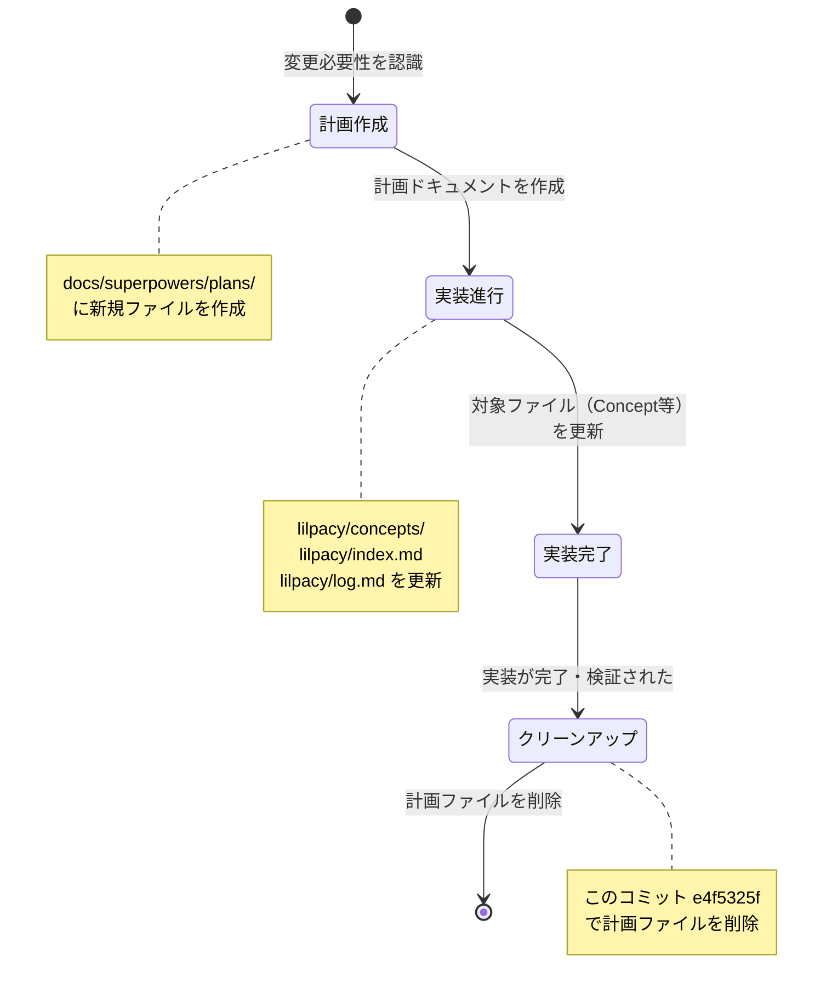

# コミット e4f5325f の理解：中間生成物の実装計画を削除

## TL;DR

- **削除内容**: `docs/superpowers/plans/2026-08-16-development-process-artifacts.md` という計画ドキュメントを削除
- **削除の背景**: このドキュメントは、開発プロセスの概念ファイル（`lilpacy/concepts/ソフトウェア開発プロセス.md`）を更新するための詳細な実装計画だった
- **実装は完了**: 計画の内容は既に3つの前のコミット（6818a609, 5ecee513, その後のコミット）で実装済み
- **なぜ削除したのか**: 計画は実行中の一時的な成果物であり、実装が完了したら処理用ファイルは不要
- **工程での位置づけ**: このコミットは「chore」—— 構想工程から基本設計工程へ向かう過渡的なドキュメントを片付けた作業

## Background

このリポジトリは LLM Wiki（`lilpacy/` vault）を運用するプロジェクト。CLAUDE.md に記載されたルールに従い、知識を構造化・維持・成長させている。

開発工程の説明は Vault の Concept に格納される。Conceptは信頼できる一次情報（summaries など）を根拠に、要件を整理し、実装計画を立てる工程を経る。その計画は一時ファイル（`docs/superpowers/plans/` 配下）として作られ、実装後に役割を終える。

このコミットが削除したファイルはそうした一時計画ファイルの典型例：2026-08-16 時点で、ソフトウェア開発プロセスの Concept ページを更新する目的で書かれたもの。

## Intuition

**ゴール**: 計画ドキュメントのライフサイクルを示す —— 立案 → 実装 → クリーンアップ。

Vault 管理では、計画は**意思の記録**であり、実装は**成果の確定**である。計画ドキュメントそのものは成果ではなく、実装後は情報価値を失う。これを削除するのは、Vault を整頓し、読者の認知負荷を減らす正常な工程。

このコミットは状態遷移の「クリーンアップ」フェーズ。

## Code

削除対象の計画ファイルは、78行でしたが、以下が構成：

| 部分 | 内容 |
|---|---|
| Goal と方針 | Concept ページを「工程名だけでなく、いつ何を確定し、次工程へ何を渡すか」が明確な正本へ更新する意図 |
| 変更範囲 | 3つのファイル更新項目リスト（Concept、index.md、log.md） |
| 工程別成果物の設計 | 11工程の確定対象・代表成果物・次工程への状態をテーブル形式で定義 |
| 成果物の精緻化系列 | Mermaid で 5つの系列（課題→検証、業務→実装など）を図示する設計 |
| 概念設計・ドメイン設計の統合 | 起動条件と戻り先を示す詳細ルール |
| 新規クレームの根拠 | claim と独立した source lineage の対応表 |
| 検証と完了 | 6段階の検証ステップ（lint、目視確認、review など） |

この計画の**実装状況**:

- ✅ コミット 2a53eb61（`docs: 開発工程と成果物の対応を整理`）: 工程表と基本設計を開始
- ✅ コミット 6818a609（`fix: 概念設計とドメイン設計を全体フローへ統合`）: Mermaid フロー、条件分岐を追加
- ✅ コミット 5ecee513（`fix: 開発フロー分岐と成果物表を条件付き活動として整合`）: フロー分岐の修正、表の最終化
- ✅ その後のコミット: `lilpacy/index.md`、`lilpacy/log.md` の更新

計画の全項目が既に実装済みであり、計画ドキュメント自体の役割は終了。したがって削除は正当。

## Quiz

理解を確認するため、以下の問題に答えてください：

**Q1**: このコミットの削除対象は「実装を妨げる何かに気づいて計画を中止した」という意味でしょうか、それとも別の理由でしょうか？

- A) 実装中に問題が見つかり、計画を棄却した
- B) 計画通りに実装が完了したから、一時計画ファイルを片付けた（**正解**）
- C) 計画の内容が Concept に統合されたが、実装は未完了なので、進捗トラッキング用に残す予定だった
- D) CI/CD パイプラインで古い計画ファイルが検出されたので、自動削除した

**A の理由**: 問題が見つかったなら「fix」ではなく「revert」コミットになるはず。また、前のコミット群で実装が進んでいることから、計画は無視されていない。

**C の理由**: 計画の役割は「次工程へ判断を渡す」こと。一度実装に組み込まれた内容は、Concept ページ内に永続化される。計画ファイル自体で進捗トラッキングは行わない（git log で十分）。

**D の理由**: リポジトリルール（AGENTS.md / CLAUDE.md）に CI/CD による自動削除の記述がない。

---

**Q2**: 計画ファイルが `docs/superpowers/plans/` に置かれている理由は何だと考えられますか？

- A) PR やブランチで見直されるべき一時的成果物だから
- B) git history に記録して、過去の意思決定を追跡できるようにするため
- C) Vault の主要ファイル（`lilpacy/` 配下）とは分離し、実装工程の「中間生成物」として扱うため（**複数正解**）
- D) セキュリティ上の理由で、計画は vault の外に置く

**A,C の理由**: 計画は一時的であり、実装可否や方向性の見直し対象。`docs/` は Vault 外の構想・計画域。`lilpacy/` は永続的な知識ベース。

**B の理由**: 削除されても git log に歴史が残るため、トレーサビリティは損なわない。

**D の理由**: セキュリティを理由に置くなら「削除」ではなく「アクセス制御」のはず。ここは仕事用 wiki であり、セキュリティ理由の分離ではない。

---

**Q3**: 後続のコミット（例：「ingest: knowledge delta（makefile 最小単位.md）」）が計画ファイル削除後に続く理由は何だと考えられますか？

- A) 削除が他の作業を妨害したから、妨害を修正する新しい変更をリリースした
- B) 計画の削除は「整理」であり、Vault への知識取り込み工程は独立した並行作業（**正解**）
- C) 削除して穴が空いたので、新しい知識を詰める決まりになっている
- D) CI が削除を検出し、自動的に補正を試みた

**A の理由**: 削除は非破壊的（git で復元可能）。後続コミットの内容「knowledge delta」は完全に独立。

**C の理由**: Vault は常に成長しており、新知識取り込みは定期的。計画削除とは無関係。

**D の理由**: 後続コミットは人間の作業（「ingest」は手動）の跡。CI 自動化ではない。

---

## 次の一手

- **レビューで見るべき点**: 
  - 計画の実装が Concept、index.md、log.md に完全に反映されているか確認する
  - `git show 5ecee513..e4f5325f` で実装完了から削除までの期間に変更がないか確認

- **残った未解決点**: 
  - 新規 Concept クレームの根拠表（計画内の「新規 claim の根拠」セクション）が、実装後の Concept に記載されているか検証が必要

- **発展の方向**:
  - 計画ファイルのテンプレート化：「実装ステップ → 検証 → クリーンアップ」の工程を AGENTS.md に文書化し、同じパターンを反復可能にする

