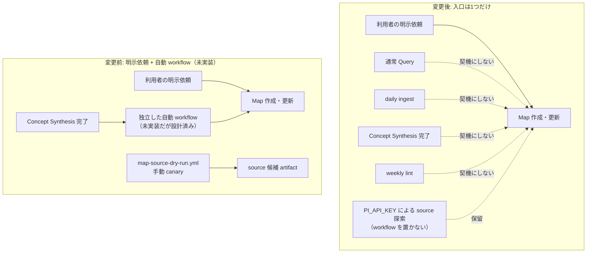

# 7a3879fd「fix: Domain Map作成を明示依頼に限定する」を理解する

## TL;DR

- Domain Map の**自動生成路線を打ち切り**、Map 作成・更新の入口を「利用者の明示依頼」だけに限定した方針転換コミット。機能追加ではなく、直前まで作っていたものを畳む変更。
- 直前の3コミットで作った有料 API（`PI_API_KEY`）による source 探索 canary — workflow・Ruby script・専用テストの計583行 — を**削除**した。
- 引き金は 2026-08-10 の手動 canary [run #31355724703](https://github.com/lilpacy/obsidian/actions/runs/31355724703) が `spec.modelcontextprotocol.io` の **TLS 接続エラー**で失敗し、API 費用を払ったのに snapshot も Map も得られなかったこと。「技術的に成立する」と「運用として採用できる」は別だ、という判断。
- 設計記録は消さず、`status` を `design_review` → **`deferred`** に変え、保留理由と**再開条件**（source選定精度・完成Map 1件あたりの費用・2View完結率）を `current_decision` として追記した。
- テストの契約も張り替えた。「workflow がこう書かれている」の検証から「**ポリシー文がこう書かれている＋削除したファイルが存在しない**」の検証へ。

## Background（なぜこの変更が存在するのか）

### 深い背景（Domain Map を知っているならスキップ可）

このリポジトリは LLM Wiki のパターンを実装した vault（`lilpacy/`）で、`lilpacy/CLAUDE.md` が実行契約を持つスキーマファイルとして機能している。その中の成果物のひとつが **Domain Map**（`maps/`）で、分野の Node と Relation を永続化したグラフだ。Map には2つの厳しい規則がある。

第一に、Map は**経時View（分野がどう発展したか）と共時View（いま何がどう構成されているか）の両方**が完成したときだけ生成できる。片方しか作れなければ Map を作らず、不足 source と再開条件を書いて終わる。第二に、根拠は外部 source の**不変 snapshot** でなければならず、`map-sources/<body_sha256>.md` という content-addressed なファイル名で保存し、以後編集も改名もしない。つまり Map は「推測で埋めてはいけない、出典に紐づいたグラフ」である。

この厳しさが、そのまま自動化の難しさになる。Map を機械的に作るには、まず「その分野の公式・一次 source はどれか」を自動で決めなければならない。

### 直結する背景（この commit の直前に何をしていたか）

直前の5コミットは、まさにその自動化の実現可能性を実測する作業だった。

| コミット | やったこと |
|---|---|
| `ee07d34b` / `3f198a1b` | GitHub Actions から Anthropic API を叩いて source 候補を検索し、制限付き HTTPS で取得する経路を spike で実測 |
| `782c2b95` | 実測結果を `docs/map-source-acquisition-feasibility.md` に記録 |
| `af107ef4` / `58c29305` | それを手動 canary workflow（`map-source-dry-run.yml` + `scripts/map_source_dry_run.rb`）として実装し、取得境界を締めた |

この時点の feasibility doc の結論は歯切れが悪い。「**経路は成立する**（HTTPS 限定で取得でき、SHA-256 も計算できる）が、**prompt だけで一次・公式 source に限定することはできない**（18 URL 中に Medium や Wikipedia が混在した）」。そこで残された希望は「候補と選定理由を Map PR に出して、人間の merge review を公開境界にする」という妥協案だった。

そして 2026-08-10、その canary を MCP の scope で実際に回した。結果は失敗。Map まで到達しなかった。この commit はその失敗を受けた意思決定である。

## Intuition（何を変えたのか）

**ゴールを1文で**: Domain Map を「Wiki の日常運転から自動で育つもの」から「利用者が頼んだときだけ作るもの」へ引き戻し、有料 API を使う自動生成の実行経路をリポジトリから物理的に取り除いた。

変更前は、Map 作成の入口が複数開いている（正確には「開く予定になっていた」）設計だった。変更後は、明示依頼という1本だけが残り、他は塞がれた。



ここで押さえるべき区別が2つある。

**「削除」と「保留」を使い分けている。** 実行できるコード（workflow・script・テスト）は削除した。放置すると誰か／何かが実行できてしまい、費用が発生するからだ。一方、設計の記録（design-case JSON と feasibility doc）は残した。将来再検討するときに、何を検討して何が分かっていたかを再発見し直すコストを払いたくないからだ。design-case には `history_note: "以下の自動maintenance設計は、再検討時の履歴として保持するが、現在の実行契約ではない"` という一行が入り、**記録と契約を明示的に分離**している。

**「できない」ではなく「割に合わない」と言っている。** feasibility doc の書き換えが象徴的で、`技術的に成立することと、運用として効率的であることは別である。` という文が新たに置かれた。取得境界のセクション見出しも `## 採用する境界` → `## 将来再検討する場合にも必要な境界` に変わり、「いま稼働している pipeline の仕様」から「再開時にも失ってはいけない制約」へ格下げされている。`## 未解決` → `## 再開条件` の改名も同じ性質で、宙ぶらりんの TODO を、測定すべき3項目を持つ明示的なゲートに変えた。

再開条件はこの3つで、いずれも「精度」だけでなく**費用と完結率**を含む点が要点だ。

| 測定項目 | なぜ必要か |
|---|---|
| source 選定精度 | prompt だけでの一次 source 限定が失敗している（18 URL に Medium 等が混在） |
| 完成 Map 1件あたりの API 費用 | 今回まさに「払ったが成果物ゼロ」になった |
| 経時・共時2 View の完結率 | 片方だけでは Map を生成できない規則があるため、成功率が費用を直接押し上げる |

## Code（変更のウォークスルー）

8ファイル、53 insertions / 616 deletions。ファイル順ではなく「契約 → 記録 → 実行経路 → テスト」の順で見ると分かりやすい。

### 1. 契約の書き換え — `lilpacy/CLAUDE.md`

これが本体である。vault の実行契約なので、ここが変われば以後のエージェントの振る舞いが変わる。旧文はこうだった。

```
Map作成・更新の明示依頼は正当なentrypointであり、定期hookを待たず同じ品質条件で処理する。将来の
自動Map maintenanceも既存ingestやConcept Synthesisの責務へ混ぜず、Concept Synthesis完了後に起動する
独立workflowとし、明示経路と同じscope解決・builder・lintへ合流させる。自動workflowはまだ未実装である。
```

「明示依頼も正当な入口の**ひとつ**」「自動化は将来やる、設計はこう」というトーンだ。新文は許可から禁止へ反転する。

```
Map作成・更新は、利用者が明示的に依頼した場合だけ実行する。通常Query、daily ingest、Concept Synthesis、weekly lint
の実行や完了をMap作成・更新の契機にしない。`PI_API_KEY`を使う有料APIでのsource探索・Map自動生成は、
費用対効果が確認できるまで保留し、workflowを置かない。
```

禁止する契機を4つ**名前で列挙**しているのが効いている。「自動でやるな」だけだと解釈の幅が残るが、daily ingest や weekly lint という既存 workflow 名を挙げれば、エージェントが「これは自動化ではなく通常運転の一部だから Map を更新してよい」と自己正当化する隙がなくなる。

同じファイルの workflow 一覧からは `map-source-dry-run.yml` の3行の説明が削られた。ちなみにこの構造は、すぐ上にある Curriculum の規則（「学習目的を明示して依頼された場合だけ draft を生成する。通常 Query や目的への言及だけでは生成しない」）と同じ形をしている。Map が Curriculum と同じ「明示依頼オンリー」の型に揃った、という読み方もできる。

### 2. 記録の更新 — design-case JSON と feasibility doc

`automatic-domain-map-maintenance.design-case.json` は `status` を `deferred` にし、`current_decision` オブジェクトを追加した。`active_entrypoint` が1つ、`deferred_entrypoints` が4つ、それに `reason` / `resumption_condition` / `history_note`。CLAUDE.md の散文で書いた決定を、機械可読な形でも持たせている（後述するがテストがここを読む）。

`docs/map-source-acquisition-feasibility.md` には実測表に1行追加された。失敗も測定結果として同じ表に並べている点が誠実だ。

```
| MCP scopeの手動canaryでMap作成まで完結したか | できない | run #31355724703 はsource探索後、
  spec.modelcontextprotocol.io のTLS接続エラーで失敗し、snapshot artifactもMapも生成しなかった |
```

### 3. 実行経路の削除 — workflow と script

`.github/workflows/map-source-dry-run.yml`（117行）と `scripts/map_source_dry_run.rb`（263行）が消えた。何を捨てたのかを押さえておくと、再開条件の重みが分かる。この canary は雑な実装ではなく、かなり厳重に境界を締めたものだった。

- **入力検証**（Ruby 側）: scope は1〜200文字で制御文字なし、source root は1〜5件の DNS ドメイン、path に `..` を含めない、といった検証を `MapSourceDryRunInput` が行う。
- **取得境界**: `--proto '=https'` で HTTPS 限定、`MAX_REDIRECTS = 0`（`--location` を使わない）、接続10秒・全体30秒、1 source 1 MiB 上限、content-type は text / json / pdf のみ許可。
- **API 呼び出し**: `stop_reason == "pause_turn"` を検出したら continuation request を組んで2回目を呼び、レスポンスをマージする、という Anthropic API の中断再開まで実装済み。
- **書き込みしない**: `permissions: contents: read` のみ、`git add/commit/push` は一切なし。成果物は artifact に upload するだけ（retention 7日）。

つまり「危ないから消した」のではなく、**安全に作れることは示せたが、成果に対する費用が見合わなかったから消した**。ここが `git revert` 的な後戻りと違うところで、学びは doc に残っている。

### 4. テスト契約の張り替え — `test/ci_workflow_contract_test.rb`

削除した workflow を検証していた `test_正常系_map_source_dry_runは手動実行でartifactだけを生成する` はそのまま消せない。消すだけだと「方針を守っているか」を誰も検査しなくなる。そこで**同じテストを別の対象に向け直した**。

```ruby
def test_正常系_map作成は利用者の明示依頼だけを入口にする
  policy = REPO_ROOT.join("lilpacy/CLAUDE.md").read
  design = JSON.parse(REPO_ROOT.join("docs/interactive-design-review/automatic-domain-map-maintenance.design-case.json").read)

  assert_includes policy, "Map作成・更新は、利用者が明示的に依頼した場合だけ実行する。"
  assert_includes policy, "通常Query、daily ingest、Concept Synthesis、weekly lint"
  assert_equal "deferred", design.dig("project", "status")
  assert_equal "利用者による明示的なMap作成・更新依頼", design.dig("project", "current_decision", "active_entrypoint")
  refute REPO_ROOT.join(".github/workflows/map-source-dry-run.yml").exist?
  refute REPO_ROOT.join("scripts/map_source_dry_run.rb").exist?
end
```

3種類の検証が入っている。**ポリシー文の存在**（人が読む契約が薄まっていないか）、**design-case の状態**（機械可読な決定が `deferred` のままか）、そして**ファイルの不在**。最後の `refute ... exist?` が地味に重要で、将来誰かが古いブランチを merge して workflow を復活させたら、CI が落ちて気づける。ポリシーを散文で書くだけでなく、**削除そのものをテストで固定した**わけだ。

`test/map_source_dry_run_test.rb`（203行）は対象が消えたので丸ごと削除された。

### 5. 台帳への追記 — `lilpacy/log.md`

`## [2026-08-10] ops | 有料APIによるDomain Map自動生成を保留` として、更新・削除・判断を追記。最後の1行が範囲を限定している。

```
- 判断: Domain Mapの経時・共時View、外部source、Curriculumとの分離は維持し、Map自動生成だけを一時的に断念する。
```

**Map という成果物の設計は生きている。自動生成という運搬手段だけを止めた。** ここを混同すると「Map をやめた」と誤読してしまう。

## Quiz

中規模の方針変更コミットなので3問。本文の言い換えでは解けない形にしてある。

**Q1.** この commit の後、あなたがエージェントとしてこの vault で作業しているとする。daily ingest を実行して新しい記事を取り込んだところ、その記事が既存の `maps/` にある Node と明らかに関係する新しい概念を含んでいた。正しい振る舞いはどれか。

- A. 経時・共時の両 View を更新できる根拠が揃っているなら、Map を更新してよい
- B. Map は更新せず、ingest の成果物（delta / summary / index）だけを作る
- C. Map の更新案を PR として出し、人間の merge review を公開境界にする
- D. `PI_API_KEY` を使わない範囲であれば Map を更新してよい

**Q2.** 削除された `map-source-dry-run.yml` は `permissions: contents: read` だけを持ち、`git push` も行わず、HTTPS 限定・redirect 0 回・1 MiB 上限という境界で実装されていた。それでも削除された理由を最もよく説明しているのはどれか。

- A. 境界の実装に穴があり、リポジトリを書き換える危険が残っていたため
- B. `workflow_dispatch` の手動実行でも、誰かが誤って `schedule` に変えるリスクがあったため
- C. 安全性は問題なかったが、API 費用に対して完成 Map という成果を得られず、費用対効果を採用できなかったため
- D. Anthropic API に web search tool がなく、technically 実行不可能だと判明したため

**Q3.** 半年後、あなたは Map 自動生成を再開したいと考え、「source 選定精度は十分だし、費用も安い」と実測データを持ってきた。しかし CLAUDE.md の再開条件を満たすには、もう1つ測定が必要である。それは何か、そしてなぜそれが費用の議論に直結するか。

- A. 取得する source の平均バイト数。1 MiB 上限に収まるかが費用を決めるため
- B. 経時・共時2 View を同じ試行で完成できる割合。片方だけでは Map を生成できない規則があるため、失敗試行の API 費用がすべて無駄になるため
- C. `pause_turn` による continuation の発生率。API 呼び出しが2回になると費用が倍になるため
- D. Concept Synthesis の完了頻度。自動 workflow の起動回数が費用の総額を決めるため

### 解答と解説

**Q1 — 正解: B**

CLAUDE.md の新しい文が `通常Query、daily ingest、Concept Synthesis、weekly lint の実行や完了をMap作成・更新の契機にしない` と、daily ingest を名指しで禁止している。ここが今回の変更の実務上の核心で、「根拠が揃っているなら更新してよいのでは」という自然な推論を明示的に塞いだ点がポイントだ。

- **A が誤り**: 根拠の充足は Map の**品質**条件であって、**起動**条件ではない。この commit は両者を分離し、起動条件を「明示依頼」だけにした。品質条件を満たしても入口が開くわけではない。
- **C が誤り**: これは変更**前**の feasibility doc に書かれていた妥協案（「source 候補と選定理由を Map PR へ明示し、人間の merge review を公開境界として残す」）で、まさにこの commit で撤回された。旧設計を覚えている人が引っかかる選択肢。
- **D が誤り**: 禁止されているのは有料 API の使用**だけ**ではなく、明示依頼以外の**契機**そのもの。API を使わなければよいという読み替えはできない。

**Q2 — 正解: C**

feasibility doc に追記された `技術的に成立することと、運用として効率的であることは別である。` がそのまま答えになっている。log.md の判断行も「費用対効果を採用できない」と書く。安全性の否定ではなく、経済性の否定である。

- **A が誤り**: 境界は実測で機能していた。probe #31333925809 では境界内で取得に成功し、SHA-256 も算出できている。doc も `いずれも contents: read だけで、repositoryへの書き込みは行っていない` と明記する。
- **B が誤り**: そういう懸念があるなら、旧テストの `refute_includes workflow, "schedule:"` のようなガードを足せば足りる。実際、旧テストはまさにそれを検査していた。削除の理由にはならない。
- **D が誤り**: web search tool がないのは事実だが（doc の冒頭に書かれている）、それは「prompt だけで一次 source に限定できない」という**精度**の問題で、実行自体は可能だった。技術的不可能と費用対効果の不成立を混同させる選択肢。

**Q3 — 正解: B**

CLAUDE.md が挙げる3項目は `source選定精度`、`完成Map 1件あたりの費用`、`経時・共時2 Viewの完結率`。3つ目が抜けている。

なぜこれが費用に直結するか。Map には「両 View が完成した場合だけ Map、index、log を更新する。完結できない場合はMapを生成せず、不足sourceと再開条件を示す」という規則がある。つまり片 View しか作れなかった試行は、API 費用を払って**成果物ゼロ**で終わる。完結率が 50% なら、完成 Map 1件あたりの実効費用は単純計算の2倍になる。今回の canary の失敗そのものがこの構造の実例で、TLS エラーで Map に到達せず、費用だけが残った。だから「費用」と「完結率」は別々に測る必要がある。

- **A が誤り**: 1 MiB は取得境界の上限値で、doc も `probeの上限であり、production既定値ではない` と釘を刺している。再開条件に挙がっていない。
- **C が誤り**: `pause_turn` の continuation は削除された script が実装していた仕組みで、費用に影響はするが再開条件の項目ではない。実装詳細を覚えていると引っかかる。
- **D が誤り**: Concept Synthesis 完了は `deferred_entrypoints` に入った、いま**使わない**契機。それの頻度を測る意味はない。

### この後の流れ

回答するか「掴めた」と言ってください。全問正解なら Step 4（この explainer を wiki に取り込むか等の共有確認）へ進みます。誤答があった領域には、操作して直感を掴むための小さなツール＝マイクロワールドを提案します。たとえば Q1 を外した場合は「入力（依頼文 / ingest イベント / synthesis 完了）を1つ与えると、この commit 前後の契約でそれぞれ Map が更新されるかを判定して差分を並べる小さな CLI」を `/tmp` に作る、といった形です。Q3 を外した場合は「完結率と 1試行あたり API 費用をパラメータで振って、完成 Map 1件あたりの実効費用を出すスクリプト」が効きます。クイズを飛ばしたい場合はそう言ってください（調整弁であって関所ではありません）。

## 次の一手

**レビューで見るべき点**

- **ポリシー文とテストの結合が文字列一致である**こと。`assert_includes policy, "Map作成・更新は、利用者が明示的に依頼した場合だけ実行する。"` は、句読点を1つ変えるだけで落ちる。方針を固定する意図としては正しいが、後から文を磨きたくなったときにテストも直す必要があると認識しておく。
- **禁止契機のリストが列挙である**こと。将来 `lilpacy/` に新しい定期 workflow が増えたとき、CLAUDE.md の4つの列挙に自動では加わらない。新 workflow 追加時に「Map の契機にしない」を書き足す運用が要る。
- **`docs/interactive-design-review/` 配下の他の記述**が旧方針（自動 maintenance 前提）のままになっていないか。`current_decision` と `history_note` で状態は示したが、JSON 内の `success_conditions` 以下は旧設計の本文が残っている。読む人が現在の契約と誤認しないか確認する価値がある。

**残った未解決点**

- 「任意分野で公式・一次 source を決定的に判定する方法」は依然として未解決。prompt での限定は失敗が実測済み。再開にはここのブレークスルーか、人間のレビューを前提にした別の設計が必要になる。
- 明示依頼で Map を作る経路そのものは、実際には手作業（エージェントとの対話）で行われる。その経路のコストは今回測られていない。自動化の費用対効果を語るには、比較対象となる手動経路のコストも要る。

**発展の方向**

- 再開条件の3項目を測るための最小の計測装置を、実行 workflow ではなく**ローカルの捨てスクリプト**として作る。CI に置かないので費用が勝手に発生せず、`refute ... exist?` のテストとも衝突しない。
- Curriculum と Map が同じ「明示依頼オンリー」の型に揃ったので、CLAUDE.md の2箇所に散っている入口規則を1つの表に統合できる余地がある（Curriculum 側にはすでに入力 → draft生成 → 保存の表がある）。
