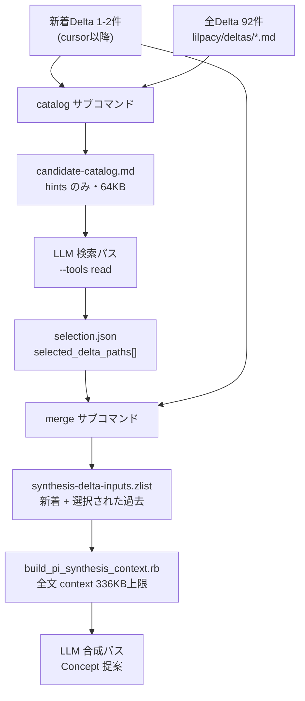

# `scripts/pi_synthesis_candidates.rb` を読み解く

## TL;DR

- このスクリプトは **Concept Synthesis の「二段検索」の1段目**を担う。CI が LLM に「過去の Delta のどれを合成入力に呼び戻すか」を選ばせるための、軽量カタログ生成器と、その回答の検証マージ器である。
- 2つのクラス = 2つの CLI サブコマンド。`catalog` が候補一覧を作り、`merge` が LLM の選択結果を検証して実入力リストに畳み込む。
- カタログに入るのは Delta の **frontmatter の source / summary リンクと `## Concept impact hints` だけ**。`## Changes` 本文と Raw Source は意図的に排除する（安く、かつ一次情報を検索段に漏らさないため）。
- **LLM の出力を信用しない**のが設計の芯。`merge` は返ってきた path を全件再検証し、`lilpacy/deltas/*.md` かつ実在するファイル以外は `ArgumentError` で落とす。
- 予算超過は「候補を黙って切り捨てる」のではなく **例外で落ちる**。壊れた入力で合成が走るより、CI が赤くなる方が安全という判断。

## Background (why)

### 深い背景（この vault のパイプラインを知っているならスキップ可）

この repo は Markdown の vault (`lilpacy/`) を、GitHub Actions 上の LLM エージェント（pi-coding-agent）が自動で育てるパイプラインを持っている。層は3つある。

| 層 | 実体 | 誰が書くか |
|---|---|---|
| Raw Source | `lilpacy/*.md`（クリップ記事など） | 人間（不変） |
| Summary / Delta / Entity | `lilpacy/summaries/`, `deltas/`, `entities/` | ingest ワークフロー |
| Concept | `lilpacy/concepts/` | synthesis ワークフロー |

Knowledge Delta は1つの source を取り込んだときの「差分の記録」で、frontmatter に `source` / `summary` / `entities` のリンクを持ち、本文に `## Changes`（claim + evidence の列）と `## Concept impact hints`（「この知識は将来どんな Concept になりうるか」のメモ）を持つ。

Concept はその上位層で、**複数の独立した source lineage を横断して初めて見える理解**である。`.github/workflows/pi-concept-synthesis.yml` の prompt はこれを硬い制約として課している——「新規または変更する各 claim は、必ず2つ以上の独立 source lineage に解決できる grounding_inputs を持たせます」。

### この仕組みに直結する狭い背景

synthesis ワークフローは 48 時間ごとに走り、`synthesis_ledger.rb cursor` が返す**カーソル以降に新規追加された Delta** だけを起点にする。ここに構造的な問題がある。

新着 Delta が1〜2件しかない回は珍しくない。しかし Concept の claim は2つ以上の独立 lineage を要求する。つまり**新着だけでは原理的に Concept が作れない回が頻発する**。必要なのは、新着と噛み合う「過去の Delta」を呼び戻す経路だ。

素朴な解は「全 Delta を context に入れる」。これは通らない。`build_pi_synthesis_context.rb` の予算は 336,000 バイトで、Delta 本文 + Summary + Entity + Concept をすべて積むと現時点の 92 件でも溢れる。

そこで入ったのが二段検索である。ログ (`lilpacy/log.md`) の該当エントリがこの設計判断を明記している。

> cursor以降の新着Deltaを起点に全DeltaのConcept impact hintsを軽量検索し、選択した過去Deltaを通常合成と一次情報検証の共通入力へ戻す二段フローを追加。
> 判断: cursorは新着検知だけに使い、Concept候補の有効期限にはしない。可変pending台帳、embedding、新規依存、件数quotaは追加しない。

**このスクリプトは、その「軽量検索」段の決定論的な足回り**である。判断そのものは LLM がするが、入力の組み立てと出力の検証は Ruby が握る。

## Intuition (what)

**ゴールを1文で**: 全 Delta の「hints」だけを薄く並べたカタログを LLM に読ませ、新着と組み合わせる価値のある過去 Delta を選ばせ、その選択を検証して本番の合成入力に混ぜ戻す。

鍵は **「検索用の安い表現」と「合成用の高い表現」を分けている**ことだ。同じ Delta 群を2回読むが、1回目は hints だけ、2回目は選ばれたものの全文。



実データで見ると効き方が分かる。この repo で実際に `catalog` を1件の新着で走らせると、

- 90個の `##` セクション（92 Delta のうち hints が空/`none` の2件は落ちる）
- 64,825 バイト — 上限 160,000 の 40%

一方、同じ 92 件を全文で `build_pi_synthesis_context.rb` に渡せば 336,000 バイトの予算は溢れる。**hints への圧縮が、全件を検索対象に保つことを可能にしている**のがこの設計の核心である。

カタログの1セクションは、実際にはこう出る（`## Changes` の claim/evidence が入っていないことに注目）。

```markdown
## lilpacy/deltas/2026-08-02 DGX Spark複数台連結の目的と帯域制約--8c9eb13082c5.md

source: [[queries/2026-08-02 DGX Spark複数台連結の目的と帯域制約]]
summary: [[summaries/DGX Spark複数台連結の目的と帯域制約]]
- ローカルLLMハードウェア選定に、ノード単体帯域とモデル分割後のシステム総帯域を分ける判断軸を追加候補とする
- ローカルLLMハードウェア選定に、複数台化の主目的を容量・総スループット・単一ストリーム速度に分解する比較表を追加候補とする
```

なぜ `source` / `summary` リンクを一緒に出すのか。LLM が「2つ以上の**独立**な lineage」を判定するには、hints の内容だけでなく**その hints がどの source 由来か**を見る必要がある。同じ記事から出た2つの Delta は独立 lineage ではない。だから両リンクは必須項目で、欠けていれば例外になる。

## Code (how)

ファイル順ではなく、**信頼境界**で読むと構造が見える。このスクリプトの仕事は「LLM に渡すものを絞る」と「LLM から返るものを疑う」の2つだ。

### 1. `catalog`: 何を出さないかを決める

`build` の中心はこのループである。

```ruby
@vault_dir.glob("deltas/*.md").sort.each do |path|
  relative = path.relative_path_from(@repo_root).to_s
  hints = concept_hints(path)
  next if hints.empty?

  metadata = frontmatter(path)
  marker = @new_delta_paths.include?(relative) ? " [new]" : ""
```

3点が読みどころだ。

`glob("deltas/*.md")` は**全件を舐める**。cursor を使っていない。これは意図的で、ログの「cursorは新着検知だけに使い、Concept候補の有効期限にはしない」がそのままコードに出ている。2年前の Delta も候補である。

`next if hints.empty?` — hints を持たない Delta はカタログから消える。`concept_hints` は `## Concept impact hints` 見出しを探し、次の `## ` までの `- ` 行を集め、`none` を捨てる。hints が無い/`none` の Delta は「ingest 段で Concept 化の見込み無しと判断済み」なので、検索対象から外すのが妥当だ。

`[new]` マーカー。カタログには新着も過去も同じ形で並ぶので、LLM が「どれが起点か」を区別する唯一の手がかりがこれである。ワークフローの prompt が `[new] の Delta と組み合わせることで` と書いているのは、このマーカーを指している。

`take_while` の使い方も地味に効いている。

```ruby
lines[(heading + 1)..]
  .take_while { |line| !line.start_with?("## ") }
```

`## Concept impact hints` は Delta の最終 section とは限らない。`take_while` で次の見出しで打ち切ることで、他 section の箇条書きを hints として誤収集しない。

### 2. 壊れた入力は黙って通さない

`frontmatter` と `required_link` は、どちらも「取れなかったら nil を返す」ではなく**例外を投げる**設計になっている。

```ruby
def required_link(metadata, field, path)
  link = metadata[field].to_s[/\[\[([^\]]+)\]\]/, 1]&.split("|", 2)&.first
  raise ArgumentError, "Delta #{field} link is missing: #{path}" unless link
  link
end
```

`split("|", 2).first` は Obsidian の別名リンク `[[実path|表示名]]` から実 path 側を取る処理。`YAML.safe_load(..., permitted_classes: [Date], aliases: false)` も同じ思想で、Delta frontmatter には `created: 2026-08-04` があるので `Date` だけ許し、任意クラスの復元と YAML alias は禁じている。

予算チェックも同じ姿勢だ。

```ruby
content = "#{lines.join("\n")}\n"
raise ArgumentError, "candidate catalog budget exceeded: ..." if content.bytesize > @max_total_bytes
```

**全部組み立ててから測り、超えたら書かずに落ちる**。上位 N 件に切り詰めたりしない。テストがこの意図を名前で明言している — `test_異常系_catalog上限を超える場合は候補を欠落させず失敗する`。切り詰めれば合成は成功するが、**落ちた候補が Concept にならなかった事実は誰にも見えない**。CI が赤くなる方が発見可能である。

### 3. `merge`: LLM の出力を1つも信用しない

```ruby
selection = JSON.parse(Pathname(selection_path).read)
raise ArgumentError, "schema_version must be integer 1" unless selection.fetch("schema_version", nil) == 1

selected = selection.fetch("selected_delta_paths", nil)
raise ArgumentError, "selected_delta_paths must be an array" unless selected.is_a?(Array)

paths = (@new_delta_paths + selected.map { |path| validate_delta_path(path) }).uniq
Pathname(output_path).binwrite("#{paths.join("\0")}\0")
```

`== 1` は型も見る厳格比較（`"1"` は通らない）。`selected` は配列であることを確認する。そして**選択された全 path が `validate_delta_path` を再通過する**。

```ruby
unless path.start_with?("lilpacy/deltas/") && path.end_with?(".md") && !path.include?("..") && @repo_root.join(path).file?
```

4条件が別々の攻撃/事故を塞いでいる。`start_with?` はディレクトリの閉じ込め、`end_with?` は拡張子、`include?("..")` は traversal、`.file?` は幻覚 path。`cleanpath` を先に通しているので `lilpacy/deltas/../Raw.md` のような迂回も `lilpacy/Raw.md` に正規化されて第1条件で落ちる。

これは理屈だけの防御ではない。**この検索段の LLM は `--tools read` を持って repo 上で動いている**。Raw Source を合成 context から排除しているのに、選択リストに Raw path を混ぜられたら排除が無意味になる。テストがまさにこれを踏んでいる — `test_異常系_delta以外の候補pathは拒否される` は `lilpacy/Raw Old.md` を渡して拒否を確認する。

なぜ検索用と合成用で `validate_delta_path` が2クラスに重複しているのか。片方を緩めたときにもう片方が一緒に緩まないようにする分離であり、`merge` 側は LLM 出力という別の信頼レベルを扱っているので、独立した門であることに意味がある。

出力形式が `join("\0")` の NUL 区切りなのは、ここの Delta ファイル名が `2026-08-04 Linearのチーム横断工数集計--3b4a442f09f9.md` のように**空白を含む**ため。ワークフローが `mapfile -d '' -t` で読み戻すので、空白でも改行でも壊れない。

### 4. 出力に必ず新着が含まれる

```ruby
paths = (@new_delta_paths + selected...).uniq
```

新着が常に先頭に足される。LLM が空配列を返しても（関連候補ゼロ）、新着だけで合成は続行する。テスト名がそのまま仕様である — `test_準正常系_関連候補がない場合も新着知識だけで合成を続行できる`。`uniq` は LLM が新着 path を選択リストに含めてきた場合の重複を吸収する。

### 5. CLI 部分

```ruby
if $PROGRAM_NAME == __FILE__
```

これで `require_relative` からロードしてもメインが走らない。テストがクラスだけを直接叩けているのはこのガードのおかげだ。`ARGV.shift` を順に消費し、残った `ARGV` 全部が新着 Delta path 群になる（だから新着 path は必ず最後に置く）。`unless ... && !ARGV.empty?` で新着ゼロの誤呼び出しも弾く。

## Quiz

**Q1.** `catalog` が `synthesis_ledger.rb` の cursor を使わず `glob("deltas/*.md")` で全件を舐めるのは、どの設計判断の帰結か。

- A. cursor の取得が遅いので検索段では省略している
- B. Concept 候補に有効期限を設けず、古い Delta も新着と組み合わせられるようにするため
- C. cursor は ingest 専用で synthesis からは参照できないため
- D. 全件舐めないとカタログの予算チェックが正しく効かないため

**Q2.** ある Delta の frontmatter の `summary` フィールドが手作業で消えてしまったとする。この Delta は hints を2件持っている。`catalog` を走らせると何が起きるか。

- A. その Delta のセクションだけ `summary:` 行が空で出力され、他は正常に出る
- B. その Delta は `next if hints.empty?` で静かにスキップされる
- C. `ArgumentError` が投げられ、カタログファイルは一切書かれない
- D. `summary` は任意項目なので何も起きない

**Q3.** 検索段の LLM が `{"schema_version":1,"selected_delta_paths":["lilpacy/deltas/../summaries/Linear.md"]}` を返した。`merge` はどう振る舞うか。

- A. `cleanpath` で `lilpacy/summaries/Linear.md` に正規化され、`lilpacy/deltas/` 前置チェックで落ちて `ArgumentError`
- B. `include?("..")` チェックで落ちて `ArgumentError`
- C. ファイルは実在するので通り、Summary が合成入力に入る
- D. 警告を出してその1件だけスキップし、新着だけで続行する

**Q4.** 新着 Delta が非常に多い回で、カタログが 160,000 バイトを超えた。この設計での帰結と、その理由付けとして正しいものはどれか。

- A. 古い Delta から順に落として上限内に収め、合成は続行する
- B. hints を1件だけに間引いて全 Delta を残し、合成は続行する
- C. 例外で落ちて CI が失敗する。黙って候補を落とすと Concept にならなかった候補が観測不能になるため
- D. カタログを2ファイルに分割し、LLM を2回呼ぶ

**Q5.** `catalog` が Delta の `## Changes`（claim と evidence の全文）をカタログに含めない理由として、この設計で成立している説明はどれか。

- A. `## Changes` は機密情報を含むので LLM に見せてはいけない
- B. 検索段は「どの Delta を呼び戻すか」の判定だけを行い、claim の実体判断は選択後の full context 段が担うので、hints だけで足りる
- C. `## Changes` の形式が Delta ごとに違うので機械的に抽出できない
- D. `## Changes` はすでに Summary に転記されているので Delta から読む必要がない

## 解答と解説

**Q1: B**

ログの設計判断が明示している——「cursorは新着検知だけに使い、Concept候補の有効期限にはしない」。Concept は複数 lineage の横断で生まれるので、相方が2年前の Delta であることは普通にある。cursor で候補を絞ると、その組み合わせは永久に発見されなくなる。

- A は誤り。cursor は `synthesis_ledger.rb` の単純な参照で、コストは問題になっていない。
- C は誤り。同じワークフローの前の step が実際に cursor を呼んでいる（`ruby scripts/synthesis_ledger.rb cursor .`）。参照できないのではなく、使わないと決めている。
- D は因果が逆。予算チェックは組み立てた結果を測るだけで、走査範囲を要求しない。

**Q2: C**

`summary` は `required_link` を通る**必須**項目で、`[[...]]` パターンが取れなければ `raise ArgumentError` になる。そして書き込みは `build` の最後の1回 (`Pathname(output_path).write`) なので、途中で例外が出た時点でファイルは作られない。**部分的なカタログが LLM に渡ることはない**——これが「必ず全部組み立ててから一度に書く」構造の効果である。

- A は誤り。壊れたリンクを空欄で通すと、LLM は lineage の独立性を判定できないまま選択してしまう。
- B は誤り。`hints.empty?` のスキップは hints が空のときだけで、この Delta は hints を2件持っている。順序も `next` の判定が `frontmatter` より前にあることに注意。
- D は誤り。関数名がそのまま `required_link` である。

**Q3: A**

`validate_delta_path` は最初に `Pathname(...).cleanpath` を通す。`lilpacy/deltas/../summaries/Linear.md` は `lilpacy/summaries/Linear.md` に**正規化されてから**検査されるので、この時点で `..` は文字列として残っていない。落ちるのは `start_with?("lilpacy/deltas/")` である。

- B は落ちる結論は合っているが**落ちる条件が違う**。`include?("..")` は cleanpath で除去しきれない形（先頭の `../` など）に対する二重の網であり、この入力では発火しない。
- C は誤り。ファイルの実在は4条件のうち1つで、他3つを満たさなければ通らない。Raw / Summary を検索段から合成入力に混ぜ込む経路を塞ぐのがこの検証の主目的である。
- D は誤り。この設計は部分的な成功を許さない。1件でも不正なら全体が落ちる。

**Q4: C**

`raise ArgumentError, "candidate catalog budget exceeded"` で終わる。テスト名が意図を名前にしている——`test_異常系_catalog上限を超える場合は候補を欠落させず失敗する`。

重要なのは A/B との比較で、**A も B も合成は「成功」する**ことだ。だから危険なのである。切り捨てられた Delta が Concept の相方だった場合、Concept は作られず、しかも誰もそれに気づかない。失敗は観測できるが、静かな欠落は観測できない。LLM が絡むパイプラインで決定論的な部分を厳しくする、というこの repo 全体の方針の一例である。

- D は誤り。分割・複数回呼び出しの機構はコードに無く、「新規依存や複雑化を足さない」という設計判断とも逆行する。

**Q5: B**

二段検索の分業がそのまま答えになる。ワークフローの検索 prompt が明言している——「Hintは検索手掛かりであってConcept claimの根拠ではなく、Conceptの最終判断は後続のfull contextで行います」。1段目は絞り込みだけを担うので、hints という圧縮表現で十分であり、その圧縮が 92 件全件を検索範囲に保つことを可能にしている。

- A は近いが的を外している。カタログが除外している機密相当のものは **Raw Source と query transcript** であって（ファイル冒頭の注記とテストの `refute_includes catalog, "NEW_RAW_SECRET"` がこれ）、`## Changes` は Delta 由来の加工済み記述である。除外理由は秘匿ではなくコストと分業。
- C は誤り。`## Changes` は `classification: ... | claim: ... | evidence: ...` の固定形式で、機械抽出は可能である。実際 `concept_hints` と同じ手法で読める。
- D は誤り。Summary には `summary_text` だけが転記され、`evidence` や `classification` は Delta 側にしかない。

## この後の流れ

回答するか「掴めた」と言ってください。誤答があった領域には、操作して直感を掴むための小さなツール＝マイクロワールドを提案します。たとえば Q3・Q4 のような検証・予算の境界が曖昧なら、`validate_delta_path` に任意の path を食わせて4条件のどれで落ちたかを表示する CLI、あるいは新着 Delta の件数を変えながらカタログのバイト数と `##` セクション数の推移を出すスクリプトが候補になります（どちらも `/tmp` に数十分で作れて捨てられる規模で、160,000 バイトという上限が現在の 92 件に対してどれだけ余裕があるか、何件で破綻するかを手で確かめられます）。

## 次の一手

**レビューで見るべき点**

- `validate_delta_path` が2クラスに重複している。信頼レベルの分離としては筋が通るが、片方だけ直す事故は起きうる。共通化するなら「同じルールである」ことが仕様なのか「たまたま同じ」なのかを先に決める必要がある。
- `catalog` の 160,000 と `build_pi_synthesis_context.rb` の 336,000 は独立した定数で、関係が明示されていない。カタログは全 Delta 件数に比例して伸びるので、Delta が現在の 92 件から3倍になると 160,000 を超える。現在 64,825 バイトで消費率 40%、余裕は約 2.5 倍。
- `concept_hints` は `path.readlines` を2回呼ぶ（`frontmatter` でも読む）。92 件で問題にはならないが、件数が増えたときの最初の候補。

**残っている未解決点**

- 検索段の LLM が「関連あり」を過剰に返した場合の上限がない。件数 quota を足さないのは意図的な設計判断だが、選択が多すぎると2段目の 336,000 バイト予算が溢れて `build_pi_synthesis_context.rb` が落ちる。この失敗モードは `catalog` 側では検知できない。
- hints の品質が検索精度を決めるので、ingest 段の hints 生成がこの仕組みの実質的なボトルネックになっている。

**発展の方向**

`scripts/pi_ingest_apply.rb` で hints がどう生成されるか、`scripts/synthesis_ledger.rb` が cursor をどう進めるか（skip 時と merge 時の違い）を読むと、パイプライン全体の状態遷移が閉じる。
