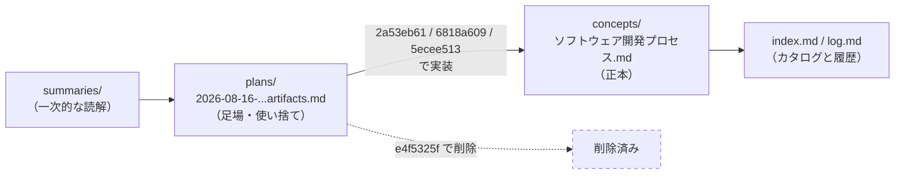

# コミット e4f5325f を理解する

`chore: 中間生成物の実装計画を削除` — 1ファイル削除、78行減、それだけのコミット。

## TL;DR

- 削除されたのは `docs/superpowers/plans/2026-08-16-development-process-artifacts.md`、つまり**実装計画書**であって、知識そのものではない。
- この計画が指示していた内容は、直前の3コミット（`2a53eb61` → `6818a609` → `5ecee513`）で `lilpacy/concepts/ソフトウェア開発プロセス.md` に反映済み。計画は役目を終えた足場だった。
- vault の「正本」は concept ページ側にあり、計画書はそこへ至る作業指示にすぎない。だから消しても知識は失われない。
- ただし `lilpacy/log.md` には削除後もこの計画書へのパス参照が3箇所残っている（2992・2999・3009行目）。これがこのコミットの唯一のレビュー観点。
- 規模が小さいのでクイズは省略します（必要なら言ってください）。

## Background (why)

### 深い背景（vault の運用に馴染みがあればスキップ可）

このリポジトリは LLM Wiki パターンの vault で、3つのレイヤーが分かれている。`raw/` の一次情報は不変、`lilpacy/` 配下の summaries・concepts・entities が LLM が育てる wiki 本体、そして `CLAUDE.md` / `AGENTS.md` がスキーマ。ここに `docs/superpowers/plans/` という第4のものが混じっている。これは wiki の知識ではなく、superpowers の writing-plans / executing-plans ワークフローが使う**作業用の計画ファイル**である。「何を変更し、どう検証し、いつ完了とするか」を実行前に書き下し、agent がそれを見ながら実装する。ビルドの足場（scaffolding）であって、建物ではない。

### この変更に直結する背景

削除された計画書は、`concepts/ソフトウェア開発プロセス.md` を「工程名の羅列」から「いつ・何を確定し・どの成果物として次工程へ渡すか」が分かる正本へ更新するための設計書だった。中身は具体的で、工程別成果物表の列構成、Mermaid に描く5つの精緻化系列、概念設計・ドメイン設計の起動条件、新規 claim ごとの独立 source lineage 表、`ruby scripts/wiki_pipeline_lint.rb .` を含む検証手順まで書かれていた。

そして計画は実行された。ファイル履歴を追うと、この計画書は3回の実装コミットに付き添っている。

| コミット | 内容 | 計画書への操作 |
|---|---|---|
| `2a53eb61` | docs: 開発工程と成果物の対応を整理 | 作成 |
| `6818a609` | fix: 概念設計とドメイン設計を全体フローへ統合 | 更新（全体図を中核とする方針へ） |
| `5ecee513` | fix: 開発フロー分岐と成果物表を条件付き活動として整合 | 更新（分岐の「いいえ経路」を必須条件として明記） |
| `e4f5325f` | **本コミット** | 削除 |

3回目の更新で計画は完全に消化され、4回目でファイルごと片付けられた。計画が実装中に2回書き換わっているのが面白い点で、これは「計画は実装前に固まる仕様」ではなく「実装しながら精度が上がる作業メモ」として扱われていたことを示している。使い捨て前提のものだったからこそ、最後に捨てられる。

## Intuition (what)

**ゴール: 実装が終わって内容が正本へ移った計画書を消し、vault に「どこを読めば正しいのか」の重複を残さない。**

ここで効いている考え方は、単一の情報源（single source of truth）である。同じ主張が計画書と concept ページの両方にあると、片方だけ更新された時点でどちらが正しいのか読者には分からなくなる。計画書は「これから書くつもりの内容」を書いた文書なので、実装後は必ず concept ページの後追いになる。放置すれば、いつか矛盾する。

削除が安全である理由は、計画の内容が実際に concept へ着地しているからだ。実物を確認すると対応が取れている。

| 計画が指示したこと | `concepts/ソフトウェア開発プロセス.md` の現状 |
|---|---|
| 工程別成果物表を置く | 70行目に `## 工程と成果物の対応` セクションが存在 |
| 成果物の精緻化系列を Mermaid で示す | 92行目に `### 成果物が精緻化される流れ` |
| 概念設計・ドメイン設計を条件付き活動として統合 | 44行目に `Q1 -- はい --> CD[概念設計...]` の分岐、79行目に `概念設計（条件付き）` 行 |
| `inputs` に3つの summary を追加 | 17行目に `[[summaries/概念設計が、その後のコードの命運を左右する]]` 等 |
| 「固定工程ではない」と矛盾させない | 68行目「固定工程でもなく、判断条件を満たさなければどちらも通らずに進んでよい」 |

計画書は knowledge を持っていたのではなく、knowledge を **どこへ書くかの指示** を持っていた。指示が実行されれば、指示書は情報を持たない。

情報の流れとして見ると、こうなる。



## Code (how)

diff は78行の削除1つだけなので、コードとして読むべきものはない。代わりに「削除の安全性がどう担保されているか」を見る。

被リンクの確認をすると、この計画書へ言及しているのは `lilpacy/log.md` の3行だけである。

```
2992:- 作成: `docs/superpowers/plans/2026-08-16-development-process-artifacts.md` — 実装範囲、claimの独立source lineage、検証手順を記録。
2999:- 更新: `docs/superpowers/plans/2026-08-16-development-process-artifacts.md` — 全体図を中核とする実装方針と検証条件へ修正。
3009:- 更新: `docs/superpowers/plans/2026-08-16-development-process-artifacts.md` — 分岐の「いいえ経路」を必須条件として明記。
```

concept ページ・`index.md` 本文からのリンクは無い。`scripts/wiki_pipeline_lint.rb` は `plans` という語を一切参照していないので、lint の検査対象にも入っていない。つまり削除によって壊れるビルドや lint は無い。

`log.md` の参照については、性質を分けて考える必要がある。log.md は追記専用の時系列記録であり、「その時点で何が起きたか」を残すのが役目だ。過去のエントリを後から書き換えるのは、追記専用という設計自体に反する。だから「作成した」「更新した」という記述はそのまま残るのが正しい。一方で、**削除したという事実が log に追記されていない**のが実際のギャップである。`log.md` の 2987–3009 行には3件の synthesis エントリがあるが、e4f5325f 相当の chore エントリは無い。時系列を読み進めた人は「この計画書は今も存在する」と受け取る。

もう一点、`docs/superpowers/plans/` に残っているのは `2026-07-21-query-ingest.md` だけになった。こちらは `lilpacy/queries/2026-07-21 query ingest の設計.md:1340` から参照されており、query の記録が計画書を指している。同じ `plans/` 配下に「参照されている計画」と「消される計画」が混在しているので、ディレクトリの扱いは一貫したルールというより都度の判断になっている。

## Quiz

この規模の変更なのでクイズは省略します（必要なら言ってください）。削除1件で、理解すべき論点は「計画は足場、concept が正本」の一点に集約されるため、クイズで測る誤解の余地がほとんどありません。同じ理由でマイクロワールドも提案しません。

## 次の一手

レビューで見るなら、ここだけ。

1. **log.md に削除エントリが無い。** 追記専用の設計を尊重するなら、過去の「作成/更新」記述は残したまま、`## [2026-08-16] chore | 実装計画の削除` のような1エントリを追記して、計画書が消えた事実を時系列に載せるのが筋。これが実質的にこのコミットの唯一の未完部分。
2. **`plans/` のライフサイクルを明文化するか。** 今は「実装が終わったら消す」が暗黙のルールで、しかも `2026-07-21-query-ingest.md` は残っている（queries から参照されているため）。`AGENTS.md` か `lilpacy/CLAUDE.md` に一行「plans は実装完了後に削除する。ただし他ページから参照されている場合は残す」と書けば、次の agent が迷わない。
3. **計画書の検証手順5番の扱い。** 削除された計画には「commit 後に read-only の Codex review を実行する」という完了条件が含まれていた。計画自体を消したので、この完了条件が満たされたかどうかを追える場所が無くなっている。1番の log 追記でカバーするのが自然。

逆に、心配しなくていいこと。concept ページの内容は確認済みで欠落は無い。lint も壊れない。削除された内容が本当に必要になっても `git show e4f5325f^:docs/superpowers/plans/2026-08-16-development-process-artifacts.md` で完全に復元できる。git 履歴がある限り、この種の削除は不可逆ではない。
