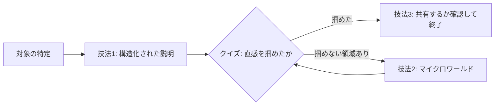

# Understand: 理解のエスカレーションループ

エージェントがコードを量産する時代のボトルネックは人間の理解である。
このskillの目的は「検証」ではなく「参加」— 読者が次の一手を自分で発想できる
状態にすること。理解不足は認知的負債として蓄積するので、変更が新鮮なうちに返済する。

Geoffrey Litt の3技法（説明・マイクロワールド・共有空間)を、直列工程ではなく
エスカレーション型に組む。技法1は常に実行し、技法2はクイズで直感が掴めて
いない領域が見つかったときだけ、技法3は最後の出力先オプションとして提示する。

2つの横断原則（全stepに適用）:

- **言葉より構造**: 関係・流れ・状態遷移・分岐・構成は散文で書かずに
  Mermaid 図・表・コード例にする。散文は図の前提・例外・結論を繋ぐ最小限に
  留める。読者は長い段落より「図＋短い散文＋実データ例」の方が速く直感を得る。
  **図はコードブロック内のテキスト図（ASCIIアート）で書いてはいけない**:
  `↓` や `→` を改行・空白で並べた疑似フローチャートは視認性が悪く認知負荷が
  かかる。流れ・分岐を図示したくなったら、その内容をそのまま
  ```mermaid の flowchart / sequenceDiagram / stateDiagram に書く。
  表で足りるものは表にする。この2択以外の図形式は使わない。
  書き終えたら**全コードブロックを見直し、mermaid 以外のブロックに
  `↓` `→` `├` などの矢印・罫線で組んだ図が紛れていないか確認する**。
  実行例やコード引用のブロックは対象外。1つでも見つけたら mermaid に
  変換してから出力する。
- **言語の一貫性**: ユーザーが使った言語で全文を書く。日本語の依頼に対して
  section 見出しや説明文が英語に切り替わると読みの負荷が急増する
  （Background/Intuition 等の枠組み名はそのままでよいが、本文は混ぜない）。

## 全体フロー



## Step 0: 対象と深さの特定

まず何を理解したいのかを確定する。diff / PR / ブランチ / コミット範囲 /
モジュール / 概念のどれか。曖昧なら聞く。

次に深さを見積もる。すべての変更に全段階は要らない:

| 対象 | 各sectionの厚み | クイズ | マイクロワールド提案 |
|---|---|---|---|
| typo・設定値・依存bump・単純削除・リネーム | 各1-3文（Code は省略可） | 1-2問 | しない |
| 中規模の機能追加・修正 | フル | 3問 | 誤答領域があれば |
| アルゴリズム・並行処理・アーキテクチャ変更 | フル | 5問 | 積極的に |

深さが変わっても **section の流れ（TL;DR → Background → Intuition → Code →
Quiz → 次の一手）は崩さない**。小さい変更で調整するのは各sectionの厚みと
省略であって、構成の順序ではない。読者は毎回同じ地図で読めることに価値がある。

厚みはコミットの「重要そうな雰囲気」ではなく**読者が誤解しうる量**で決める。
1ファイル削除の chore は、なぜ消せたのかを2-3文で言えれば読者の理解は足りる。
そこにフルの厚みを被せるのは、内容が良くても過剰包装で、読むコストが理解の
増分を上回る。調査で面白い文脈を見つけても、説明に入れるのは読者の次の一手に
効く分だけにする。

小さい変更に儀式を強制しない。「このskillを通したのに時間だけ取られた」体験は
skill自体への信頼を毀損する。ただし**クイズは規模にかかわらず必ず出す**
（最小でも1-2問）。クイズは「読んだつもり」を検出する装置であり、小さな
変更でも「なぜこの削除が安全なのか」のような核心1問には意味がある。
規模で削るのは説明の厚みとマイクロワールド提案であって、クイズではない。
Code section など本当に書くことがない section だけ、省略を1行で明示して飛ばす。

## Step 1: 構造化された説明（技法1・常に実行）

Litt の /explain-diff 構成に従い、この順で書く。順序に意味がある:
背景なしの直感は宙に浮き、直感なしのコード解説は写経になる。

section構成は読者の認知の流れ 要約 → why → what → how → check → todo に対応する:

0. **TL;DR** — 冒頭に箇条書き3-5点で全体の要約。読者はまずここで
   「読み進める価値と全体像」を掴む。散文にせず箇条書きにし、**各項目は
   1文で完結させる**。1項目に2-3文を接続詞で詰め込むと、それは段落を
   ハイフンで始めただけで箇条書きの意味（一目で走査できること）が失われる。
   1文に収まらない内容は本文（Background 以降）に置く。
1. **Background (why)** — なぜこの変更が存在するのか、変更前の世界の説明。
   周辺コードを実際に探索してから書く（diffだけ読んで書かない）。読者の
   前提知識は不明なので、初心者向けの深い背景（既知ならスキップ可と明記）→
   変更に直結する狭い背景、の二段構成にする。
2. **Intuition (what)** — 詳細の前に直感。**最初に変更のゴールを1文で宣言する**
   （元記事の例:「2D描画のトリックで庭を立体的に見せる」）。次にゴールの理解に
   必要な関連概念を、トイデータを使った具体例で説明する。関係・流れ・状態遷移は
   Mermaid 図にする。少数の図の型を決めて説明全体で再利用すると、読者の図の
   読み方の学習コストが一度で済む。
3. **Code (how)** — 変更の高レベルウォークスルー。ファイル順ではなく理解
   しやすい順にグループ化する。literate style: コードを引用し、散文で繋ぐ。
4. **Quiz (check)** — 次のstepで詳述。**クイズがない説明は未完成品**である。
   説明を書き終えた気になった時点で Quiz section が無ければ、それは
   まだ Step 1 の途中。
5. **次の一手 (todo)** — レビューで見るべき点、残った未解決点、発展の方向を
   短い section として最後に置く。理解を行動に接続する。

書き出す前に「TL;DR / Background / Intuition / Code / Quiz / 次の一手が
全部あるか」を確認する。各sectionの内部でも同じ流れを守る: 結論や要点を
先に置き、根拠と詳細を後ろに。読者が途中で「なぜ今この話をされているのか」と
迷ったら順序設計の失敗である。

文体は明快で流れのある散文（Martin Kleppmann 調）。セクション間の遷移を滑らかに。
出力は会話内 Markdown を基本とし、ユーザーが求めたら自己完結 HTML
（/tmp/YYYY-MM-DD-explanation-<slug>.html）にする。

## Step 2: クイズ = 理解速度の調整弁

Quiz section に多肢選択クイズを置く（中規模3問、大規模5問）。

元記事での位置づけを保つこと: クイズは「読んだつもり」防止装置である
（Matuschak の "books don't work" — 読んだだけでは保持も理解もしていない
ことに気づけない）。Litt 自身のルールは「クイズに合格するまでコードを
他人に送らない」。つまりクイズは説明の付録ではなく、理解したと宣言する
ための関門的な自己チェックであり、同時にAIの開発ループが人間の理解速度を
追い越さないようにする調整弁である。

問題は場当たり的に作らない。**逆算で設計する**: まず「この変更を理解したと
言えるためには、どの論点を押さえている必要があるか」を列挙し（変更の動機、
核となる仕組み、境界条件・副作用、変更しなかったものとその理由、など）、
その論点集合を必要十分に覆うように問題を割り当てる。本文をそのまま引用した
文言の再認で答えられる問題は理解を測れないので出さない — 本文の内容を
新しい状況・別の入力に適用しないと解けない形にする。

難易度は「PRの実質を理解していないと解けないが、ひっかけではない」中程度。
各選択肢に正誤の理由を用意する。

**正解と解説は必ず全問分を出力に含め、各問題の直下に置く**。出題だけして
正解を伏せると、読者は答え合わせのために追加のやりとりを強いられる。
末尾に解答をまとめる形式は、問題と解答の間の往復スクロールを強いるので
使わない。ネタバレが気になる読者は自分で読み飛ばせるが、スクロールの往復は
読者には解消できない。

クイズの本当の役割は採点ではなく**分岐条件の取得**である。ユーザーの回答を
受けたら:

- 全問正解 or 自己申告で「掴めた」→ Step 4（共有確認）へ。
- 誤答した、または「ここがまだピンとこない」と言われた → その領域を特定して
  Step 3 を提案する。誤答パターンから「どの概念の直感が欠けているか」を
  診断して伝えること。単に「不正解です」で終えない。

この分岐は頭の中に持つだけでなく、**クイズの直後に「この後の流れ」として
明示的に出力する**（例:「回答するか『掴めた』と言ってください。誤答が
あった領域には、操作して直感を掴むための小さなツール＝マイクロワールドを
提案します」）。読者が次に何をすればループが進むのかを見えるようにする
ためであり、非対話的な文脈（explainer を後で読む人、次のターンの agent）
でもこの1段落が行動の手がかりになる。

ユーザーがクイズを飛ばしたがったら飛ばす。調整弁であって関所ではない。

## Step 3: マイクロワールド（技法2・条件付きエスカレーション）

Papert の「Mathland に住む」の応用: 説明を読むだけでは掴めない直感は、
対象を自分の手で操作すると掴める。クイズで特定した「直感が欠けている領域」に
対して、小さな操作可能ツールを作ることを**提案**する（勝手に作り始めない。
作るコストと得られる直感を1-2文で示し、ユーザーが乗ったら作る）。

本質は「agent がデバッグを代行する」のではなく「**人間が自分で操作するための
ツールを agent が作る**」こと。元記事の言葉では「自分でやることが、途中で
理解を育てる方法」。Litt の website 移行の例が示すとおり、agent に全部
やらせて眺めるのと、コマンドセンターで自分がボタンを押して1ステップずつ
進めるのとでは、残る理解がまるで違う。

良いマイクロワールドの条件:

- **その領域専用**: 汎用デバッガではなく、今回の変更の核となる状態や挙動だけを
  見せる・触らせる使い捨てツール。
- **操作→即フィードバック**: パラメータを変えたら結果がすぐ変わる。
  例: 状態機械のステップ実行CLI、アルゴリズムの入力を変えて途中経過を出す
  スクリプト、移行前後の挙動を並べて叩けるコマンド、簡単なHTML playground。
- **小ささ**: 数十分で作れて捨てられる。メンテ資産にしない（/tmp か
  scratch ディレクトリに置く）。

ユーザーが操作して直感を得たら Step 2 の再クイズ（同領域の別問題を1-2問）で
確認し、Step 4 へ進む。

## Step 4: 共有（技法3・出力先オプション）

理解は個人で完結させず、チームや将来の自分と共有すると複利になる。
最後に1回だけ聞く: 「この explainer を共有・保存しますか？」

- **この vault のユーザー（lilpacy）の場合**: 共有空間は wiki（lilpacy/）に相当
  する。「wiki に取り込む」と言われたら、vault の query 取り込みフロー
  （lilpacy/CLAUDE.md）に従う。勝手に ingest しない。
- **チーム共有**: Notion 等のツールが使えるならそこへ、なければ Markdown
  ファイルとして repo 外に書き出してパスを渡す。
- **不要**: そのまま終了。何も残さない。

## アンチパターン

- 3技法を毎回1→2→3と全部実行する（適合性より儀式を優先している）。
- diffだけ読んでBackgroundを書く（周辺コードを探索せずに書いた背景は薄い）。
- クイズの誤答に「不正解」とだけ返す（誤答は診断情報。どの直感が欠けているかを読む）。
- マイクロワールドを恒久ツールとして作り込む（使い捨てでよい）。
- ユーザーの合意なしに wiki / Notion へ書き込む。
