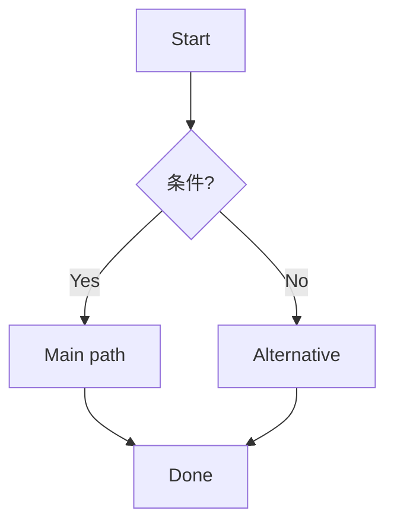

# resources/templates.md

## 00_context.md（前提・仮置き）
- 対象:
- 背景/課題:
- 目的:
- ターゲット:
- 利用シーン:
- 制約（期限/技術/運用/法務）:
- 既存情報（URL/仕様/画面）:
- Assumptions（仮置き）:
- Open Questions（未決）:
- 次アクション:

---

## 10_strategy.md（戦略）
### Goals
- User Goals:
- Business/Stakeholder Goals:
- Non-goals（やらないこと）:

### Users
- Primary persona/segment:
- Context of use:
- Current alternatives:

### Success
- 定量KPI:
- 定性ゴール（例: 信頼/安心/迷いの減少）:
- 計測方法（イベント/ログ/アンケ）:

### Constraints & Risks
- 制約:
- リスク:
- 検証計画（リサーチ/AB/プロト）:

---

## 20_scope.md（要件）
### Requirements（MoSCoW）
| ID | 種別（機能/コンテンツ） | 要件 | 優先度 | 受け入れ条件 | 備考 |
|---|---|---|---|---|---|

### Out of Scope（今回やらない）
- 

---

## 30_structure.md（構造）
### IA方針
- 分類軸:
- 命名規則:
- メタデータ:
- 検索/フィルタ方針:

### User Flows（Mermaid例）

### Sitemap（必要なら）
- 

---

## 40_skeleton.md（骨格）
### 画面一覧
| 画面 | 目的 | 主CTA | 主情報 | 状態（loading/empty/error） |
|---|---|---|---|---|

### ワイヤー（テキスト）
- Header:
- Primary area:
- Secondary area:
- Footer:
- Notes（優先度/視線誘導/入力補助）:

### UIコンポーネント定義（最小）
| Component | Purpose | States | Notes |
|---|---|---|---|

---

## 50_surface.md（表層）
### Visual Principles
- 原則1:
- 原則2:
- 原則3:

### Style Rules（最小セット）
- Color:
- Typography:
- Spacing:
- Icons/Illustrations:
- Accessibility（コントラスト等）:

### Design System連携
- 参照する既存（あるなら）:
- 追加/拡張が必要なトークン:

