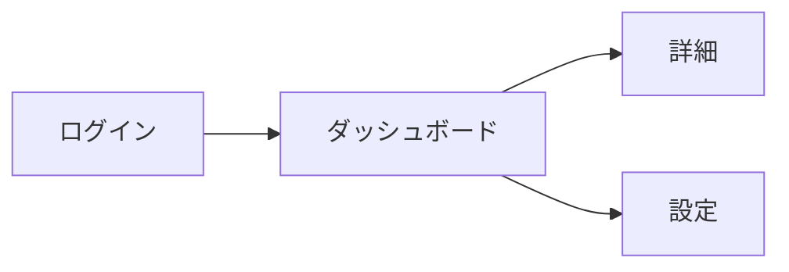

# Wireframe Builder

Web/アプリの**画面ワイヤーフレーム**を、ASCIIアート図 + Markdown注釈で作成するSkill。

## Goals
- ユーザー要件から**画面の構造・レイアウト・導線**を設計する
- **ASCII図**で視覚的にレイアウトを表現する（色・装飾より構造優先）
- **注釈**で仕様（状態、制約、挙動、エッジケース）を明確化する
- 実装前に要件漏れ・矛盾を炙り出せる粒度で出力する

## Non-goals
- 色・フォント・画像などのビジュアルデザイン（→ モックアップの領域）
- 動作するプロトタイプの作成
- 実装コードの生成

---

## Inputs（入力の期待形式）

以下のいずれか、または組み合わせ：
- **機能要件**：「ユーザーが〇〇できる画面」
- **ユーザーフロー**：「検索 → 一覧 → 詳細 → 購入」
- **画面リスト**：「ログイン画面、ダッシュボード、設定画面」
- **既存画面の改善依頼**：「この画面のレイアウトを見直したい」
- **PRD/仕様書の一部**

入力が曖昧な場合、まず**ユーザーゴール**と**主要タスク**を確認する。

---

## Outputs（成果物）

### 1. 画面一覧（Screen Inventory）
```markdown
| # | 画面名 | 目的 | 主要CTA |
|---|--------|------|---------|
| 1 | ログイン | 認証 | ログインボタン |
| 2 | ダッシュボード | 状況把握 | 新規作成 |
```

### 2. ユーザーフロー（必要な場合）


### 3. 各画面のワイヤーフレーム（ASCII図 + 注釈）

```
┌─────────────────────────────────────────┐
│ [Logo]              [検索]    [👤 User] │  ← Header
├─────────────────────────────────────────┤
│ ┌─────────┐  ┌─────────────────────────┐│
│ │ Nav     │  │ Main Content            ││
│ │ ・Home  │  │ ┌─────────────────────┐ ││
│ │ ・Items │  │ │ Card 1              │ ││
│ │ ・設定  │  │ └─────────────────────┘ ││
│ └─────────┘  │ ┌─────────────────────┐ ││
│              │ │ Card 2              │ ││
│              │ └─────────────────────┘ ││
│              └─────────────────────────┘│
└─────────────────────────────────────────┘
```

### 4. 画面注釈（Screen Annotation）
各画面に対して以下を記載：
- Screen name / User goal / Primary CTA
- UI要素（入力・表示・操作）
- States（Empty / Loading / Error / Success）
- Validation / Rules
- Notes / Edge cases

---

## Instructions（手順）

### Phase 1: 前提の確認
1. **ユーザーゴール**を確認（この機能で何を達成したいか）
2. **対象ユーザー**を確認（誰が使うか）
3. **主要タスク**を書き出す（ユーザーがやること）

### Phase 2: フロー設計
4. **ユーザーフロー**を作成（Mermaid flowchart）
5. **画面一覧**を洗い出す（テーブル形式）
6. 動的プロセス（ウィザード等）があれば**Wireflow**として画面＋フローを統合

### Phase 3: ワイヤーフレーム作成
7. 各画面の**ASCIIワイヤーフレーム**を作成
   - 重要な要素ほど上・左・目立つ位置に配置
   - ナビゲーション構造を明示
   - PC/SPで異なる場合は両方作成
8. 各画面の**注釈**を作成（templates/screen-annotation.md参照）

### Phase 4: レビュー観点の提示
9. **確認ポイント**を提示
   - 要件の過不足
   - 導線の破綻
   - エッジケース（空、エラー、権限）

---

## Quality Checklist（自己確認）

- [ ] ユーザーゴールと主要タスクが明確
- [ ] ユーザーフローで画面遷移が破綻していない
- [ ] 各画面の目的とPrimary CTAが明確
- [ ] 情報の優先順位がレイアウトに反映されている
- [ ] 状態（Empty/Loading/Error/Success）が考慮されている
- [ ] 入力項目のバリデーションが明記されている
- [ ] エッジケース（権限、0件、上限）が考慮されている
- [ ] 色・装飾ではなく構造・導線に集中している

---

## Examples

### 発動する例
- 「ユーザー登録フローのワイヤーフレームを作って」
- 「ダッシュボード画面の構成を設計して」
- 「ECサイトの商品一覧→詳細→カートの画面設計をして」
- 「管理画面のレイアウトを考えて」
- 「このPRDから画面のワイヤーを起こして」
- 「画面の骨組みを整理したい」

### 発動しない例
- 「画面のデザインを作って」→ モックアップ（ui-mockup-builder）の領域
- 「ボタンの色を決めて」→ ビジュアルデザインの領域
- 「動くプロトタイプを作って」→ プロトタイピングツールの領域
- 「コンポーネントを実装して」→ 実装の領域

---

## References

- 詳細ガイド・判断基準：[reference.md](./reference.md)
- 画面注釈テンプレート：[templates/screen-annotation.md](./templates/screen-annotation.md)
