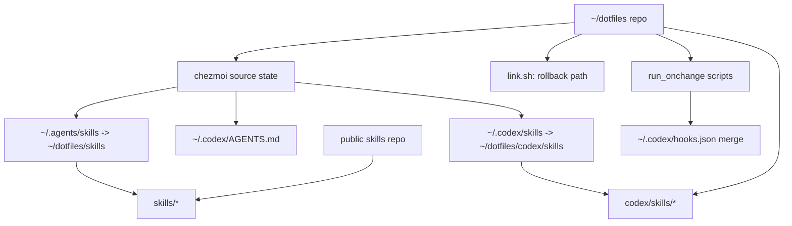
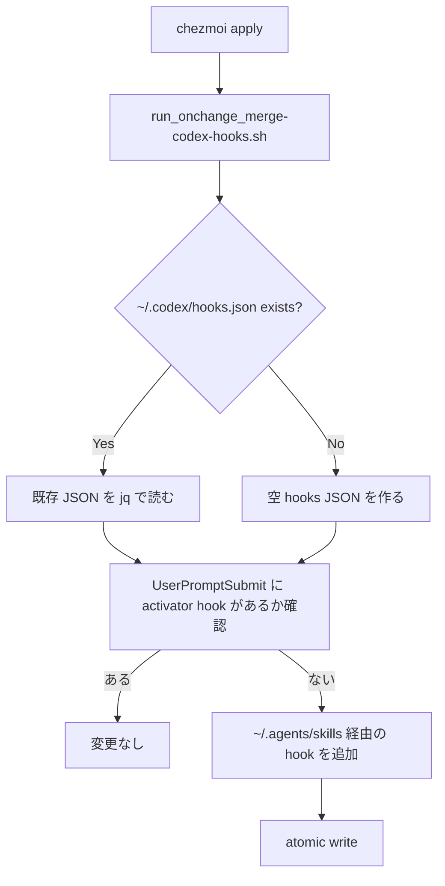

# chezmoi 移行計画案

> **Status: 見送り（2026-07-21）** — 移行しない判断とその理由は [chezmoi-migration-decision.md](./chezmoi-migration-decision.md) を参照。本計画は再検討時の参考として残す。

## レビュー状態

| 項目 | 結果 |
|---|---|
| `codex exec --sandbox read-only` review | 致命的な問題なし |
| 最終確認日時 | 2026-07-21 |
| 計画の保存元 | `/tmp/chezmoi-migration-plan.md` |

## 目的

`~/dotfiles` の既存 symlink ベース運用を壊さず、次を再現可能にする。

| 対象 | 目的 |
|---|---|
| `~/.codex/hooks.json` | git 管理外のローカル設定を再現可能にする |
| `~/.codex/AGENTS.md` / `~/.codex/skills` | 既存 Codex 設定を chezmoi で配置できるようにする |
| `skills/` | 将来、別 repository / 公開 skills repository として切り出せる構造を保つ |
| `codex/skills/` | Codex 用 curated/system skill 群として既存構成を維持する |
| `link.sh` | 移行完了まで rollback path として残す |

## 前提

| 前提 | 内容 |
|---|---|
| 移行方式 | 一括置換ではなく、branch 上で chezmoi source state を追加する |
| skills 管理 | `skills/` と `codex/skills/` を別物として扱う |
| 公開 skills repo | 公開候補は `skills/` のみ。`codex/skills/` は今回切り出さない |
| skills repo 配置 | 公開 repo 化する場合も `~/dotfiles/skills` パスを維持するため、第一候補は git submodule |
| hook 管理 | `~/.codex/hooks.json` は template 直置きではなく、既存 hook と merge する script を使う |
| hook path | hook からは `~/dotfiles/skills/...` ではなく、安定 symlink の `~/.agents/skills/...` を呼ぶ |
| rollback | `link.sh` とバックアップファイルで旧運用に戻せる状態を維持する |

## 推奨構成

## skills 管理方針

| 選択肢 | 推奨度 | 使う場面 | rollback |
|---|---:|---|---|
| `skills/` を git submodule 化 | 高 | `~/dotfiles/skills` のパスを維持しながら公開 repo として管理したい | submodule を外し、backup または branch から旧 `skills/` ディレクトリを戻す |
| `.chezmoiexternal` の `git-repo` | 低 | skills repo を home 配下の別 checkout として利用するだけの場合 | `.chezmoiexternal` entry を消し、checkout 先を削除 |
| `.chezmoiexternal` の `archive` | 低 | tag 固定の配布物として使いたい | entry を消し、展開先を削除 |
| chezmoi source に skills 本体を移す | 低 | 非公開で dotfiles と完全一体管理したい場合のみ | 移動差分が大きく rollback が重い |

結論: 公開 skills repo 化を見据えるなら、`skills/` は chezmoi source へ変換しない。`~/dotfiles/skills` に submodule として置き、dotfiles/chezmoi 側は `~/.agents/skills` への配置だけ担当する。`codex/skills/` は別系統なので、`~/.codex/skills -> ~/dotfiles/codex/skills` を維持する。

## 段階的実装

### Phase 0: 現状固定とバックアップ

| 手順 | 内容 | rollback |
|---|---|---|
| 0.1 | `git status --short --untracked-files=all` を確認し、現在の未追跡 skill 変更を把握 | 変更しない |
| 0.2 | `~/.codex/hooks.json` を `~/.codex/hooks.json.bak.<timestamp>` に保存 | backup を戻す |
| 0.3 | `~/.codex/config.toml` を `~/.codex/config.toml.bak.<timestamp>` に保存 | backup を戻す |
| 0.4 | `skills/` を `skills.bak.<timestamp>` へ複製しておく | backup から戻す |
| 0.5 | `link.sh` を触らず、旧セットアップ経路として保持 | `./link.sh` を再実行 |

### Phase 1: chezmoi source state を repo 内に追加

| 手順 | 内容 | rollback |
|---|---|---|
| 1.1 | `~/dotfiles/chezmoi/` に source state を作る | ディレクトリ削除 |
| 1.2 | `.chezmoiroot` は使わない。実行時は `chezmoi --source ~/dotfiles/chezmoi ...` または user config の `sourceDir` で明示する | `sourceDir` 設定を削除 |
| 1.3 | 既存 dotfiles を一気に移さず、Codex 関連だけを最初の対象にする | Phase 1 差分を revert |

### Phase 2: Codex 設定の chezmoi 管理

| 手順 | 内容 | rollback |
|---|---|---|
| 2.1 | `~/.codex/AGENTS.md -> ~/dotfiles/codex/AGENTS.md` を維持する | 既存 symlink を戻す |
| 2.2 | `~/.codex/skills -> ~/dotfiles/codex/skills` を維持する。公開 `skills/` repo へ向けない | 既存 symlink を戻す |
| 2.3 | `~/.agents/skills -> ~/dotfiles/skills` を維持する。`skills/` を submodule 化してもパスは変えない | 既存 symlink を戻す |
| 2.4 | `~/.codex/hooks.json` は template で全置換せず、`run_onchange_merge-codex-hooks.sh` で `UserPromptSubmit` に structured-answer activator を jq merge | backup hooks を戻す |
| 2.5 | hook command は `~/.agents/skills/structured-answer/scripts/activator.sh` を呼ぶ | backup hooks を戻す |

### Phase 3: skills repo 切り出し準備

| 手順 | 内容 | rollback |
|---|---|---|
| 3.1 | `skills/` に private 情報や machine-local path がないか棚卸し | 変更しない |
| 3.2 | `codex/skills/` は棚卸し対象から除外し、今回の公開 repo 候補に含めない | 変更しない |
| 3.3 | 公開可能 skill と private skill を分類 | 変更しない |
| 3.4 | 公開 repo 候補へ `skills/` を分離する branch を作る | branch 削除 |
| 3.5 | dotfiles 側では `skills/` を `~/dotfiles/skills` の submodule として参照 | submodule 参照を削除し旧 directory を戻す |

### Phase 4: dry-run と parity 確認

| 手順 | 内容 | rollback |
|---|---|---|
| 4.1 | `chezmoi diff` で `~/.codex/*` の差分だけ確認 | apply しない |
| 4.2 | `chezmoi apply --dry-run --verbose` で script 実行予定を確認 | apply しない |
| 4.3 | 問題なければ `chezmoi apply` を実行 | backup から復元 |
| 4.4 | Codex 起動後、hook trust が必要なら trust する | backup から復元 |

### Phase 5: link.sh との二重管理解消

| 手順 | 内容 | rollback |
|---|---|---|
| 5.1 | chezmoi 管理対象になった Codex 関連だけ `link.sh` から外す | 行を戻す |
| 5.2 | 他の dotfiles は既存 `link.sh` のまま残す | `./link.sh` 再実行 |
| 5.3 | 十分に安定後、他設定も chezmoi に移すか判断 | Codex 部分だけで止める |

## hook merge の方針

`~/.codex/hooks.json` は既存 hook が複数あるため、全置換しない。

## rollback 手順

| ケース | 戻し方 |
|---|---|
| `chezmoi apply` 後に hook が壊れた | `cp ~/.codex/hooks.json.bak.<timestamp> ~/.codex/hooks.json` |
| `~/.codex/AGENTS.md` / `~/.codex/skills` が壊れた | `./link.sh` を再実行し、`~/.codex/skills -> ~/dotfiles/codex/skills` を戻す |
| `~/.agents/skills` が壊れた | `./link.sh` を再実行し、`~/.agents/skills -> ~/dotfiles/skills` を戻す |
| `skills` submodule が問題を起こした | submodule entry を消し、`skills.bak.<timestamp>` または git branch から旧 `skills/` directory を戻す |
| chezmoi source state が不要になった | `chezmoi/` と chezmoi 関連差分を revert |
| グローバルに chezmoi をやめる | chezmoi は apply 済みファイルを消さない前提で、backup 復元と `link.sh` 再実行 |

## 実装前の確認ポイント

| 確認 | 理由 |
|---|---|
| `skills/` を submodule にするか | `~/dotfiles/skills` のパスを維持でき、現行 hook/AGENTS との衝突が少ない |
| private skill があるか | 公開 repo へ混入させないため |
| `~/.codex/hooks.json` を global 管理にするか repo 管理にするか | hook の適用範囲が変わる |
| chezmoi source state を `chezmoi/` に置くか repo root に寄せるか | 既存 repo のファイル名を chezmoi 形式へ変換する影響が変わる |

## この計画で実装しないこと

| 対象外 | 理由 |
|---|---|
| dotfiles 全体の一括 chezmoi 移行 | rollback 範囲が広すぎる |
| `~/.codex/hooks.json` の全置換 | 既存 hook を壊すリスクがある |
| `~/.codex/skills` を公開 `skills/` repo に向けること | 現行の `codex/skills/` 専用 skill 群を失う |
| private skill の公開 repo 移動 | 棚卸し前にやるべきではない |
| `link.sh` の即削除 | rollback path を失う |
