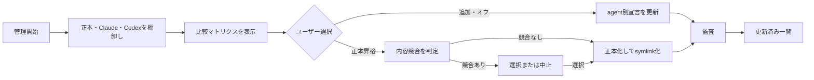
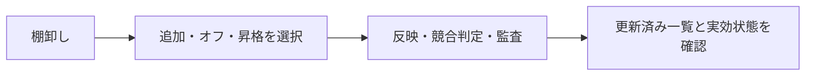
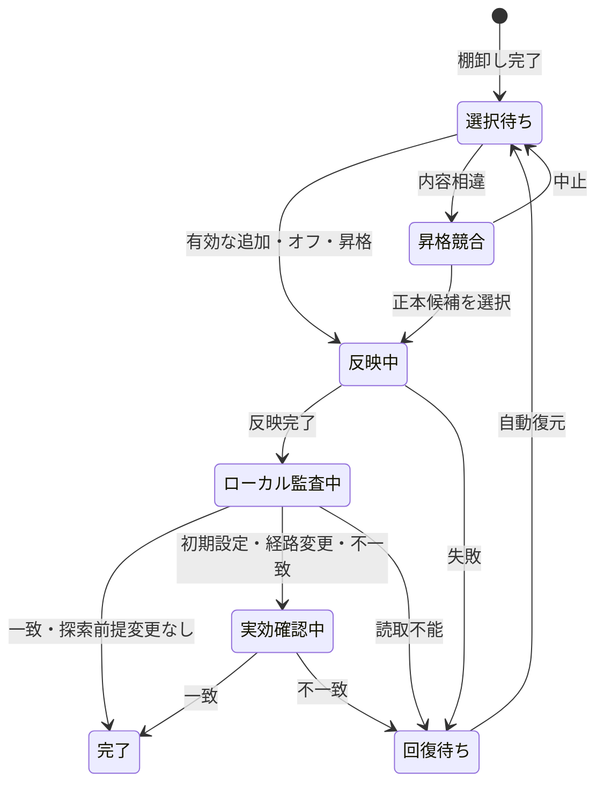

# Skill可視性管理 設計レビュー

- Status: Approved
- Date: 2026-08-17
- Canonical case: `conversational-skill-visibility-management.design-case.json`
- Validation: Blocking 0 / Issues 0

## 1. 設計概要・成功条件

`./skills`を正本とし、Claude CodeとCodexへSkill単位のsymlinkで選択公開する。処理本体はCLI、`skill-visibility-management` Skillは会話からCLIを呼ぶ薄い入口とする。

| ID | 成功条件 |
|---|---|
| SC1 | 正本・Claude Code・Codexの現在状態を一覧できる |
| SC2 | 一覧からagent別に追加・オフできる |
| SC3 | 設定ファイルを直接編集せず操作できる |
| SC4 | オフにしたSkillが対象agentの新規セッションで見えない |
| SC5 | 操作後の更新済み一覧を確認できる |
| SC6 | agent固有Skillを内容と既存可視性を保って正本へ昇格できる |

## 2. Business Understanding / Current Business Workflow



管理対象セルは`オフ`、`正本リンク`、`固有`、`固有・正本と相違`の4状態を持つ。`~/.agents/skills`から正本全体を公開せず、Codexは`~/.codex/skills`、Claude Codeはagent専用rootから選択Skillを読む。

## 3. Decision Requirements

| ID | 必要な判断 | 発生条件 | 誤判断の影響 |
|---|---|---|---|
| DR1 | どのSkillをどのagentで追加・オフするか | 一覧表示後 | 必要Skillの欠落、不要Skillの公開 |
| DR2 | 実効可視性をどう確認するか | 変更後 | 見かけ上だけ成功する、または毎回遅くなる |
| DR3 | 同名固有Skillのどの内容を正本にするか | 正本昇格時 | agent固有内容の消失 |
| DR4 | 人とagentが使う入口をどう構成するか | 管理開始時 | 遅い、再現不能、会話から使えない |

## 4. Target Value Loop



通常操作はローカル監査だけで完了する。初期設定、探索経路変更、監査不一致時だけagentの新規セッションで実効可視性を確認する。

## 5. Decision Specifications

| ID | 決定 |
|---|---|
| D1 | ユーザーが比較マトリクスから対象Skillとagentを選ぶ |
| D2 | 通常はローカル監査、必要時だけ新規セッション確認 |
| D3 | 同一内容は統合、異なる内容は停止して明示選択 |
| D4 | CLIを処理本体、Skillを薄い会話入口にする。TUIは延期 |

### 正本昇格 Decision Table

| 正本あり | 同名固有が複数 | 内容一致 | 動作 |
|---|---|---|---|
| N | N | - | 単一Skillを正本へ昇格し、元配置をsymlink化 |
| N | Y | Y | 1つの正本へ統合し、既存agentの可視性をsymlinkで維持 |
| N | Y | N | 自動昇格を停止し、正本候補の選択または中止を求める |
| Y | - | - | 昇格せず、既存正本の追加・オフを案内 |

内容比較では`.DS_Store`、`__pycache__`、`*.pyc`だけを除外する。

## 6. Design Principles

| 優先 | ID | 原則 |
|---:|---|---|
| 1 | P1 | 実効可視性が不確かな状態で成功報告しない |
| 2 | P4 | 異なるSkill内容を自動で上書き・統合・破棄しない |
| 3 | P2 | 通常操作ではagentを起動せずローカル監査で完了する |
| 4 | P3 | 通常変更では正本を変えず、昇格では内容を変えず配置だけを一元化する |

## 7. Contradiction Review

| ID | 矛盾 | 解消 |
|---|---|---|
| X1 | `~/.agents/skills`の全件公開が選択公開を無効化 | 全件公開を廃止し、agent別rootへ一本化 |
| X2 | 実セッション確認の確実性と通常速度 | 通常はローカル監査、必要時だけ実セッション確認 |
| X3 | `.DS_Store`等が内容競合を誤検出 | 既知の生成物だけ比較対象外 |

Open Blockingは0件。

## 8. State Machine



内容が異なる一方を正本へ選んだ場合、未選択側は`固有・正本と相違`として保持する。

## 9. Information Architecture

```text
Skill可視性管理
├── Skill比較マトリクス
│   ├── Skill名
│   ├── 正本の有無
│   ├── Claude Code状態・操作
│   └── Codex状態・操作
├── 反映・確認状況
├── 正本昇格候補・内容競合差分
└── 失敗内容・自動復元結果
```

正本がない`固有`行だけに`正本へ昇格`を表示する。

## 10. UI Behavior Specification

| ID | 挙動 | 主な結果 | 回復 |
|---|---|---|---|
| UI1 | マトリクス表示・更新 | 3rootの状態を1表で表示 | 読取不能pathを示し無変更 |
| UI2 | 追加・オフ | agent別宣言とsymlinkを変更 | 操作前へ自動復元 |
| UI3 | 正本昇格 | 内容保持、正本化、可視性維持 | 正本作成と置換を自動復元 |
| UI4 | 昇格競合 | 差分・候補・保持先を表示 | 中止時は無変更 |
| UI5 | 条件付き実セッション確認 | 必要理由と実効可視性を表示 | 不一致なら成功報告せず復元 |
| UI6 | 会話からの管理 | Skillが同じCLIを呼びマトリクスを返す | CLIのエラー・復元結果を返す |

初版はCLIを提供する。TUIはCLIの選択操作が実測で不便になった場合だけ追加する。

## 11. Decision Log

| 決定 | 根拠 |
|---|---|
| 正本は`./skills` | ユーザーが元設計として再確認 |
| agent別rootへ選択symlink | 全件公開ではオフが成立しない |
| 比較マトリクスを主表示 | 3一覧の目視突合を不要にする |
| agent固有Skillを正本へ昇格可能 | 実在する固有Skillを整理対象に含める |
| 競合内容は無言で統合しない | 実内容が異なる同名Skillが存在する |
| CLI本体＋薄いSkill入口 | 会話体験、速度、再現性を両立する |

## 12. Assumptions / Open Questions

- Assumptions: 0
- Open Questions: 0
- Deferred: TUI。CLIの利用負担が実測された場合だけ検討する。
- Scope out: Skill内容の編集、plugin/system Skillの管理、履歴・version管理、自動マージ。

## 13. Traceability Matrix

| 成功条件 | 判断 | 原則 | 状態・UI |
|---|---|---|---|
| SC1 | D1, D4 | P1, P2 | S1 / UI1, UI6 |
| SC2 | D1 | P2, P3 | S1-S5 / UI2 |
| SC3 | D4 | P2 | 全状態 / UI6 |
| SC4 | D2 | P1 | S3-S6 / UI5 |
| SC5 | D1, D2 | P1, P2 | S5 / UI1, UI2 |
| SC6 | D3 | P3, P4 | S1-S3, S7 / UI3, UI4 |
