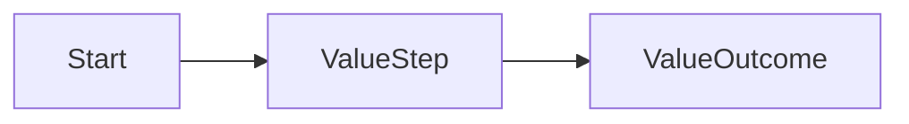

# Interaction Design Review

## Pipeline Status

| Stage | Status | Blockers |
|---|---|---:|

## Success Conditions

| ID | Condition | Verification |
|---|---|---|

## Business Understanding

| Purpose | Current normal flow | Teach-back | Approval |
|---|---|---|---|

## Decision Requirements

| ID | Required decision | Business reason | Trigger | Failure impact |
|---|---|---|---|---|

## Target Value Loop

## Decision Specifications

| ID | Requirement | Trigger | Owner | Evidence | Logic | Outcome | Principle |
|---|---|---|---|---|---|---|---|

## Contradictions

| ID | Rule | Severity | Problem | Resolution | Status |
|---|---|---|---|---|---|

## Next Question

（1問のみ）

## Downstream Impact

| Changed item | Stale outputs |
|---|---|
