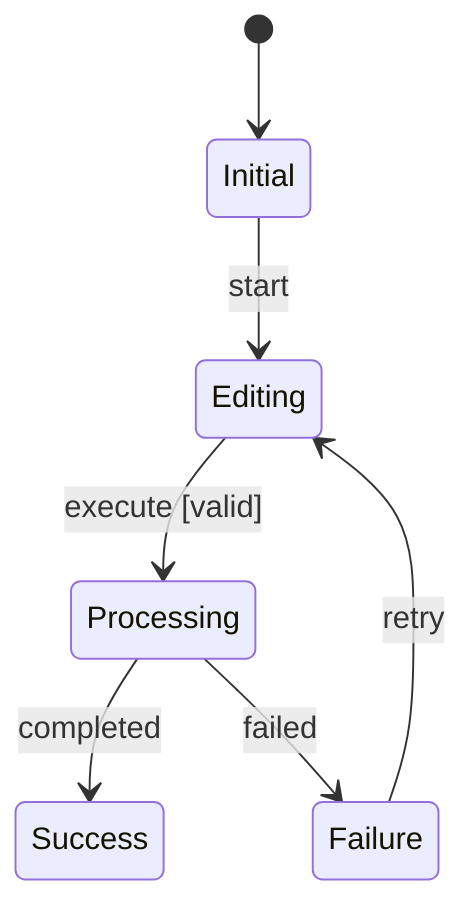
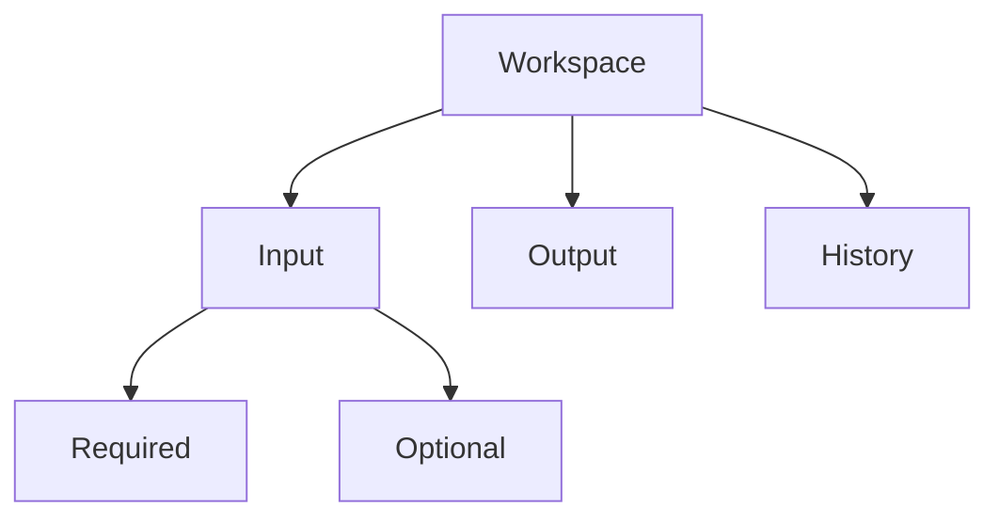

# Output Contracts

## 1. Review Summary

```markdown
# Design Review Summary

## Pipeline
| Stage | Status | Blocking | Warning |
|---|---|---:|---:|

## Next Action
（質問または作業を1つ）
```

## 2. Decision Register

| ID | 問い | 決定 | 主体 | 適用条件 | 理由 | 原則 | 状態 |
|---|---|---|---|---|---|---|---|

## 3. Contradiction Report

| ID | 規則 | 重大度 | 対象 | 問題 | 解消方法 | 状態 |
|---|---|---|---|---|---|---|

## 4. State Machine



## 5. IA



## 6. UI Behavior Specification

| ID | 状態 | 表示条件 | 操作 | システム結果 | フィードバック | 回復 | 根拠 |
|---|---|---|---|---|---|---|---|

## 7. 完了レポート

1. Scope
2. Success Conditions
3. Actors
4. Business Workflow
5. Decision Flow
6. Decision Table
7. Principles
8. Contradiction Review
9. State Machine
10. IA
11. UI Behavior
12. Assumptions
13. Open Questions
14. Traceability
