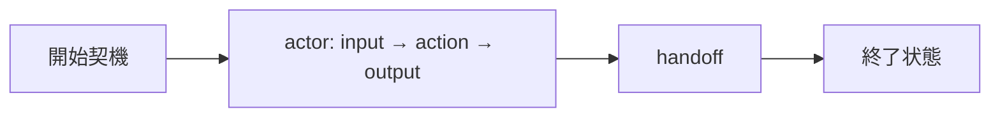
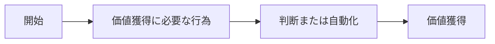
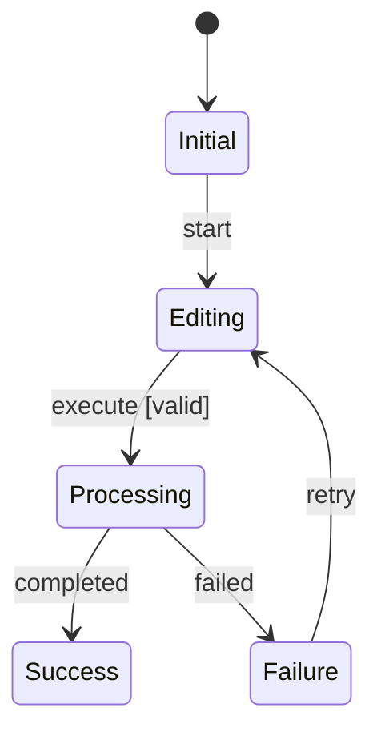
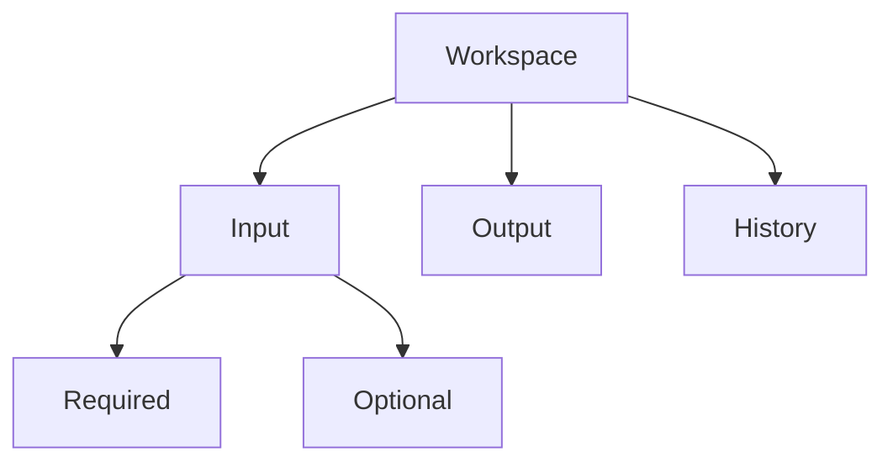

# Output Contracts

## 1. Review Summary

```markdown
# Design Review Summary

## Pipeline
| Stage | Status | Blocking | Warning |
|---|---|---:|---:|

## Next Action
（質問または作業を1つ）
```

## 2. Business Understanding Review

| 項目 | 内容 | 根拠 | 状態 |
|---|---|---|---|
| 業務目的 | | | confirmed / inferred / open |
| 対象内 | | | |
| 対象外 | | | |
| 開始契機 | | | |
| 終了状態 | | | |



最後にagentのteach-backと、ユーザーの承認状態を記録する。

## 3. Decision Requirements

| ID | 必要な判断 | 業務上の理由 | 発生契機 | 根拠 | 誤判断・未判断の影響 | 現行工程 |
|---|---|---|---|---|---|---|

## 4. Target Value Loop



各ノードにactor・input・action・output・Decision Requirement参照を持たせる。

## 5. Decision Specification

| ID | Requirement | Trigger | Owner | Evidence | Logic | Outcome | Failure impact | Reversible | Value step |
|---|---|---|---|---|---|---|---|---|---|

複数条件の組合せで結果が変わる判断だけDecision Tableを追加する。

| 条件＼ケース | C1 | C2 | C3 |
|---|---:|---:|---:|
| 条件A | Y | N | - |
| 条件B | - | Y | N |
| **結果X** | X | - | - |
| **結果Y** | - | X | X |

凡例：条件 `Y`=真、`N`=偽、`-`=無関係。動作 `X`=実行。

## 6. Contradiction Report

| ID | 規則 | 重大度 | 対象 | 問題 | 解消方法 | 状態 |
|---|---|---|---|---|---|---|

## 7. State Machine



## 8. IA



## 9. UI Behavior Specification

| ID | 状態 | 表示条件 | 操作 | システム結果 | フィードバック | 回復 | 根拠 |
|---|---|---|---|---|---|---|---|

## 10. 完了レポート

1. Scope / Success Conditions
2. Business Understanding / Current Business Workflow
3. Decision Requirements
4. Target Value Loop
5. Decision Specifications（必要な場合だけDecision Table）
6. Design Principles
7. Contradiction Review
8. State Machine
9. IA
10. UI Behavior
11. Assumptions / Open Questions
12. Traceability
