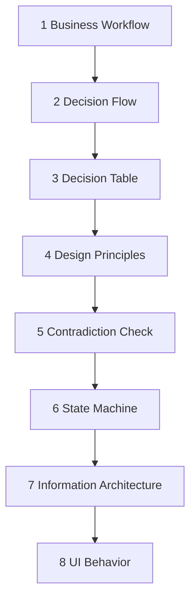

# Process Model

## 1. 8ステージ

## 2. 各ステージの主語

| ステージ | 主語 | 問い |
|---|---|---|
| Business Workflow | 人・組織 | 現場で誰が何をするか |
| Decision Flow | 判断主体 | どこで何を決めるか |
| Decision Table | 条件の組合せ | どの条件で何が起きるか |
| Design Principles | 設計全体 | 衝突時に何を優先するか |
| Contradiction Check | レビュー | 決定同士が両立するか |
| State Machine | システム | 何を契機に状態が変わるか |
| IA | 情報・機能 | 何をどうまとめるか |
| UI Behavior | 利用者と画面 | 何が見え、押すと何が起きるか |

## 3. 巻き戻し

下流で問題が見つかった場合、最も近い上流原因へ戻る。

| 問題 | 戻る先 |
|---|---|
| ボタンが多すぎる | Decision Flow |
| 初回と通常利用が衝突 | Design Principles / State Machine |
| 同じ条件で異なる結果 | Decision Table |
| 専門判断を一般ユーザーが行う | Decision Flow |
| 情報を置く場所がない | State Machine / IA |
| エラー後に戻れない | State Machine |
| 表示理由が説明できない | Decision / Principle |

## 4. 暫定進行

Blockingがある場合は原則停止する。  
ただしユーザーが明示的に「仮定を置いて試案を見たい」と依頼した場合のみ、次を満たして暫定案を作る。

- 仮定をID付きで分離
- 該当箇所を `※推測` と表示
- 成果物の状態を `provisional` とする
- Blockingが解消したとは扱わない
