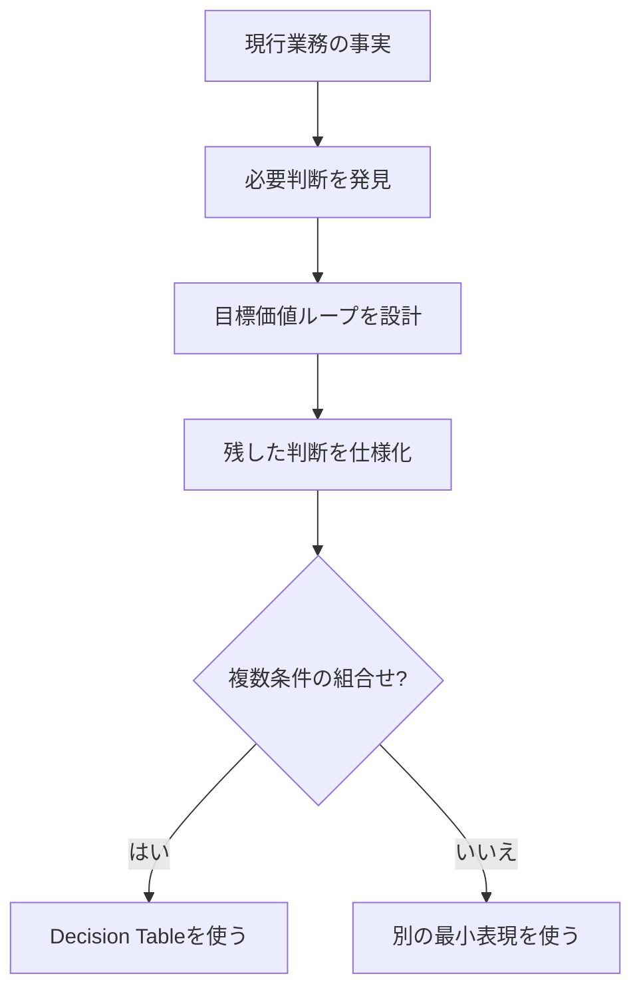

# Process Model

## 1. 9ステージ

```mermaid
flowchart LR
    S1[S1 Business Understanding]
    S2[S2 Decision Requirements]
    S3[S3 Target Value Loop]
    S4[S4 Decision Specification]
    S5[S5 Design Principles]
    S6[S6 Contradiction Check]
    S7[S7 State Machine]
    S8[S8 Information Architecture]
    S9[S9 UI Behavior]

    S1 --> S2 --> S3 --> S4 --> S5 --> S6 --> S7 --> S8 --> S9
```

## 2. 責務境界

| ステージ | 主語 | 問い | まだ決めないこと |
|---|---|---|---|
| Business Understanding | 人・組織 | 現場で誰が何のために何をしているか | 解決策、目標フロー、UI |
| Decision Requirements | 業務 | 何を判断しないと業務が進まないか | 削除、自動化、UI |
| Target Value Loop | 価値獲得 | 何を残し、消し、自動化すれば価値へ到達するか | 詳細条件、UI部品 |
| Decision Specification | 判断主体 | 残した判断を、いつ、誰が、何を根拠にどう行うか | UI表現 |
| Design Principles | 設計全体 | 衝突時に何を優先するか | 個別UI部品 |
| Contradiction Check | レビュー | 決定同士が両立するか | 下流の局所修正 |
| State Machine | システム | 何を契機に状態が変わるか | 情報配置 |
| IA | 情報・機能 | 何をどうまとめるか | 見た目 |
| UI Behavior | 利用者と画面 | 何が見え、操作後に何が起きるか | - |

## 3. 発見と設計の境界

Decision Tableはステージではなく、Decision Specification内で必要な場合だけ使う表現である。

## 4. 巻き戻し

| 問題 | 戻る先 |
|---|---|
| 目標フローが業務価値へ到達しない | Business Understanding / Target Value Loop |
| 必要な専門判断が消えている | Decision Requirements |
| 判断主体に権限がない | Decision Specification |
| 同じ条件で異なる結果になる | Decision Specification |
| ボタンが多すぎる | Target Value Loop / Decision Specification |
| 初回と通常利用が衝突 | Design Principles / State Machine |
| 情報を置く場所がない | State Machine / IA |
| エラー後に戻れない | State Machine |

## 5. 暫定進行

Blockingがある場合は原則停止する。ただしユーザーが明示的に仮定つき試案を求めた場合だけ、仮定IDを分離し、該当箇所へ `※推測` を付け、成果物を `provisional` にする。Blockingが解消したとは扱わない。
