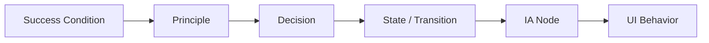

# Traceability

## 1. 追跡方向

## 2. 最低要件

| 対象 | 参照必須 |
|---|---|
| principle | success condition |
| confirmed decision | principle |
| transition | decision または workflow step |
| IA node | state または decision |
| UI behavior | decision + state |
| contradiction | decision / principle / stateのいずれか |

## 3. 変更影響

上流を変更したら、下流を自動的に `stale` とみなす。

| 変更 | staleにする対象 |
|---|---|
| Success Condition | 原則以降すべて |
| Principle | 関連Decision以降 |
| Decision | State、IA、UI |
| State | IA、UI |
| IA | UI |

## 4. マトリクス

| Success | Principle | Decision | State | IA | UI |
|---|---|---|---|---|---|
| SC1 | P1 | D3 | S2→S3 | IA2 | UI4 |
