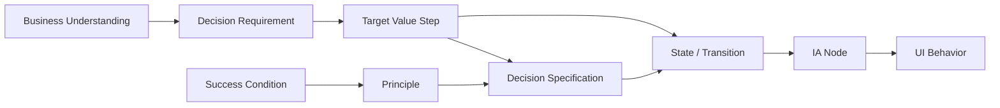

# Traceability

## 1. 追跡方向

## 2. 最低要件

| 対象 | 参照必須 |
|---|---|
| decision requirement | current business workflow step |
| target value step | decision requirement（関連する場合） |
| decision specification | decision requirement + target value step |
| principle | success condition |
| confirmed decision | principle |
| transition | decision または target value step |
| IA node | state または decision |
| UI behavior | decision + state |
| contradiction | requirement / decision / principle / stateのいずれか |

## 3. 変更影響

上流を変更したら、下流を自動的に `stale` とみなす。

| 変更 | staleにする対象 |
|---|---|
| Business Understanding | Decision Requirements以降すべて |
| Decision Requirement | Target Value Loop以降すべて |
| Target Value Loop | Decision Specification、State、IA、UI |
| Success Condition | Principle以降すべて |
| Principle | 関連Decision以降 |
| Decision Specification | State、IA、UI |
| State | IA、UI |
| IA | UI |

## 4. マトリクス

| Business | Requirement | Value Step | Decision | Success | Principle | State | IA | UI |
|---|---|---|---|---|---|---|---|---|
| W2 | DR1 | V2 | D1 | SC1 | P1 | S2→S3 | IA2 | UI4 |
