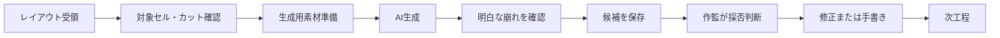
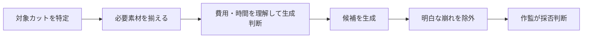
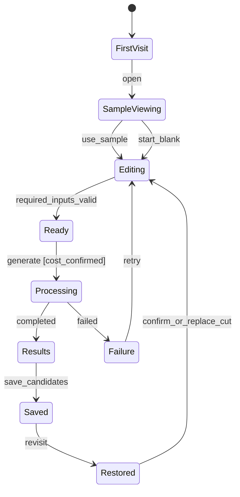

# Worked Example: Anime Key-Pose Generation

## 1. Success Conditions

| ID | 成功条件 |
|---|---|
| SC1 | 初回利用者が有料生成せず、入力画像と出力変化の関係を理解できる |
| SC2 | 反復利用者が前回の設定を再利用しつつ、別カットへの誤用を防げる |
| SC3 | 生成前に100円・約160秒・4枚出力を理解できる |

## 2. Business Understanding

業務目的：アシスタントがレイアウトから原画の当たり候補を作り、専門品質判断を行う作監へ引き渡す。

この理解をユーザーへteach-backし、正しいと承認されてから次へ進む。

## 3. Decision Requirements

| ID | 必要な判断 | 業務上の理由 | 誤判断の影響 |
|---|---|---|---|
| DR1 | 対象カット・セルは何か | 正しい素材を紐づける | 別カットへ誤適用 |
| DR2 | どのキャラ設定を使うか | キャラクター整合性を保つ | 外見不一致 |
| DR3 | 生成してよいか | 費用・待ち時間が発生する | 意図しない課金・待機 |
| DR4 | 原画として採用可能か | 専門品質を保証する | 品質不足の採用 |

## 4. Target Value Loop

## 5. Decision Specification

| ID | Requirement | Trigger | Owner | Evidence | Logic |
|---|---|---|---|---|---|
| D1 | DR1 | 素材準備開始時 | アシスタント | カットID・セル番号 | simple rule |
| D2 | DR2 | キャラ設定選択時 | hybrid | 対象キャラ・設定資料 | flowchart |
| D3 | DR3 | 生成直前 | ユーザー | 100円・約160秒・4枚 | simple rule |
| D4 | DR4 | 候補確認後 | 作監 | 原画品質基準 | expert judgment |

複数条件の組合せで結果が変わる判断がある場合だけ、ここへDecision Tableを追加する。

## 6. Design Principles

| 優先 | ID | 原則 |
|---:|---|---|
| 1 | P1 | 有料・長時間処理の前に、費用・時間・出力単位を予測可能にする |
| 2 | P2 | 初回理解と反復利用を別状態として設計する |
| 3 | P3 | 専門品質判断は作監に残し、アシスタントは明白な破綻確認に限定する |
| 4 | P4 | 入力例と出力差分を対応づけ、項目名の記憶へ依存させない |

## 7. Contradiction Review

| ID | 問題 | 重大度 | 解消 |
|---|---|---|---|
| C1 | 初回理解のために実生成するとSC1と衝突 | blocking | 生成済み見本を表示 |
| C2 | 前回入力の自動復元は別カット誤用の危険 | warning | 復元状態を明示し、カットID変更時に確認 |
| C3 | アシスタントへ最終採否を委ねる | blocking | 最終採否を作監へ固定 |

## 8. State Machine

## 9. IA Implication

| 領域 | 内容 |
|---|---|
| First-visit sample | 入力済み例、生成済み4枚、入力→出力の説明 |
| Main input | ベースラフ、キャラ設定 |
| Optional context | 線画・影、クローズアップ、演出指示 |
| Execution | 100円、約160秒、4枚、生成 |
| Comparison | 元画像と4出力を同条件で比較 |
| Handoff | カットID付き保存、作監確認用出力 |

## 10. UI Behavior

| ID | 状態 | 挙動 | 根拠 |
|---|---|---|---|
| UI1 | FirstVisit | 実生成せず生成済み見本を表示 | P1, P2, P4 |
| UI2 | Editing | キャラ設定候補を示し、ユーザーが修正可能 | D2 |
| UI3 | Ready | 生成前に100円・約160秒・4枚を表示 | P1 |
| UI4 | Results | 元画像と4出力を並べ、明白な崩れを確認 | D7 |
| UI5 | Saved | カットIDと候補をまとめて保存 | SC2 |
