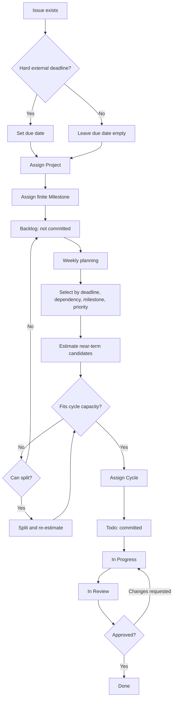

# Linear Work Planning

## Purpose

Turn existing Linear issues into a reviewable work system:

`Project -> Milestone -> Backlog -> Estimate -> Cycle -> Todo -> In Progress -> In Review -> Done`

Keep issue creation separate. Use `linear-bulk-issue-triage` when the input is a raw task list rather than existing issue identifiers.

## Workspace Rules

- Target workspace: `lilpacys-workspace`.
- Use `LIL` for personal work, life administration, investing, and personal agent/tooling work.
- Use `ANI` for Aniark product, production management, recruiting, partnerships, infrastructure, and company work.
- Query current teams, projects, milestones, cycles, workflow states, and estimate settings before proposing changes. Do not rely on remembered names or stale IDs.
- Use Linear CLI for supported operations and `linear api` when exact filtering, aggregation, milestone assignment, cycle assignment, or settings inspection requires GraphQL.
- Derive counts from API results. Do not interpret CLI glyphs or visual summaries as data.
- Preserve issue descriptions. Never use `linear issue update -d` merely to add planning metadata.

## Planning Model

| Linear field | Meaning | Apply when |
|---|---|---|
| Project | A bounded outcome worth coordinating | Multiple issues contribute to the same outcome |
| Milestone | A finite, reviewable checkpoint inside a project | Completion can be stated unambiguously |
| Backlog | Candidate work not yet committed | The issue is valid but not selected for the current cycle |
| Estimate | Relative work size for capacity decisions | The issue is a near-term cycle candidate |
| Cycle | Work explicitly committed for the time box | The issue fits after deadlines, dependencies, and capacity are considered |
| Due date | A real external deadline | Payment, submission, contract, expiry, appointment, or other hard constraint exists |

Do not assign due dates to every issue. Do not create permanent topic buckets as milestones. Prefer a finite outcome such as `Complete the RL material and Transformer primer` over `AI learning`. Keep recurring input queues as labels or recurring issues unless the user explicitly wants a milestone.

In this workspace, every non-terminal issue that already has a due date must have a cycle. Assign overdue issues to the active cycle. If no active cycle exists, assign them to the earliest available upcoming cycle and report the scheduling gap. Assign future issues to the cycle containing their due date. This scheduling rule applies even when the issue is non-blocking or its deadline may later need cleanup. Do not invent due dates merely to force cycle membership.

## Workflow

### 1. Audit before proposing

1. Fetch all in-scope issues with all assignees and workflow states.
2. Separate terminal states (`Done`, `Canceled`, `Duplicate`) from actionable states.
3. Record current project, milestone, cycle, state, estimate, due date, updated time, team, and parent issue.
4. Identify likely duplicates, stale `In Review` issues, ambiguous project boundaries, one-off tasks, and recurring queues.
5. Inspect existing projects and their actual issue membership before reusing them. Project names alone are not reliable boundaries.

### 2. Propose a dry run

Present a compact table before any mutation:

| Proposed destination | Action | Issues | Reason | Confidence |
|---|---|---|---|---|
| Existing or new Project / Milestone | Create, reuse, or leave unchanged | Identifiers | Shared bounded outcome | High / Medium / Needs confirmation |

Mark inferred classification as `※推測`. Keep these out of an automatic bulk mutation:

- likely duplicates;
- issues whose descriptions conflict with their titles;
- issues that plausibly fit multiple projects;
- stale active issues requiring a keep/close/backlog decision;
- one-off tasks that do not benefit from project coordination.

### 3. Mutate only after authorization

Treat an explicit user instruction such as `それで入れて` as authorization for the presented mapping. Otherwise remain read-only.

1. Re-fetch targets immediately before mutation and skip any issue whose state or planning fields changed.
2. Reuse an existing project when its boundary is clear; otherwise create the approved project in `Backlog` status.
3. Create finite milestones with target dates only when supported by real constraints.
4. Assign project and milestone without changing title, description, priority, due date, or state unless separately authorized.
5. Verify every mutation through the GraphQL API and report partial failures explicitly.

### 4. Plan the cycle

Evaluate only near-term candidates:

| Condition | Decision |
|---|---|
| Hard deadline falls within the cycle | Reserve capacity and include |
| Issue blocks other committed work | Prefer inclusion |
| Milestone target is approaching | Include if capacity allows |
| Estimate is missing | Estimate before deciding |
| Scope exceeds remaining capacity | Split the issue or leave it in Backlog |
| Work is merely desirable someday | Leave it in Backlog |

Use completed estimates from recent cycles when available. When the team lacks usable history, select a conservative first-cycle scope and calibrate from completed work instead of inventing velocity.

### 5. Execute through workflow states

Follow the state order. Do not move an issue directly from Backlog or Todo to Done.

### 6. Proactively hand off the next issue

After the user confirms that the preceding task is complete, do not wait for the user to ask what to do next. Do not recommend a next task after planning, triage, comments, due-date edits, cycle assignments, or workflow updates short of task completion.

1. Fetch the current and next cycle boundaries, then re-fetch actionable issues whose due dates fall on or before the next cycle end.
2. Audit due-dated issues without a cycle before ranking the next action. Do not let existing cycle membership hide a closer deadline.
3. Recommend exactly one next issue and its first concrete action in the final response.
4. Rank candidates by executable hard deadline, downstream blocking impact, current-cycle commitment, approaching milestone, then priority and due date as tie-breakers.
5. Respect the current time and external availability. Distinguish work that can start now from calls, visits, or other actions that require a later time window.
6. Skip issues that are waiting for an external response, lack enough context to act safely, or are likely duplicates. List them separately only when the user needs to clarify them.
7. Do not mutate the recommended issue's state, cycle, or other fields without authorization.

Include the issue link, selection reason, and immediate first step. If no issue is safely actionable, state the blocking fact and ask one focused question.

## Cycle Automation Safety

Before changing team cycle automation, inspect:

- `cyclesEnabled`;
- `cycleIssueAutoAssignStarted`;
- `cycleIssueAutoAssignCompleted`;
- `cycleLockToActive`;
- count of active issues without a cycle, grouped by state, project, due date, and staleness.

Do not enable `cycleLockToActive` while a large unresolved set of active issues lacks cycles. The setup can force existing active issues either into Backlog or into the current/next cycle, destroying review-state meaning or cycle capacity.

Treat cycle assignment as stateful. In this workspace, assigning a Backlog issue to a cycle has been observed to move it automatically to Todo. Always compare both `cycle` and `state` before and after mutation and report automatic transitions.

## Final Verification

After changes, report:

| Check | Required result |
|---|---|
| Project and milestone membership | Every authorized issue matches the approved mapping |
| Cycle membership | Every committed issue is in the intended cycle |
| Workflow state | Automatic and explicit state changes are accounted for |
| Protected fields | Title, description, priority, and due date are unchanged unless authorized |
| Deferred issues | Duplicates, ambiguous items, one-offs, and stale-review decisions remain listed separately |
| Next issue handoff | Only after the preceding task is complete, one current actionable issue and its first step are presented without waiting for a follow-up prompt |

Link created projects when URLs are available. Keep the final report focused on changed counts, deferred counts, and any unexpected side effects.
