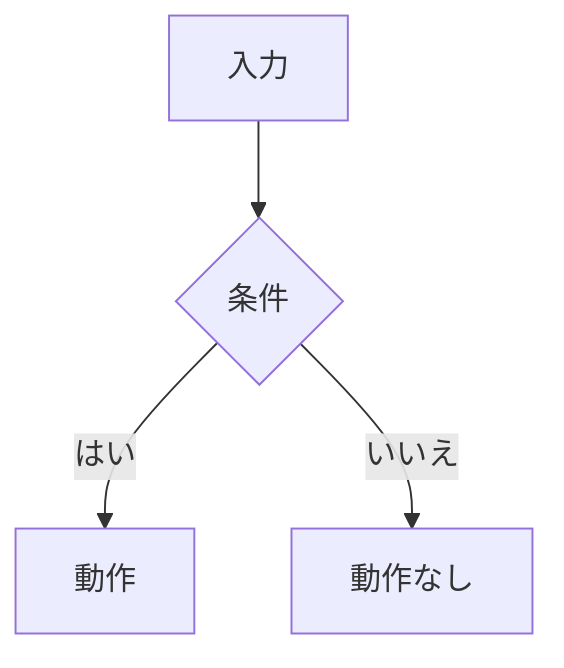
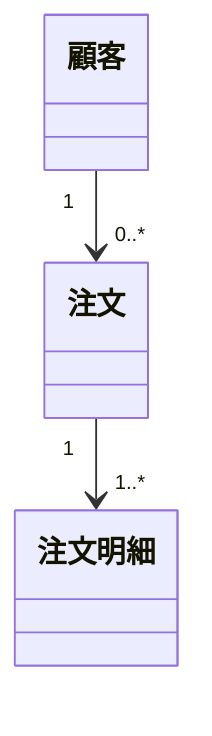

# Structured Answer

## 基本原則

自然言語の曖昧さを減らし、壊れやすい文章説明を構造化表現に置き換える。

回答に次が含まれる場合は、図表または表を使う。

- 条件分岐
- 状態または遷移
- 多重度、構成、エンティティ間の関係
- 期間、時刻、範囲、境界値
- 実行できる行為、できない行為の制約
- 条件から導く分類、判定、推論
- 計算式、算出方法、アルゴリズム

## 記法の選択

| 型 | 記述したいこと | 兆候となる言い回し | 推奨記法 |
|---|---|---|---|
| 事実 | 用語間の関係、構成、多重度 | 「〜は…である」「〜は…で構成される」 | Mermaid `classDiagram` / `erDiagram`、階層図、用語定義表 |
| 契機 | ある状況で何かを起こす | 「〜の場合…をする」「〜であれば…する」 | Mermaid `flowchart`、アクティビティ図風フロー |
| 制約 | 実行できる／できない行為の制限 | 「〜だけができる」「〜の場合のみ」 | デシジョンテーブル |
| 推論 | 条件が真のとき新たに判定される値 | 「〜の場合…とみなす」「〜で判定する」 | デシジョンテーブル |
| 計算 | 数式・アルゴリズムで求める値 | 「〜から…を算出する」 | 計算式、境界を示す表 |

## 必ず構造化するもの

複数条件の組み合わせで結果が変わる場合は、デシジョンテーブルを使う。

| 条件 \ ケース | 1 | 2 | 3 |
|---|---|---|---|
| 会員区分 = 優良 | Y | N | N |
| 年間購買額 ≥ 10万 | - | Y | N |
| **割引券を送付する** | X | X | - |
| **通常案内を送付する** | - | - | X |

凡例: 条件 `Y` = 真、`N` = 偽、`-` = 無関係。動作 `X` = 実行する、`-` = 実行しない。

範囲、日付、時刻、年齢、個数、上限・下限、以上・未満などは境界値表を使う。

| 範囲 | 開始を含む | 終了を含む | 結果 |
|---|---:|---:|---|
| `0 <= x < 10` | はい | いいえ | A |
| `10 <= x <= 20` | はい | はい | B |

## Mermaid の使い方

関係や流れが視覚的に検証しやすくなる場合は Mermaid を使う。

エンティティ、所有、構成、多重度には `classDiagram` または `erDiagram` を使う。

## 推測の扱い

遷移、分岐、関係、境界ルールを勝手に補わない。

元の情報やユーザーの指示に明記されていない要素を図表へ含める場合は、推測であることを明示する。

- 日本語回答では `※推測` を付ける。
- 英語回答では `inferred` を付ける。
- Mermaid が対応している場合、推測した関係は点線で示す。
- 推測した要素は事実として断定せず、レビューで確定すべき項目として扱う。

## 出力前チェック

最終回答の前に確認する。

- 条件分岐に隠れたケースがないか。
- 境界値の含む／含まないが明示されているか。
- 多重度やエンティティ関係が必要な箇所で示されているか。
- 推測した箇所に `※推測` または `inferred` が付いているか。
- 図表が文章より小さく明確になっているか。
